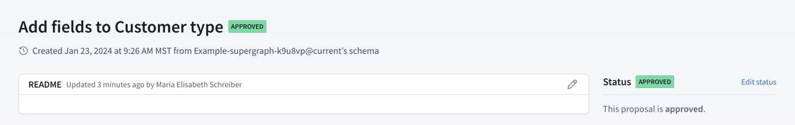

Once a proposal receives the [minimum number of approvals](/graphos/delivery/configure-proposals#required-approvals), its status changes to **Approved**.

<Note>

Changes made to an approved proposal don't change the **Approved** status of the proposal.
To set the proposal's status to **Open for feedback** or another status, [manually change it](/graphos/delivery/propose-changes#change-proposal-status) from the proposal's overview page.

</Note>

Once a proposal is approved, your team can then begin [implementing the approved changes](/graphos/delivery/implement-proposals).
