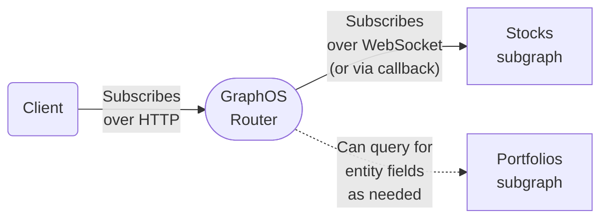

1. A client executes a GraphQL subscription operation against your router over HTTP:

    ```graphql title="Example subscription"
    subscription OnStockPricesChanged {
      stockPricesChanged {
        symbol
        price
      }
    }
    ```

   - The client doesn't use a WebSocket protocol. Instead, it receives updates via [multipart HTTP responses](https://www.apollographql.com/docs/router/executing-operations/subscription-multipart-protocol/).
   - By using HTTP for subscriptions, clients can execute all GraphQL operation types over HTTP instead of using two different protocols.
   - [Apollo Client](https://www.apollographql.com/docs/react/data/subscriptions#http), [Apollo Kotlin](https://www.apollographql.com/docs/kotlin/essentials/subscriptions#configuring-http-subscriptions), and [Apollo iOS](https://www.apollographql.com/docs/ios/fetching/subscriptions#http) all support GraphQL subscriptions over HTTP with minimal configuration. See each library's documentation for details. Apollo Client also provides network adapters for the [Relay](https://www.apollographql.com/docs/react/data/subscriptions#relay) and [urql](https://www.apollographql.com/docs/react/data/subscriptions#urql) libraries.

2. When your router receives a subscription, it executes that same subscription against whichever subgraph defines the requested field—`stockPricesChanged` in the code snippet above.

   - This communication usually does use a WebSocket subprotocol, for compatibility with most subgraph libraries.
   - With a self-hosted router, you can also configure an [HTTP-callback-based protocol](https://www.apollographql.com/docs/router/executing-operations/subscription-support/#http-callback-setup).

3. The subgraph periodically sends new data to your router. Whenever it does, the router returns that data to the client in an additional HTTP response part.
   - A subscription can include federated entity fields that are defined in other subgraphs. If it does, the router first fetches those fields by querying the corresponding subgraphs, such as the **Portfolios subgraph** in the diagram above. These queries use HTTP as usual.