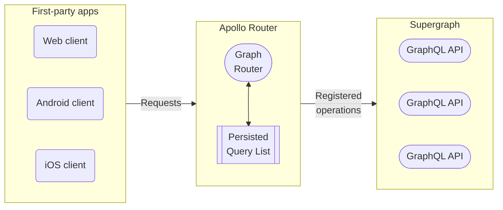

With [GraphOS Enterprise](/graphos/enterprise/), you can enhance your supergraph's security by maintaining a **persisted query list** (**PQL**) for your supergraph's self-hosted router. The [Apollo Router](/router/) checks incoming requests against the PQL which acts as an operation safelist made by your first-party apps.

> You can include any kind of operation in your PQL, including queries, mutations, and subscriptions.

Your router can use its persisted query list (PQL) to both **protect your supergraph** and **speed up your clients' operations**:

- When you enable **safelisting**, your router rejects any incoming operations not registered in its PQL.
- Client apps can execute an operation by providing its PQL-specified ID _instead of_ the entire operation string.
  - Requesting by ID can significantly reduce latency and bandwidth usage for very large operation strings.
  - Your router can _require_ that clients provide operations by ID and _reject_ full operation strings—even operation strings present in the PQL.
