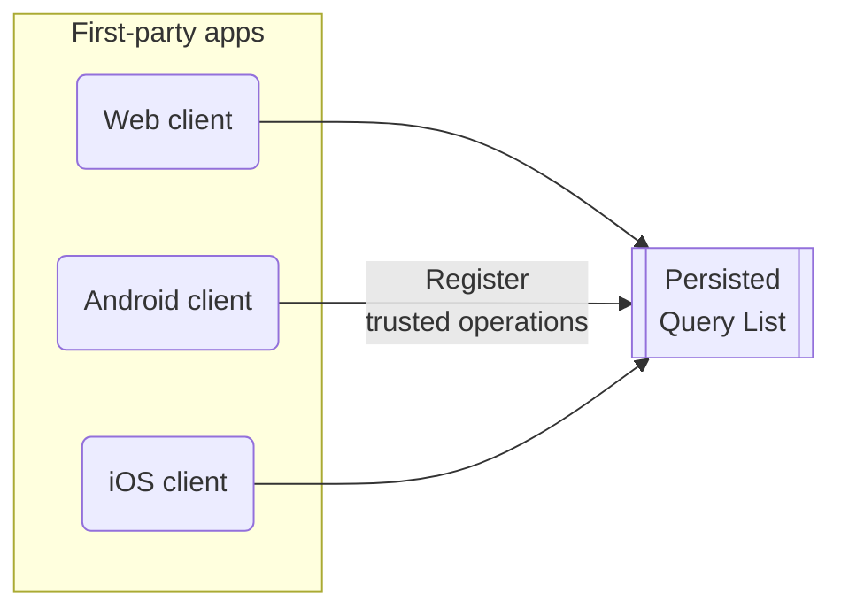
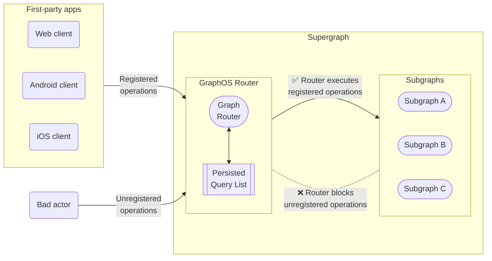

With [GraphOS Enterprise](/graphos/enterprise/), you can enhance your supergraph's security by maintaining a _persisted query list_ (PQL) for your GraphOS Router. To create and update the PQL, first-party apps register trusted operations to the PQL at build time.

<Note>

Clients can register any kind of operation to a PQL, including queries, mutations, and subscriptions.

</Note>

At runtime, the router checks incoming requests against the PQL, which can act as operation safelist, depending on your [router configuration](#2-router-configuration).

Your router can use its persisted query list (PQL) to both protect your supergraph and speed up your clients' operations:

- When you enable _safelisting_, your router rejects any incoming operations not registered in its PQL.

- Client apps can execute an operation by providing its PQL-specified ID instead of the entire operation string.
  - Requesting by ID can significantly reduce latency and bandwidth usage for large operation strings.
  - Your router can require that clients provide operations by ID and reject full operation strings—even operation strings present in the PQL.
