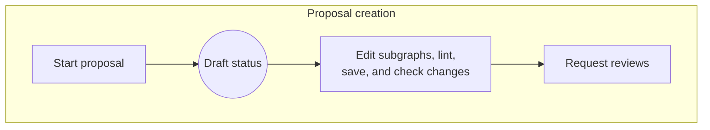

```mermaid
graph LR
    subgraph Draft ["Proposal creation"]
    direction LR
    Creation["Start proposal"]
    DraftStatus(("Draft status"))
    Edit["Edit subgraphs, lint, <br/> save, and check changes"]
    Request["Request reviews"]
    Creation -->  DraftStatus --> Edit --> Request
    end
    class DraftStatus secondary;
    class DraftStatus CircleSize50;
```
