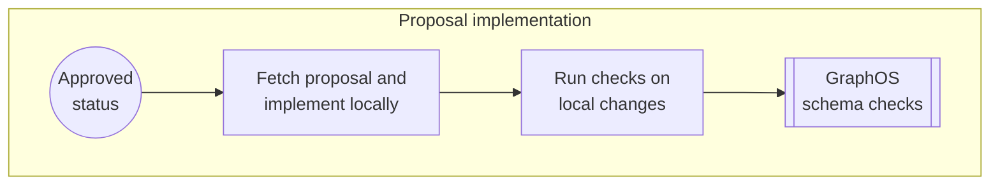

```mermaid
graph LR
    subgraph Approved ["Proposal implementation"]
    direction LR
    ApprovedStatus((Approved <br/> status))
    Fetch["Fetch proposal and <br> implement locally"]
    Push["Run checks on <br> local changes"]
    Check[["GraphOS <br/> schema checks"]]
    ApprovedStatus --> Fetch --> Push --> Check
    end
    class ApprovedStatus secondary;
    class ApprovedStatus CircleSize50;
    class Check tertiary;
```
