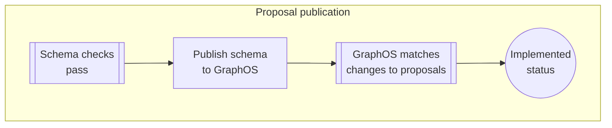

```mermaid
graph LR
    subgraph Implemented ["Proposal publication"]
    direction LR
    Checks[["Schema checks <br/> pass"]]
    Publish["Publish schema <br/> to GraphOS"]
    Monitor[["GraphOS matches <br/> changes to proposals"]]
    ImplementedStatus((Implemented <br/> status))
    Checks --> Publish --> Monitor --> ImplementedStatus
    end
    class ImplementedStatus secondary;
    class ImplementedStatus CircleSize50;
    class Checks,Monitor tertiary;
```
