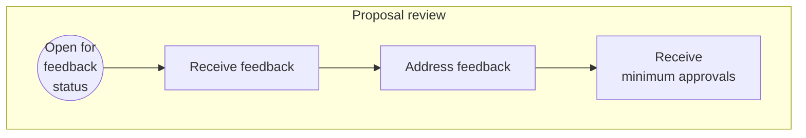

```mermaid
graph LR
    subgraph Open4Feedback ["Proposal review"]
    direction LR
    Feedback((Open for <br/>feedback <br/> status))
    Feedback1["Receive feedback "]
    Feedback2["Address feedback "]
    Approvals["Receive<br/>minimum approvals"]
    Feedback --> Feedback1 --> Feedback2 --> Approvals
    end
    class Feedback secondary;
    class Feedback CircleSize50;
```
