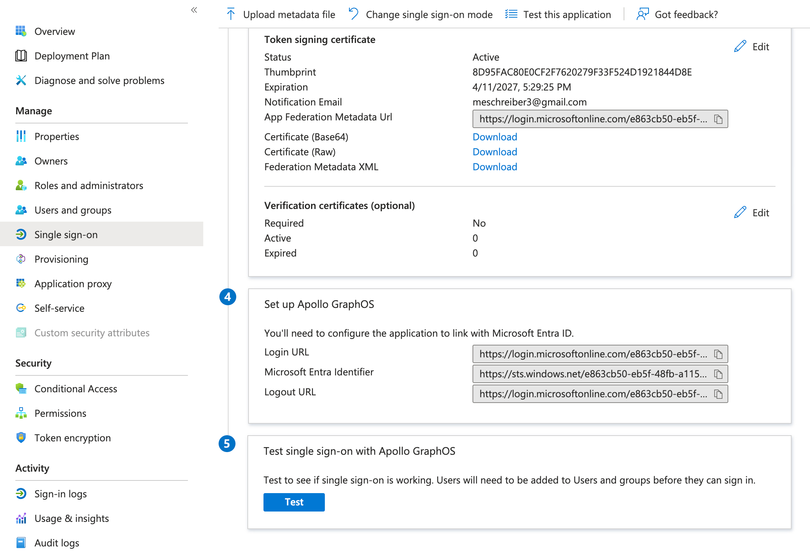

Once you've set up your Apollo GraphOS application in Entra ID, you need to assign users to it so they can access GraphOS.
You can assign individual users or groups from the **User and groups** page of your Apollo GraphOS application in Entra ID.

You may want to begin by adding yourself individually and then testing SSO by clicking **Test** at the bottom of the **Single sign-on** page.

Once you've successfully tested your own user's ability to use SSO, add any applicable users or groups.
When users are first assigned to the Apollo GraphOS application, they must re-login to GraphOS Studio.

Once you've confirmed the new configuration works for your users, remove any legacy Apollo GraphOS applications in Entra ID or app registrations in Azure AD if you have them.
