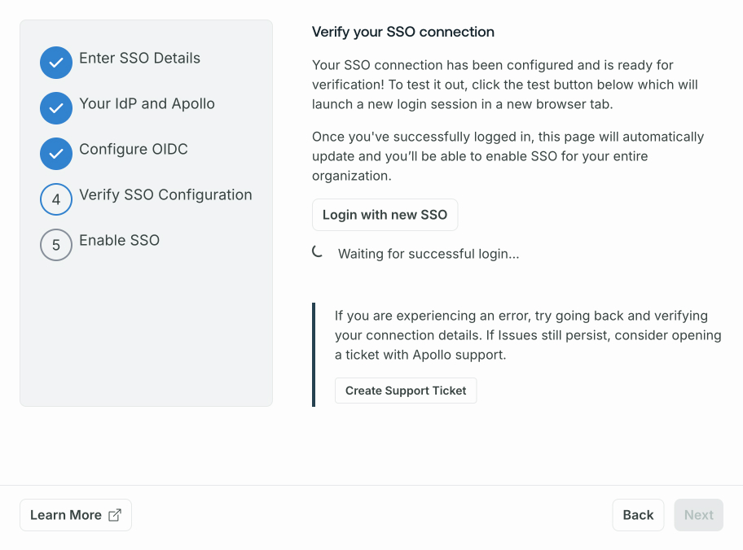

## Migration notes

<Caution>

If your organization's SSO was set up before April 2024, you must create a new SSO configuration with the [updated instructions](#setup) before November 15, 2024. After November 15, 2024, the legacy configuration will no longer work, and your organization will lose access to GraphOS if you haven't created a new configuration.

</Caution>

To migrate from a legacy configuration, a GraphOS [Org Admin](/graphos/org/members/#organization-wide-member-roles) must create a new SSO configuration.
You can create a new configuration while the legacy configuration continues to provide SSO for your organization.

The GraphOS setup wizard takes you through the configuration process, step-by-step.
It won't let you activate your new configuration until it has confirmed that you're able to sign in with it.

Once the new configuration is verified and active, you should remove any legacy configurations from your IdP.
