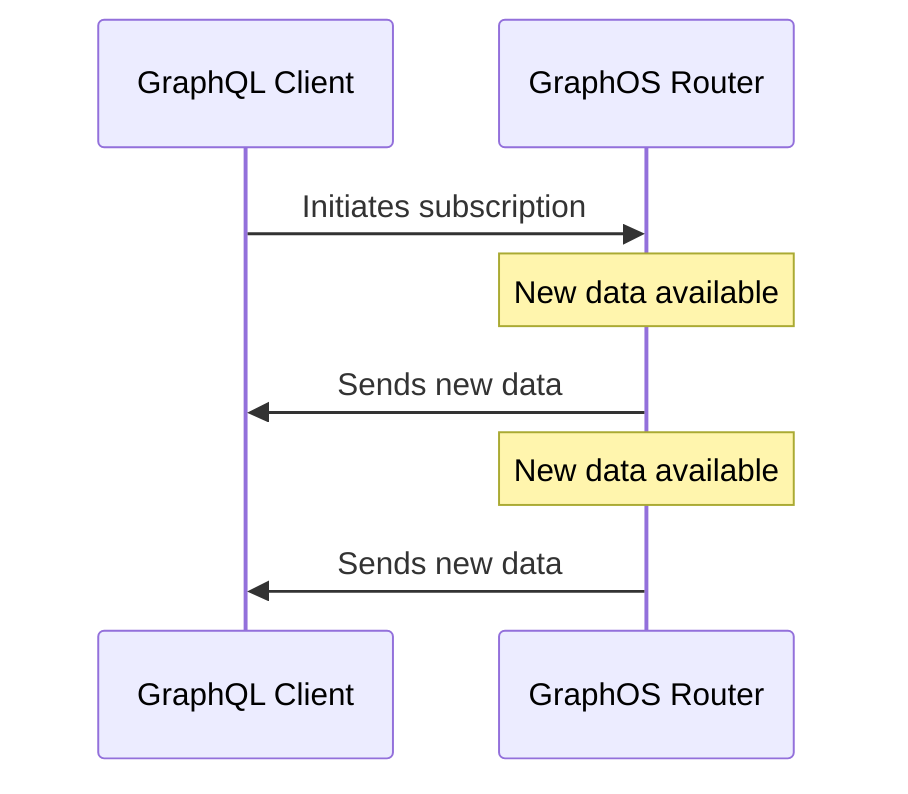

GraphQL subscriptions enable clients to receive continual, real-time updates whenever new data becomes available. Unlike queries and mutations, subscriptions are long-lasting. This means a client can receive multiple updates from a single subscription:

Subscriptions are best suited to apps that rely on frequently-changing, time-sensitive data such as stock prices, IoT sensor readings, live chat, or sports scores.