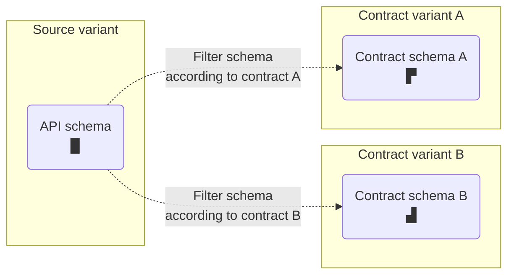
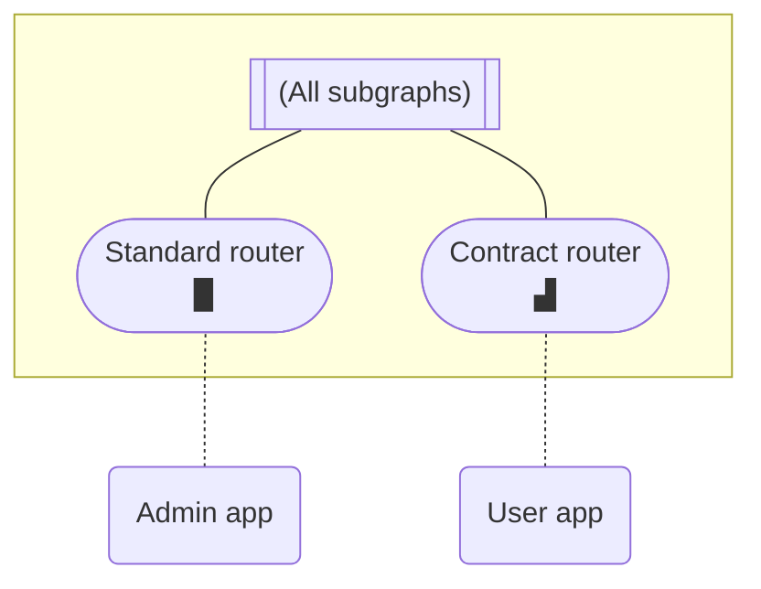
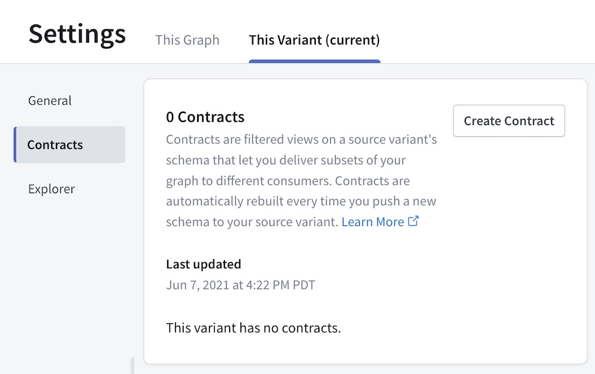

> Contracts are available only for [Enterprise plans](https://www.apollographql.com/pricing/). Currently, they only support [federated variants](/federation/) of Studio graphs.

Apollo Studio **contracts** enable you to deliver different subsets of your supergraph to different consumers. Each contract filters specific portions of your supergraph's [API schema](https://www.apollographql.com/docs/federation/#federated-schemas) into a different Studio variant:



A contract filters definitions from your subgraph schemas based on `@tag` directives that you add:

<CodeColumns>

```graphql {4} title="Source variant subgraph schema"
type Product {
  id: ID!
  name: String!
  codename: String! @tag(name: "internal")
}
```

```graphql title="Contract variant API schema"
type Product {
  id: ID!
  name: String!
  # codename field is filtered out
}
```

</CodeColumns>

In the above example, a contract excludes types and fields marked with the `internal` `@tag`.

## What are contracts for?

You usually create a contract to support a **contract router** or **contract documentation** (or both).

#### Contract routers

You can deploy a [managed instance](/federation/managed-federation/overview/) of your graph router that uses a contract schema. Clients that use a contract router's endpoint can only execute GraphQL operations that the contract schema supports:



This enables you to hide experimental types and fields that are still in development, or to limit a particular audience's access to only the portions of your graph that they need.

Contract routers can safely connect to the same subgraph instances as any other router, because their clients can only interact with data that's represented in the contract schema. This does not affect internal routing (filtered fields can still be used in a `@requires` selection set). Additionally, any `@tag` labels that are part of the source variant's supergraph schema are preserved in a contract supergraph schema.

#### Contract documentation

In Studio, each contract variant has its own README, schema reference, and Explorer. If you [make a contract variant public](./org/graphs/#public-variants), you can provide these resources to external client developers to help them interact with a specific portion of your graph (while omitting irrelevant types and fields).

## Setup

> ⚠️ The Apollo Studio steps below require an organization member with the **Org Admin** or **Graph Admin** role. [Learn about member roles.](./org/members/)

### 1. Update your router and subgraphs

**Before you create any contracts:**

1. For Federation 2 contract variants, ensure that you're running gateway versions higher than 2.0.2. For Federation 1 contract variants, update your gateway's `@apollo/gateway` library to version 0.34.0 or later. Otherwise, you'll encounter runtime errors.
2. For Federation 2 contract variants, update your Apollo Server subgraphs to use version 2.0.0 or later of the `@apollo/subgraph` library. For Federation 1 contract variants, update `@apollo/subgraph` to version 0.1.1 or later.
   - `@apollo/subgraph` recently replaced `@apollo/federation` for Apollo Server instances acting as subgraphs. Symbol names are unchanged.
3. If you're still using the Apollo CLI to publish subgraph schemas (via `apollo service:push`), [install the Rover CLI](https://www.apollographql.com/docs/rover/getting-started/) and begin using [`rover subgraph publish`](https://www.apollographql.com/docs/rover/subgraphs/#publishing-a-subgraph-schema-to-apollo-studio) instead.

Older versions of the above libraries and tools don't fully support the required `@tag` directive.

### 2. (Fed1) Enable variant support for `@tag`

> **This step is required for Federation 1 supergraphs only.** If you have a Federation 2 supergraph, proceed to the next step.

A contract uses one of your graph's existing [variants](/studio/org/graphs/#managing-variants) (called the **source variant**) to generate its contract schema. If your source variant uses Federation 1, you need to enable its support for the `@tag` directive in Apollo Studio.

Open the Settings page for the variant you want to use as your source variant, then select the **This Variant** tab:


In the **Build Configuration** section, click **Edit Configuration** and enable support for `@tag`.

### 3. Add `@tag`s

With contracts, you apply the `@tag` directive to types and fields in your subgraph schemas to indicate whether to include or exclude them from your **contract schema**.

Before you can add `@tag`s, you need to define the directive in your subgraph schema. The way you do this depends on which version of federation you're using:

<ExpansionPanel title="Federation 1">

Add the following definition to each of your subgraph schemas:

```graphql
directive @tag(name: String!) repeatable on
  | FIELD_DEFINITION
  | INTERFACE
  | OBJECT
  | UNION
```

</ExpansionPanel>

<ExpansionPanel title="Federation 2">

Add the `@tag` directive to your subgraph schema's Federation 2 `import` array:

```graphql {3}
extend schema
  @link(url: "https://specs.apollo.dev/federation/v2.0",
        import: ["@key", "@tag"])
```

</ExpansionPanel>

For example, let's take a look at this Federation 2 subgraph schema:

```graphql {1-3,6,11,17-18} title="products.graphql"
extend schema
  @link(url: "https://specs.apollo.dev/federation/v2.0",
        import: ["@key", "@tag"])

type Query {
  topProducts: [Product!]! @tag(name: "partner")
}

# All fields of the Product object type automatically inherit
# the "partner" tag so we can avoid tagging them individually
type Product @key(fields: "upc") @tag(name: "partner") {
  upc: ID!
  name: String!
  description: String!
  # These fields also inherit the "partner" tag. You can
  # prevent access to them by defining an excludes filter in Studio
  internalId: ID! @tag(name: "internal")
  percentageMatch: Float! @tag(name: "experimental")
}
```

This schema applies the `@tag` directive to the following locations:

* The `Product` object type
* The `Query.topProducts` field (which returns a list of `Product`s)
* Two fields of `Product` (`internalId` and `percentageMatch`)

Each `@tag` has a string `name`. You tag types and fields with the _same_ `name` if they should be included or excluded as a group by a particular contract.

For in-depth details on valid `@tag` usage, see [Rules for `@tag`s and contracts](#rules-for-tags-and-contracts).

> Whenever Studio composes your source variant's [supergraph schema](/federation/#federated-schemas), that schema retains all of the `@tag`s from your subgraph schemas (this is different from most other directives, which are removed).

### 4. Publish updated subgraph schemas

After you're done adding tags, update your source variant by publishing your updated subgraph schemas to Apollo Studio.

> After publishing, if Studio doesn't reflect the the tags that you've added in your subgraph schemas, make sure you've [updated all required libraries and tools](#1-update-your-router-and-subgraphs). If you obtain your subgraph schemas via introspection, older subgraph libraries might strip the `@tag` directive.

Now you're ready to create your first contract!

### 5. Create a contract

Open your source variant's Settings page and select the **This Variant** tab. This time, click **Contracts**:



Click **Create Contract** to open the following dialog:


#### Basic details

In the first step of the dialog, provide the following:

- A name for your new contract variant
- The source variant to use

> You can't change these values after the contract is created.

Then click **Continue**.

#### Contract filters

Next, you specify tag-based filters for your contract:


The dialog detects all tag names that are used in your source variant's schema, and it populates its dropdown lists with those names. You can add any number of tag names to each list.

> You can also add tag names that are not yet present in your source variant's schema. If you later add tags with that name, the contract honors them.

Your contract will filter types and fields from its source variant according to the following rules:

- **If the Included Tags list is empty**, the contract schema _includes_ each type and object/interface field _unless_ it's tagged with an _excluded_ tag.
- **If the Included Tags list is non-empty**, the contract schema _excludes_ each union type and object/interface field _unless_ it's tagged with an _included_ tag.
  - Each object and interface type is _included_ as long as _at least one_ of its fields is included (unless the type is explicitly excluded)
  - The contract schema _excludes_ a type or field if it's tagged with both an included tag _and_ an excluded tag.

> 💡 In Apollo Federation 2, if you want to exclude a type or field from your _source variant's_ API schema _and_ all of its contract schemas, you can use the `@inaccessible` directive instead of `@tag`. For details, see [Using `@inaccessible`](/federation/federated-types/sharing-types/#using-inaccessible).

When you're done adding tag names, you click **Generate Preview** to check the contract schema that your contract will generate. If the preview generates successfully, you can then click **Review** to continue.

#### Review and launch

You can now review all of the details of your contract:


If everything looks right, click **Create**. This kicks off the generation of your contract variant and its initial contract schema as a [launch](./launches).

> Studio might encounter an error while generating your contract schema. For descriptions of these errors, see [Contract errors](#contract-errors).

### 6. Use your new contract variant

Congratulations! You've created a contract in Apollo Studio. You can now use your contract variant to provide a [contract gateway or contract documentation](#what-are-contracts-for) to your users.

For example, you can complete the [managed federation setup](/federation/managed-federation/setup/) for a new router instance that uses your contract variant.

## Federation 1 limitations

Contracts behave slightly differently depending on which version of Apollo Federation your graph uses (1 or 2). Most importantly, graphs that use Federation 1 _cannot_ use `@tag`s to exclude the following from a contract schema:

* Custom scalar types (default scalar types can _never_ be excluded)
* Enum types or their values
* Input types or their fields
* Arguments of object fields or interface fields

### Contracts and Federation 2

To create a contract variant that uses Federation 2, the contract's source variant must _also_ use Federation 2.

> [Learn how to move an existing variant to Federation 2.](/federation/federation-2/moving-to-federation-2#step-2-configure-your-composition-method)

#### Moving an existing contract to Federation 2

If a Federation 1 source variant already has one or more associated contracts, it isn't possible to move that variant or its contract variants to Federation 2. Instead, you need to **delete and recreate** your contract variants with the following steps:

1. Identify the source variant you want to move to Federation 2.
2. Save the details for each of that source variant's existing contract variants (most importantly each variant's associated filters).
3. Delete all of the source variant's existing contract variants.
4. Now that the source variant has no associated contracts, you can configure it to use Federation 2 composition ([learn how](/federation/federation-2/moving-to-federation-2#step-2-configure-your-composition-method)).
5. Recreate your deleted contract variants, which will now use Federation 2 composition like the modified source variant.

## Automatic updates

Apollo automatically updates your contract schema whenever any of the following occurs:

- Studio successfully composes an updated supergraph schema for the contract's source variant.
- You [edit your contract](#editing-a-contract).

This makes sure that your contract schema reflects the latest version of your source variant's schema, and that the correct types and fields are included and excluded.

Updates to your contract schema are automatically fetched by your managed [contract routers](#contract-routers).

## Editing a contract

After you create a contract, you can edit its lists of included and excluded tags. From the Contracts list in your graph's Settings page, click **Edit Contract** where shown:


This opens a dialog similar to the one you used to create the contract.

> You can't change an existing contract's name or source variant. Instead, you can create a _new_ contract (and delete the existing contract variant if you no longer need it).

## Contract checks

If you use [schema checks](./schema-checks/) in Apollo Studio, you can (and should) configure **contract checks** for any variant that acts as a contract's source variant. This helps your team identify when proposed changes to a source variant will negatively affect one or more downstream contracts.

Contract checks execute alongside the other types of schema checks for the source variant (composition checks and operation checks). They do the following:

1. Use the source variant's proposed supergraph schema (generated by composition checks) to generate and validate an updated contract schema for each specified contract variant
2. Run operation checks against each contract variant's generated contract schema

If either of these steps fails (for example, because a generated contract schema is invalid), the entire schema checks workflow fails. As with the rest of schema checks, this failure is especially useful in CI, which can block a deployment that would otherwise break one or more contract variants.

### Setup

To set up contract checks for a source variant:

1. Open your source variant's Checks page and select the **This Variant** tab.
2. Find the Downstream Variants section:

    [TODO SCREENSHOT]

3. Select each contract variant that you want to enable contract checks for.
4. Click **Save changes**.

## Error types

Whenever Apollo Studio attempts to create or update your contract schema, it might encounter an error. Errors are identified by the step in the creation process where they occurred:

| Error                                      | Description                                                                                                                        |
| ------------------------------------------ | ---------------------------------------------------------------------------------------------------------------------------------- |
| `ADD_DIRECTIVE_DEFINITIONS_IF_NOT_PRESENT` | An error occurred adding directive definitions for `@tag`, `@inaccessible`, and core directive usages.                             |
| `DIRECTIVE_DEFINITION_LOCATION_AUGMENTING` | An error occured augmenting the directive definition for `@tag` to support `OBJECT`, `FIELD_DEFINITION`, `INTERFACE`, and `UNION`. |
| `EMPTY_OBJECT_AND_INTERFACE_MASKING`       | All of an object or interface type's fields were excluded, and an error occurred while excluding the entire type.                  |
| `EMPTY_UNION_MASKING`                      | All of a union type's included types were excluded, and an error occurred while excluding the entire union.                        |
| `INPUT_VALIDATION`                         | The contract is attempting to include and exclude the same tag.                                                                    |
| `PARSING`                                  | After including and excluding fields, the resulting contract schema failed to parse.                                               |
| `PARSING_TAG_DIRECTIVES`                   | Studio encountered an error while trying to obtain all uses of `@tag` from the source variant schema.                              |
| `PARTIAL_INTERFACE_MASKING`                | An interface field's return type was excluded, and an error occurred while excluding that interface field.                         |
| `SCHEMA_RETRIEVAL`                         | Studio encountered an error while retrieving the source variant's schema. It might not yet have a valid composed schema.           |
| `TAG_INHERITING`                           | Studio encountered an error while attempting to add parent tags to fields.                                                         |
| `TAG_MATCHING`                             | Studio encountered an error determining which types and fields should be inaccessible based on their tags.                         |
| `TO_API_SCHEMA`                            | Studio encountered an error while attempting to generate an API schema from the contract variant's supergraph schema.              |
| `TO_FILTER_SCHEMA`                         | Studio failed to generate and return a contract supergraph schema for an unknown reason.                                           |
| `UNKNOWN`                                  | An unknown error occurred.                                                                                                         |
| `VERSION_CHECK`                            | The Federation version used is not supported by contracts.                                                                         |

## Rules for `@tag`s and contracts

### Valid `@tag` locations

**In both Federation 1 and Federation 2,** you can apply tags to the following to filter your contract schema:

- Definitions of object, interface, and union types
- Fields of object types (Federation 1 doesn't support tagging fields of interface types)
    - In Federation 1, you can still make an interface field inaccessible by tagging the interface definition, or by ensuring that object fields that implement the interface field are removed.

**In Federation 2 only,** you can _also_ apply tags to the following:

- Fields of interface types
- Enum types and their values
- Input types and their fields
- Definitions of custom scalar types
- Arguments of fields, **but not directive arguments at this time**

### Valid `@tag` names

- Tag names can include alphanumeric characters (`a-z`, `A-Z`, `0-9`), along with hyphen (`-`) and forward slash (`/`).
- Each tag name cannot exceed 128 characters.

```graphql {3}
type User {
  id: ID!
  name: String! @tag(name: "a/b/c/1-2-3")
}
```

### Dependent `@tag`s

- Whenever you tag the definition of an object or interface type, Studio automatically considers that tag to be applied to _all fields_ of that type:

    ```graphql
    type InternalUser @tag(name: "internal") {
      id: ID! # Also considered to have @tag(name: "internal")
    }
    ```

- Whenever you tag the definition of an object, interface, or union type, **you should always** apply that same tag to every field that _returns_ that type:

    ```graphql {1,7}
    type BillingAccount @tag(name: "internal") {
      id: ID!
      acctNumber: String!
    }

    type Query {
      billingAccounts: [BillingAccount!]! @tag(name: "internal")
    }
    ```

  - If you don't do this, a contract might exclude a type while including fields that return that type. This produces an invalid contract schema.

- If a contract excludes an object that implements an interface or is included in a union:

  - The contract is _not_ required to exclude schema fields that return that interface or union, as long as at least one other associated object type remains:

      ```graphql {1,7,13,20}
      # Two object types implement this interface.
      interface Identity {
        id: ID!
        name: String!
      }

      # If this implementing type is excluded...
      type InternalUser implements Identity @tag(name: "internal") {
        id: ID!
        name: String!
      }

      # ...but this implementing type remains...
      type ExternalUser implements Identity {
        id: ID!
        name: String!
      }

      type Query {
        # ...then this field doesn't need to be excluded.
        currentIdentity: Identity
      }
      ```

  - **However**, if a subgraph resolves one of these fields by returning an object of an excluded type, a runtime error occurs in the router and the operation fails.

### Special cases for filtering

- If a contract defines a list of Included Tags, any object or interface type _without_ an included tag is still included in the contract schema _if_ at least one of its _fields_ is included:

    ```graphql
    # This type definition is included because one if its fields is included.
    type User {
      id: ID! @tag(name: "includeMe")
    }
    ```

- If a contract excludes _every field_ of an object or interface type, the entire type definition is excluded from the contract schema:

    ```graphql
    # This object type is excluded because all of its fields are excluded.
    type User {
      id: ID! @tag(name: "excludeMe")
    }
    ```

  - This can produce an invalid contract schema if any fields that _return_ the excluded type are included.

- If a contract excludes _every object type_ that's part of a union type, the entire union type definition is excluded from the contract schema:

    ```graphql
    # This union type is excluded because all of its possible types are excluded.
    union Media = Book | Movie

    type Book @tag(name: "excludeMe") {
      title: String!
    }

    type Movie @tag(name: "excludeMe") {
      title: String!
    }
    ```

  - This can produce an invalid contract schema if any fields that _return_ the excluded union type are included.

- A contract _cannot_ exclude any of the following, even if tagged:
  - Built-in scalars (`Int`, `Float`, etc.)
  - Built-in directives (`@skip`, `@include`, etc.)
  - Custom directives that are applied to type system locations ([see the list](https://spec.graphql.org/October2021/#TypeSystemDirectiveLocation))

- A contract _can_ exclude object fields that are used in a computed field's [`@requires` directive](/federation/entities-advanced/#contributing-computed-entity-fields) without causing runtime errors.
