> Contracts are available only for [Enterprise plans](https://www.apollographql.com/pricing/). Currently, they only support [federated supergraphs](/federation/).

Apollo Studio **contracts** enable you to deliver different subsets of your graph to different consumers. Each contract filters specific portions of your graph's [API schema](https://www.apollographql.com/docs/federation/#federated-schemas) into a different Studio variant:

```mermaid
graph LR;
  subgraph "Source variant";
  api("API schema<br/>▉");
  end
  subgraph "Contract variant B"
  contractB("Contract schema B<br/>▟")
  end
  subgraph "Contract variant A"
  contractA("Contract schema A<br/>▛");
  end
  api -."Filter schema<br/>according to contract A".->contractA
  api -."Filter schema<br/>according to contract B".->contractB
```



Contracts filter schema definitions from your subgraph schemas based on `@tag` directives that you add:

<CodeColumns>

```graphql {4} title="Source variant schema"
type Product {
  id: ID!
  name: String!
  codename: String! @tag(name: "internal")
}
```

```graphql title="Contract variant schema"
type Product {
  id: ID!
  name: String!
  # codename field is filtered out
}
```

</CodeColumns>

In the above example, a contract excludes types and fields marked with the `internal` `@tag`.

## What are contracts for?

You usually create a contract to support a **contract gateway** or **contract documentation** (or both).

#### Contract gateways

You can deploy a [managed instance](https://www.apollographql.com/docs/federation/managed-federation/overview/) of your gateway that uses a contract schema. Developers who use this contract gateway can only execute GraphQL operations that the contract schema supports:

```mermaid
graph BT;
  adminapp(Admin app);
  userapp(User app);
  subgraph " ";
    standardgateway(["Standard gateway<br/>▉"]);
    contractgateway(["Contract gateway<br/>▟"]);
    subgraphs[["(All subgraphs)"]];
  end;
  userapp -.- contractgateway;
  adminapp -.- standardgateway;
  standardgateway & contractgateway --- subgraphs;
  class adminapp,userapp secondary;
```



This enables you to hide experimental types and fields that are still in development, or to limit a particular audience's access to only the portions of your graph that they need.

Contract gateways can safely connect to the same subgraph instances as any other gateway, because they can only interact with data that's represented in the contract schema. This does not affect internal routing (hidden fields can still be used in a `@requires` selection set). Additionally, any `@tag` labels that are part of the source variant's supergraph schema are preserved in a contract supergraph schema.

#### Contract documentation

In Studio, each contract variant has its own README, schema reference, and Explorer. If you [make a contract variant public](./org/graphs/#public-variants), you can provide these resources to external client developers to help them interact with a specific portion of your graph (while omitting irrelevant types and fields).

## Setup

> ⚠️ The Apollo Studio steps below require an organization member with the **Org Admin** or **Graph Admin** role. [Learn about member roles.](./org/members/)

### 1. Update your gateway and subgraphs

**Before you create any contracts:**

1. Update your gateway's `@apollo/gateway` library to version 0.34 or later.
2. Update your Apollo Server subgraphs to use version 0.1.1 or later of the `@apollo/subgraph` library.
   - `@apollo/subgraph` recently replaced `@apollo/federation` for Apollo Server instances acting as subgraphs. Symbol names are unchanged.
3. If you're still using the Apollo CLI to publish subgraph schemas (via `apollo service:push`), [install the Rover CLI](https://www.apollographql.com/docs/rover/getting-started/) and begin using [`rover subgraph publish`](https://www.apollographql.com/docs/rover/subgraphs/#publishing-a-subgraph-schema-to-apollo-studio) instead.

Older versions of the above libraries and tools don't fully support the required `@tag` directive.

### 2. Enable variant support for `@tag`

A contract uses one of your graph's existing [variants](https://www.apollographql.com/docs/studio/org/graphs/#managing-variants) (called the **source variant**) to generate its contract schema. You need to enable the source variant's support for the `@tag` directive in Apollo Studio.

Open the Settings page for the variant you want to use as your source variant, then select the **This Variant** tab:


In the **Build Configuration** section, click **Edit Configuration** and enable support for `@tag`.

### 3. Add `@tag`s

With contracts, you apply the `@tag` directive to types and fields in your subgraph schemas to indicate whether to include or exclude them from your **contract schema**.

For example, let's take a look at this Products subgraph schema:

```graphql {2-13,16,21,27-28} title="products.graphql"
# You must include this definition in any schema that uses @tag!
directive @tag(name: String!) repeatable on
  | FIELD_DEFINITION
  | INTERFACE
  | OBJECT
  | UNION
  # ⚠️ The rest of these locations are supported only in Federation 2!
  | ARGUMENT_DEFINITION
  | SCALAR
  | ENUM
  | ENUM_VALUE
  | INPUT_OBJECT
  | INPUT_FIELD_DEFINITION

type Query {
  topProducts: [Product!]! @tag(name: "partner")
}

# All fields of the Product object type automatically inherit
# the "partner" tag so we can avoid tagging them individually
type Product @key(fields: "upc") @tag(name: "partner") {
  upc: ID!
  name: String!
  description: String!
  # These fields also inherit the "partner" tag. You can
  # prevent access to them by defining an excludes filter in Studio
  internalId: ID! @tag(name: "internal")
  percentageMatch: Float! @tag(name: "experimental")
}
```

This schema applies the `@tag` directive to the following locations:

* The `Product` object type
* The `Query.topProducts` field (which _returns_ a list of `Product`s)
* Two fields of `Product` (`internalId` and `percentageMatch`)

Each tag has a string `name`. You tag types and fields with the _same_ `name` if they should be included or excluded as a group by a particular contract.

Whenever your source variant's [supergraph schema](https://www.apollographql.com/docs/federation/#federated-schemas) is generated, that schema retains all of the `@tag`s from your subgraph schemas.

#### Tagging rules

- **In both Federation 1 and Federation 2,** you can apply tags to the following in your schema:
  - Fields of object types (Federation 1 doesn't support tagging fields of interface types)
  - Definitions of object, interface, and union types
- **In Federation 2 only,** you can _also_ apply tags to the following:
  - Definitions of custom scalar types
  - Enum types and their values
  - Input types and their fields
  - Fields of interface types
  - Arguments of fields, **but not directive arguments at this time**
- Tag names can include alphanumeric characters (`a-z`, `A-Z`, `0-9`), along with hyphen (`-`) and forward slash (`/`).
- Each tag name cannot exceed 128 characters.
- Whenever you tag an object type definition, _also_ tag every field that _returns_ that type.
  - If you don't do this, a contract might exclude a type while including fields that return it. This produces an invalid contract schema.
- Whenever you tag an object or interface type, those tags propagate to the fields of that type.

Additional guidance is provided in [Special cases](#special-cases).

### 4. Publish updated subgraph schemas

After you're done adding tags, update your source variant by publishing your updated subgraph schemas to Apollo Studio.

> After publishing, if Studio doesn't reflect the the tags that you've added in your subgraphs schemas, make sure you've [updated all required libraries and tools](#1-update-your-gateway-and-subgraphs). If you obtain your subgraph schemas via introspection, older subgraph libraries might strip the `@tag` directive.

Now you're ready to create your first contract!

### 5. Create a contract

Once again open your source variant's Settings page and select the **This Variant** tab. This time, click **Contracts**:


Click **Create Contract** to open the following dialog:


#### Basic details

In the first step of the dialog, provide the following:

- A name for your new contract variant
- The source variant to use

> You can't change these values after the contract is created.

Then click **Continue**.

#### Contract filters

Next, you specify tag-based filters for your contract:


The dialog detects all tag names that are used in your source variant's schema, and it populates its dropdown lists with those names. You can add any number of tag names to each list.

> You can also add tag names that are not yet present in your source variant's schema. If you later add tags with that name, the contract honors them.

Your contract will filter types and fields from its source variant according to the following rules:

- **If the Included Tags list is empty**, the contract schema _includes_ each type and object/interface field _unless_ it's tagged with an _excluded_ tag.
- **If the Included Tags list is non-empty**, the contract schema _excludes_ each union type and object/interface field _unless_ it's tagged with an _included_ tag.
  - Each object and interface type is _included_ as long as _at least one_ of its fields is included (unless the type is explicitly excluded)
  - The contract schema _excludes_ a type or field if it's tagged with both an included tag _and_ an excluded tag.

> 💡 In Apollo Federation 2, if you want to exclude a type or field from your _source variant's_ API schema _and_ all of its contract schemas, you can use the `@inaccessible` directive instead of `@tag`. For details, see [Using `@inaccessible`](/federation/federated-types/sharing-types/#using-inaccessible).

When you're done adding tag names, you can click **Generate Preview** to check the contract schema that your contract will generate. This enables you to make any necessary changes to your filters.

When you're ready, click **Review**.

#### Review and launch

You can now review all of the details of your contract:


If everything looks right, click **Create**. This kicks off the generation of your contract variant and its initial contract schema as a [launch](./launches).

> Studio might encounter an error while generating your contract schema. For descriptions of these errors, see [Contract errors](#contract-errors).

### 6. Use your new contract variant

Congratulations! You've created a contract in Apollo Studio. You can now use your contract variant to provide a [contract gateway or contract documentation](#what-are-contracts-for) to your users.

For example, you can complete the [managed federation setup](https://www.apollographql.com/docs/federation/managed-federation/setup/) for a new gateway instance that uses your contract variant.

## Federation 1 limitations

Contracts behave slightly differently depending on which version of Apollo Federation your graph uses (1 or 2). Most importantly, graphs that use Federation 1 _cannot_ use `@tag`s to exclude the following from a contract schema:

* Custom scalar types (default scalar types can _never_ be excluded)
* Enum types or their values
* Input types or their fields
* Arguments of object fields or interface fields

### Contracts and Federation 2

To create a contract variant that uses Federation 2, the contract's source variant must _also_ use Federation 2.

> [Learn how to move an existing variant to Federation 2.](/federation/federation-2/moving-to-federation-2#configure-your-composition-method)

#### Moving an existing contract to Federation 2

If a Federation 1 source variant already has one or more associated contracts, it isn't possible to move that variant or its contract variants to Federation 2. Instead, you need to **delete and recreate** your contract variants with the following steps:

1. Identify the source variant you want to move to Federation 2.
2. Save the details for each of that source variant's existing contract variants (most importantly each variant's associated filters).
3. Delete all of the source variant's existing contract variants.
4. Now that the source variant has no associated contracts, you can configure it to use Federation 2 composition ([learn how](/federation/federation-2/moving-to-federation-2#configure-your-composition-method)).
5. Recreate your deleted contract variants, which will now use Federation 2 composition like the modified source variant.

## Automatic updates

Apollo automatically updates your contract schema whenever any of the following occurs:

- Your contract's source variant successfully composes an updated API schema.
- You [edit your contract](#editing-a-contract).

This makes sure that your contract schema reflects the latest version of your source variant's schema, and that the correct types and fields are included and excluded.

Updates to your contract schema are automatically fetched by your managed [contract gateways](#contract-gateways).

## Editing a contract

After you create a contract, you can edit its lists of included and excluded tags. From the Contracts list in your graph's Settings page, click **Edit Contract** where shown:


This opens a dialog similar to the one you used to create the contract.

> You can't change an existing contract's name or source variant. Instead, you can create a _new_ contract (and delete the existing contract variant if you no longer need it).

## Contract errors

Whenever Apollo Studio attempts to create or update your contract schema, it might encounter an error. Errors are identified by the step in the creation process where they occurred:

| Error                                      | Description                                                                                                                        |
| ------------------------------------------ | ---------------------------------------------------------------------------------------------------------------------------------- |
| `ADD_DIRECTIVE_DEFINITIONS_IF_NOT_PRESENT` | An error occurred adding directive definitions for `@tag`, `@inaccessible`, and core directive usages.                             |
| `DIRECTIVE_DEFINITION_LOCATION_AUGMENTING` | An error occured augmenting the directive definition for `@tag` to support `OBJECT`, `FIELD_DEFINITION`, `INTERFACE`, and `UNION`. |
| `EMPTY_OBJECT_AND_INTERFACE_MASKING`       | All of an object or interface type's fields were excluded, and an error occurred while excluding the entire type.                  |
| `EMPTY_UNION_MASKING`                      | All of a union type's included types were excluded, and an error occurred while excluding the entire union.                        |
| `INPUT_VALIDATION`                         | The contract is attempting to include and exclude the same tag.                                                                    |
| `PARSING`                                  | After including and excluding fields, the resulting contract schema failed to parse.                                               |
| `PARSING_TAG_DIRECTIVES`                   | Studio encountered an error while trying to obtain all uses of `@tag` from the source variant schema.                              |
| `PARTIAL_INTERFACE_MASKING`                | An interface field's return type was excluded, and an error occurred while excluding that interface field.                         |
| `SCHEMA_RETRIEVAL`                         | Studio encountered an error while retrieving the source variant's schema. It might not yet have a valid composed schema.           |
| `TAG_INHERITING`                           | Studio encountered an error while attempting to add parent tags to fields.                                                         |
| `TAG_MATCHING`                             | Studio encountered an error determining which types and fields should be inaccessible based on their tags.                         |
| `TO_API_SCHEMA`                            | Studio encountered an error while attempting to generate an API schema from the contract variant's supergraph schema.              |
| `TO_FILTER_SCHEMA`                         | Studio failed to generate and return a contract supergraph schema for an unknown reason.                                           |
| `UNKNOWN`                                  | An unknown error occurred.                                                                                                         |
| `VERSION_CHECK`                            | The Federation version used is not supported by contracts.                                                                         |

## Special cases

- If a contract excludes _every field_ of a particular object type, the entire type definition is excluded from the contract schema.

- If a contract excludes an object, interface, or union type, it **must** also exclude all schema fields that _return_ that type. Otherwise, generation of the contract schema fails.

- If a contract has an includes filter, object and interface types without an included tag remain accessible (unlike other supported schema elements).

- If a contract excludes an object that implements an interface or is included in a union:

  - The contract is _not_ required to exclude schema fields that return that interface or union.

  - _However_, if a subgraph resolves one of these fields by returning the excluded object, a runtime error occurs in the gateway and the operation fails.

- You _cannot_ exclude any of the following from a contract schema:

  - Built-in scalars (`Int`, `Float`, etc.)
  - Built-in directives (`@skip`, `@include`, etc.)
  - Custom directives that are applied to type system locations ([see the list](https://spec.graphql.org/October2021/#TypeSystemDirectiveLocation))

- You _can_ exclude object fields that are used in a computed field's [`@requires` directive](https://www.apollographql.com/docs/federation/entities-advanced/#contributing-computed-entity-fields) without causing runtime errors.

- Tags on objects and interface types (including tags on extension types) are inherited by all fields of that type.

- Tagging interface _fields_ in [Federation 1](/federation/v1/) is not supported. You can still make an interface field inaccessible by tagging the interface definition, or by ensuring that object fields that implement the interface field are removed.
