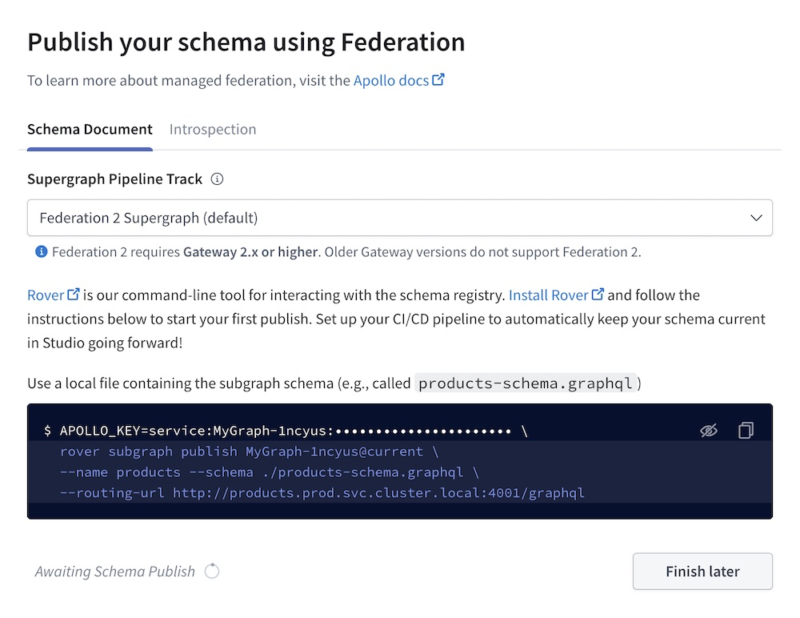

import ObtainGraphApiKey from '../shared/obtain-graph-api-key.mdx';
import RegisterCli from '../shared/register-cli.mdx';
import RegisterFederatedCli from '../shared/register-federated-cli.mdx';

Hello! This article gets you up and running with Apollo Studio. None of this setup requires a paid plan.

You can use Studio with any GraphQL server. Certain features (such as [metrics reporting](./metrics/usage-reporting/)) are currently best supported by [Apollo Server](/apollo-server/).

<VariantPicker/>

## 1. Create your account

You can sign up for Studio with either your GitHub identity or a username and password.

1. Go to [studio.apollographql.com](https://studio.apollographql.com/) and click **Let's get started**.

2. Select **Register a deployed graph**.

2. Complete the signup flow, which includes:

   - Creating an [organization](./org/organizations/) that you can invite teammates to

   - [Selecting a plan](https://www.apollographql.com/pricing/) for your organization (the Free plan is always free, and the Team plan provides a free trial of paid features)

## 2. Create your first graph

In Studio, each **graph** has an associated GraphQL schema. Your first graph will use your GraphQL server's schema.

1. Visit [studio.apollographql.com](https://studio.apollographql.com/) again. Now that you have an account, this opens Studio to your newly created organization.

2. Click **New Graph** in the top right. The following dialog appears:

    

3. Specify an organization and title for your graph.

4. Leave the graph's **Graph type** as **Deployed**.

    - [Development graphs](./dev-graphs/) can be useful for local development, but we'll create a standard deployed graph to start.

5. Specify your **Graph Architecture**:

    * If your graph uses [Apollo Federation](/federation/), leave this as **Supergraph (default)**.
    * Otherwise (i.e., your graph consists of a single GraphQL server), switch this to **Monolith**.

6. Click **Next**. A dialog like the following appears (the details differ depending on which **Graph Architecture** you're using):

    

7. **If you're using Apollo Federation,** select the version you're using from the **Supergraph Pipeline Track** dropdown.

Now you're ready to publish your graph's schema to Apollo!

## 3. Publish your schema

The **Apollo schema registry** powers nearly every feature of Apollo Studio, along with helpful developer tools like our VS Code extension.

To register your schema, first obtain a **graph API key** for your graph:

<ObtainGraphApiKey />

After you obtain your API key, select the registration method that corresponds to your graph's architecture:

<ExpansionPanel title="Apollo Server WITHOUT Apollo Federation">

Apollo Server supports a feature called **schema reporting** that enables it to register its schema automatically on startup.

Set your graph API key as the value of the `APOLLO_KEY` environment variable in your server's environment, and set the `APOLLO_SCHEMA_REPORTING` environment variable to `true`.

If you're using the [`dotenv`](https://www.npmjs.com/package/dotenv) library, you can add these definitions to the `.env` file in your project's root directory, like so:

```bash {1-2} title=".env"
APOLLO_KEY=YOUR_KEY_HERE
APOLLO_SCHEMA_REPORTING=true
APOLLO_GRAPH_ID=your-graph-id
```

> **Important:** If you use a `.env` file, **do not commit it to version control**. Always use `.gitignore` or a similar method to omit files that include secret credentials.
>
> You can alternatively provide these values to Apollo Server via the [`apollo` constructor option](https://www.apollographql.com/docs/apollo-server/api/apollo-server/#apollo), but again, **do not add secret credentials to your application source**.

Now whenever your server starts up, it automatically registers its schema with the Apollo schema registry _and_ begins pushing metrics to Apollo Studio!

> We would love for other GraphQL servers to support schema reporting too! If you're interested in implementing support, [the protocol is documented here.](./schema/schema-reporting-protocol/)

</ExpansionPanel>

<ExpansionPanel title="Another GraphQL server WITHOUT Apollo Federation">

<RegisterCli />

</ExpansionPanel>

<ExpansionPanel title="Any GraphQL server WITH Apollo Federation">

> After you complete this step, you should also complete the remaining steps in [Setting up managed federation](https://www.apollographql.com/docs/federation/managed-federation/setup/).

<RegisterFederatedCli />

> After you complete this step, complete the remaining steps in [Setting up managed federation](https://www.apollographql.com/docs/federation/managed-federation/setup/).

</ExpansionPanel>

After you register your schema, select your graph in [Apollo Studio](https://studio.apollographql.com/) and open its Fields tab. You'll see a list of all of your schema's types and fields.

## 4. Explore your schema

Now that your schema's registered, you're ready to try out one of Studio's most powerful features: the **Explorer**. This tool provides visibility into your entire schema and helps you build and run queries against it.

From [Apollo Studio](https://studio.apollographql.com/), select your graph and open its Explorer tab. Complete its Getting Started steps to see what it can do!

> [Learn more about the Apollo Studio Explorer](./explorer/explorer/)

## 5. Connect to Slack

Studio can connect to your Slack workspace to send a notification whenever your registered schema is updated. If you [configure metrics reporting](#6-configure-metrics-reporting), Studio can also send you a daily metrics report.

[Set up notifications](./notification-setup/)

## 6. Configure metrics reporting

Your GraphQL server can push operation metrics to Apollo Studio, enabling you to visualize and improve performance.

To set up metrics reporting, read [Sending metrics to Apollo Studio](./metrics/usage-reporting/).

## 7. Set up continuous delivery

Your schema is now registered with Studio, and your server is pushing operation metrics!

However, to get the most out of Studio, you need to _re_-register your server's schema every time it changes. The easiest way to do this is to make schema registration part of every deployment in your application's continuous delivery flow.

**If you set up schema reporting** in [Step 3](#3-register-your-schema) (the first schema registration option), Apollo Server automatically registers your schema every time it starts up, and no additional setup is required.

**If you registered your schema with the Apollo CLI**, see [Registering with continuous delivery](./schema/cli-registration/#registering-with-continuous-delivery) for an example.

## Next steps

The best way to fully familiarize yourself with Studio is to use it! Visit [studio.apollographql.com](https://studio.apollographql.com/) and check out the all the various views and what they provide.

The docs also have plenty of information on the features available for plans of all types, including:

- [Schema checks](./schema-checks)
- [Segmenting metrics by client types and versions](./metrics/client-awareness/)
- [Integration with Datadog](./metrics/datadog-integration/)
- [Data privacy](./data-privacy)

If you'd like to have a conversation about Apollo Studio and how it can help your organization, [please contact us](https://www.apollographql.com/contact-sales).
