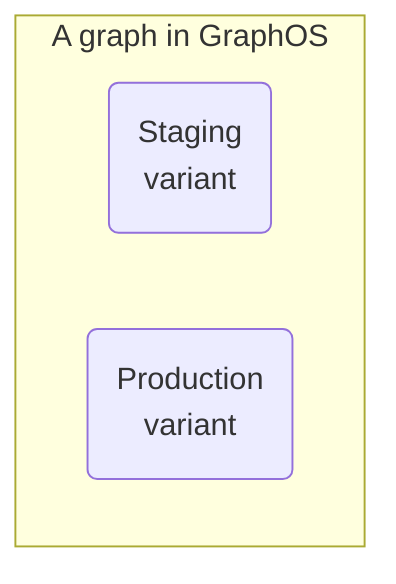
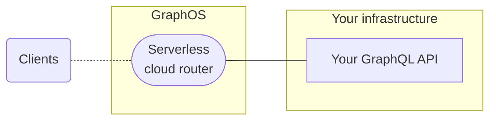
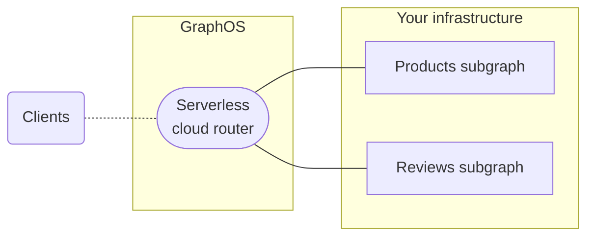
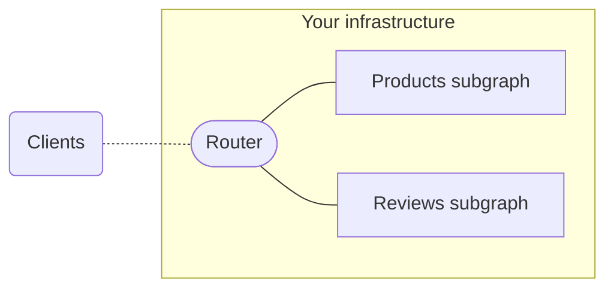
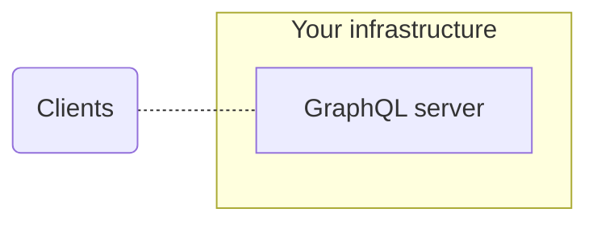
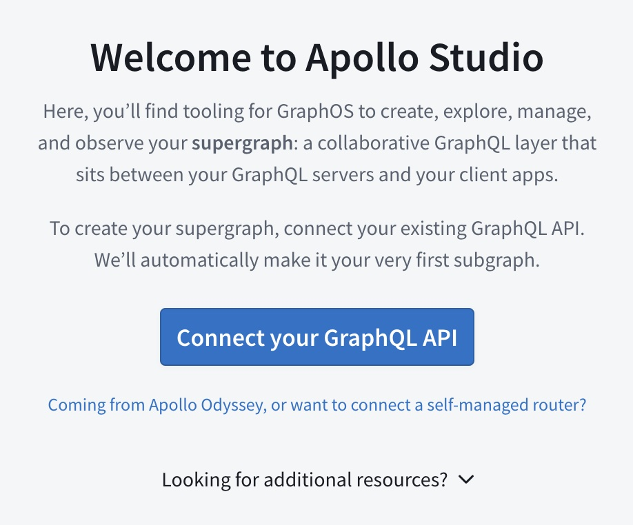
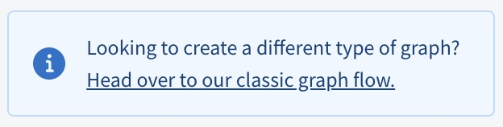

As its name suggests, **GraphOS** is a platform for building and managing **graphs**. Each graph corresponds to a GraphQL service in your organization.

A GraphQL service usually runs in more than one environment (such as staging or production), so every graph in GraphOS has one or more **variants** that each correspond to one environment:

Each variant of a graph keeps track of its own separate GraphQL schemas and operation metrics.

## Graph types

Every graph in GraphOS is one of three graph types:

| Graph type | Description |
|------------|-------------|
| [Cloud supergraph](#cloud-supergraphs) | A federated supergraph with a GraphOS-provisioned router, along with one or more subgraphs running in your infrastructure. |
| Self-deployed supergraph | A federated supergraph with a router _and_ one or more subgraphs running in your infrastructure. |
| Monograph | **Not recommended.** A single GraphQL service running in your infrastructure with _no_ router. |

- Cloud supergraph
- Self-deployed supergraph
- Monograph (not recommended)

### Cloud supergraphs

Most of the graphs created with GraphOS are called **cloud supergraphs**. For every variant of a cloud supergraph, GraphOS provisions and manages a **router** that acts as the graph's public endpoint. Application clients communicate with this endpoint instead of communicating directly with your API:

The router automatically reports certain operation metrics to GraphOS, so you don't need to configure this reporting in your GraphQL servers.

> [Learn more about cloud routing.](../cloud-routing/overview/)

Cloud supergraphs use an architecture called [Apollo Federation](/federation/). With federation, you can distribute your graph's capabilities across _multiple_ GraphQL services, which are known as **subgraphs**. The cloud router can execute client operations across multiple subgraphs as needed:

Even if your API currently uses only _one_ GraphQL server, a cloud supergraph helps you add more subgraphs later as your organization grows.

#### Creating a cloud supergraph

To learn how to create a cloud supergraph with Apollo Studio, see the [quickstart](../getting-started/).

### Self-deployed supergraphs

> **If you need to host your supergraph's router in your own infrastructure** (this isn't necessary for most organizations), you might benefit from an Enterprise plan. Please [contact us](https://www.apollographql.com/contact-sales/).
>
> Alternatively, you can create a [classic graph](#classic-graphs) instead of a cloud supergraph. Classic graphs are _not_ recommended except for use cases that require them.

With a self-deployed supergraph, GraphOS does _not_ provision a router for your supergraph. Instead, you deploy your supergraph's router in your own infrastructure:

Your self-deployed router is usually an instance of the [Apollo Router](/router/) (cloud supergraphs use the Apollo Router under the hood).

### Monographs

Alternatively, classic graphs can consist of a single GraphQL server with _no_ router (also known as a **monograph**):

A monograph often introduces scaling issues as it grows in complexity. We _strongly_ recommend a federated architecture for all business-critical graphs.

## Variants

To distinguish between instances of the same graph running in different environments (such as staging and production), you define multiple **variants** of your graph. Each variant has its own schema, along with its own change history and metrics:

### Adding a variant

To add a variant to your graph, you [publish a schema](../schema/cli-registration) to the graph and include the variant's name in the command. If a variant with the specified name doesn't exist yet, Studio creates it!

## Publishing schemas

See [Publishing schemas to GraphOS](../schema/cli-registration/).

## Creating a non-cloud graph

> ⚠️  Deploying and maintaining your own router can introduce unnecessary complexity to your graph. Create a classic graph only if your use case requires hosting your router in your own infrastructure.

1. Go to your organization's **Supergraphs** tab in [Apollo Studio](https://studio.apollographql.com/).

    - **If you see this dialog...**

        

        ...then click **Coming from Apollo Odyssey, or want to connect a self-managed router?**

    - **Otherwise,** find the following notice in the bottom-right corner of the page:

        

        Click **Head over to our classic graph flow**.

    In either case, Studio displays the following dialog for creating a classic graph:

    

2. Specify an organization and title for your graph.

3. Specify your **Graph Architecture**:

    * If your graph uses [Apollo Federation](/federation/), leave this as **Supergraph (default)**.
    * Otherwise (i.e., your graph consists of a single GraphQL server), switch this to **Monolith**.

4. Click **Next**. A dialog like the following appears (the details differ depending on which **Graph Architecture** you're using):

    

5. **If you're using Apollo Federation,** select the version of federation you're using from the **Supergraph Pipeline Track** dropdown.

Your classic graph has been created, and your Studio organization now includes a **Classic Graphs** tab in addition to its **Supergraphs** tab.

Next, you need to publish your classic graph's schema to Apollo using the Rover CLI. For details, see [Publishing schemas to Apollo Studio](../schema/cli-registration).
