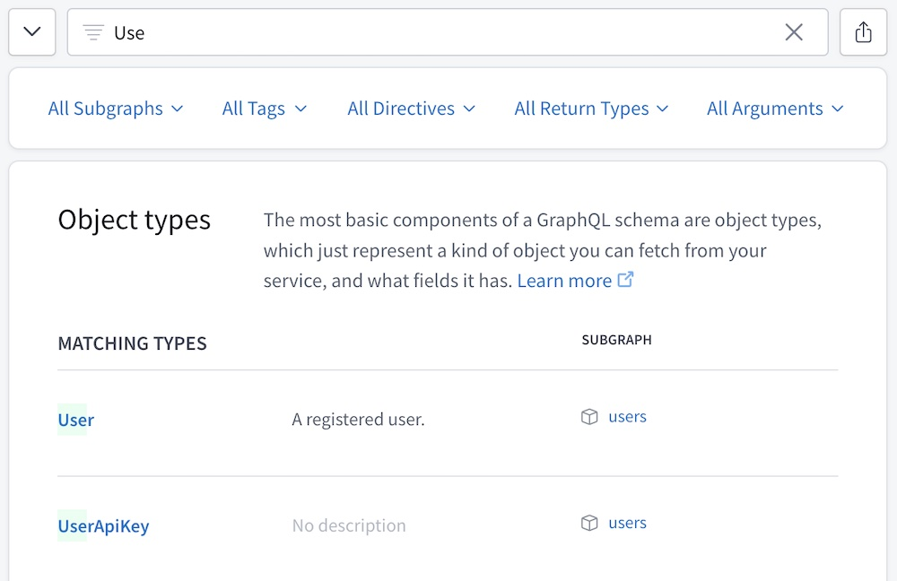

As its name suggests, **GraphOS** is a platform for building and managing **graphs**. Each graph corresponds to a GraphQL service in your organization.

A GraphQL service usually runs in more than one environment (such as staging or production), so every graph in GraphOS has one or more **variants** that each correspond to one environment:


Each variant of a graph keeps track of its own separate GraphQL schemas and operation metrics.

## Cloud supergraphs

Most of the graphs you create with GraphOS are called **cloud supergraphs**. For every variant of a cloud supergraph, GraphOS provisions and manages a serverless **cloud router** that acts as the graph's public endpoint. Application clients communicate with this endpoint instead of communicating directly with your API:


The cloud router automatically reports certain operation metrics to GraphOS, so you don't need to configure this reporting in your GraphQL servers.

> [Learn more about cloud routing.](../cloud-routing/overview/)

Cloud supergraphs use an architecture called [Apollo Federation](/federation/). With federation, you can distribute your graph's capabilities across _multiple_ GraphQL services, which are known as **subgraphs**. The cloud router can execute client operations across multiple subgraphs as needed:


Even if your API currently uses only _one_ GraphQL server, a cloud supergraph helps you add more subgraphs later as your organization grows.

> **If you need to host your supergraph's router in your own infrastructure** (this isn't necessary for most organizations), you might benefit from an Enterprise plan. Please [contact us](https://www.apollographql.com/contact-sales/).
>
> Alternatively, you can create a [classic graph](#classic-graphs) instead of a cloud supergraph. Classic graphs are _not_ recommended except for use cases that require them.

### Creating a cloud supergraph

To learn how to create a cloud supergraph with Apollo Studio, see the [quickstart](../getting-started/).

## Publishing schemas

See [Publishing schemas to GraphOS](../schema/cli-registration/).

## Viewing graph details

After selecting an organization in Apollo Studio, click on a particular graph variant to view its README, schema, data, and settings. All of a Studio organization's members can access the data and settings for every graph that belongs to that organization.

> Enterprise accounts can set [member roles](./members/#organization-wide-member-roles) to configure fine-grained access for individual members of their organization.

### The README page

When a user opens one of your graph's variants in Apollo Studio, its **README page** is shown:


Like the typical homepage for a Git repository, this page displays a Markdown-based README that you can edit with any content you like.

> **Note:** Only organization members with the [**Org Admin**, **Graph Admin**, **Contributor**, or **Documenter** role](./members/) can edit a variant's README. If a variant is [protected](#protected-variants-enterprise-only), **Contributor**s _cannot_ edit its README.

**Each variant has its own README.** If you edit one variant's README, those edits are _not_ applied to other variants. Among other uses, this enables you to provide different information to external consumers in a [public variant](../graph-access-permissions/#public-variants).

#### Supported Markdown

The README supports all [basic Markdown syntax](https://www.markdownguide.org/cheat-sheet/#basic-syntax) and _most_ [extended syntax](https://www.markdownguide.org/cheat-sheet/#extended-syntax) (including tables, code blocks, and footnotes).

You can define a GraphQL code block with the following syntax:

    ```graphql
    query MyQuery {
      users {
        id
        name
      }
    }
    ```

This renders the code block with buttons you can use to copy an operation or open it in the Explorer:


#### README shortcodes

The README supports a set of shortcodes you can use to populate it with data that's specific to your variant, such as the graph's name and the variant's graph ref:

```md
# Overview of {{ graph.name }}

Graph ref: {{ graph.ref }}
```

For a list of all supported shortcodes, click **Graph shortcodes** in the bottom-left corner of the README editor.

### Exploring your schema

Apollo Studio provides helpful views for exploring your registered schema:

* [The Explorer](#the-explorer), which helps you build new operations against your graph
* [The Schema page](#the-schema-page), which enables you to filter your schema's type and field definitions (and also view your schema's raw SDL)

#### The Explorer

Apollo Studio provides a powerful **Explorer** IDE that helps you visualize your graph and run queries against it. It's available from your graph's Explorer tab in Studio.

> [Learn about the Explorer.](../explorer/explorer/)

#### The Schema page

The Schema page lists the different kinds of definitions in your schema (objects, scalars, etc.):


Select a kind of definition to view a table of all corresponding types:


Each type definition in the table includes:

* The type's name
  * You can click the name to view additional details for the type (such as fields for an object, or possible types for a union).
* The type's description (if your schema includes one)
* Which subgraphs define the type (if you have a federated supergraph)
  * Users with the **Consumer** role can't view subgraph details.

##### Filtering your schema

The top of the Schema page provides a **Filter Schema** box you can use to find types and fields that match a set of filters:



> * Click the arrow button to the left of the filter box to show/hide the filter selection dropdowns.
> * Click the button to the right of the filter box to copy a shareable URL for your currently active set of filters (you can also copy your browser's address bar directly).

Any filters you set remain active as you move between definitions on the Schema page.

You can filter your schema definitions by type/field name (as shown above), along with any combination of the following:

<table class="field-table">
  <thead>
    <tr>
      <th>Filter</th>
      <th>Description</th>
      <th>Example</th>
    </tr>
  </thead>

<tbody>

<tr>
<td>

##### `subgraph`

</td>
<td>

Include results defined in any of the specified subgraphs.

Valid only for federated supergraphs.
</td>
<td>

`subgraph:products,reviews`

</td>
</tr>

<tr>
<td>

##### `tag`

</td>
<td>

If your graph uses the `@tag` directive, include results that have a `@tag` with any of the specified names. If viewing a table of objects, also include objects with at least one _field_ that has a specified `@tag`.

If your graph doesn't use the `@tag` directive, this filter is not available.

</td>
<td>

`tag:internal,experimental`
</td>
</tr>

<tr>
<td>

##### `directive`

</td>
<td>

Include results that have any of the specified directives applied. If viewing a table of objects, also include objects with at least one _field_ that has a specified directive.

</td>
<td>

`directive:deprecated,unused`
</td>
</tr>

<tr>
<td>

##### `returnType`

</td>
<td>

Include results with any of the specified return types. If viewing a table of objects, include objects with at least one _field_ that has a specified return type.

This filter includes all fields that return a particular type, regardless of each field's nullability or whether it returns a list. For example, if you specify `returnType:Int`, the filter includes fields that return any of `Int`, `Int!`, or `[Int]`.

</td>
<td>

`returnType:Int,String`
</td>
</tr>

<tr>
<td>

##### `argument`

</td>
<td>

Include results that take a GraphQL argument with any of the the specified names. If viewing a table of objects, include objects with at least one _field_ that takes a specified argument.

</td>
<td>

`argument:offset,limit`
</td>
</tr>

</tbody>

</table>

###### Filtering rules

* If you list multiple possible values in a single filter, those values use "OR" logic.
    * For example, if you filter by `subgraph:products,reviews` the result includes definitions from each subgraph.
* If you apply multiple types of filters, those filters use "AND" logic.
    * For example, if you filter by `subgraph:products` and `returnType:Int`, the result includes only definitions that fulfill _both_ criteria.
* Currently, it isn't possible to use "AND" logic for multiple filters of the _same_ type.
    * For example, it isn't possible to filter by `subgraph:products` "AND" `subgraph:reviews` to include only definitions that are present in _both_ subgraphs.

### Tracking schema changes

The Changelog page in Studio displays a timeline of changes made to your graph's schema:


**Only schema changes that you publish to Studio are included in this timeline**, which is one of the most important reasons to [include schema publishing in your continuous delivery pipeline](../schema/cli-registration/#publishing-with-continuous-delivery).

## Variants

To distinguish between instances of the same graph running in different environments (such as staging and production), you define multiple **variants** of your graph. Each variant has its own schema, along with its own change history and metrics:


### Adding a variant

To add a variant to your graph, you [publish a schema](../schema/cli-registration) to the graph and include the variant's name in the command. If a variant with the specified name doesn't exist yet, Studio creates it!

## Graph administration

### Transferring ownership

You can transfer a graph to a different Studio organization you belong to
by visiting the graph's Settings page and changing the **graph owner**.

### Deleting a graph

> ⚠️ **Deleting a graph cannot be undone!**
>
> If you delete a cloud supergraph, all of its GraphOS-managed routers are **deprovisioned**.

You can delete a graph from Studio by visiting its Settings page and clicking
**Delete Graph**.

## Classic graphs

In addition to creating [cloud supergraphs](#cloud-supergraphs), you can create **classic graphs** in Apollo Studio.

> ⚠️ **Classic graphs are not recommended for most organizations.** Deploying and maintaining your own router can introduce unnecessary complexity to your graph. Create a classic graph only if your use case requires hosting your router in your own infrastructure.

Classic graphs do _not_ include an Apollo-managed router. This means if you have a [federated graph](/federation/), you need to deploy, configure, and manage its router yourself:


Your self-managed router is usually an instance of the [Apollo Router](/router/) (cloud supergraphs use the Apollo Router under the hood).

Alternatively, classic graphs can consist of a single GraphQL server with _no_ router (also known as a **monograph**):


A monograph often introduces scaling issues as it grows in complexity. We _strongly_ recommend a federated architecture for all business-critical graphs.

### Creating a classic graph

> ⚠️ **Classic graphs are not recommended for most organizations.** Deploying and maintaining your own router can introduce unnecessary complexity to your graph. Create a classic graph only if your use case requires hosting your router in your own infrastructure.

1. Go to your organization's **Supergraphs** tab in [Apollo Studio](https://studio.apollographql.com/).

    - **If you see this dialog...**

        

        ...then click **Coming from Apollo Odyssey, or want to connect a self-managed router?**

    - **Otherwise,** find the following notice in the bottom-right corner of the page:

        

        Click **Head over to our classic graph flow**.

    In either case, Studio displays the following dialog for creating a classic graph:

    

2. Specify an organization and title for your graph.

3. Specify your **Graph Architecture**:

    * If your graph uses [Apollo Federation](/federation/), leave this as **Supergraph (default)**.
    * Otherwise (i.e., your graph consists of a single GraphQL server), switch this to **Monolith**.

4. Click **Next**. A dialog like the following appears (the details differ depending on which **Graph Architecture** you're using):

    

5. **If you're using Apollo Federation,** select the version of federation you're using from the **Supergraph Pipeline Track** dropdown.

Your classic graph has been created, and your Studio organization now includes a **Classic Graphs** tab in addition to its **Supergraphs** tab.

Next, you need to publish your classic graph's schema to Apollo using the Rover CLI. For details, see [Publishing schemas to Apollo Studio](../schema/cli-registration).
