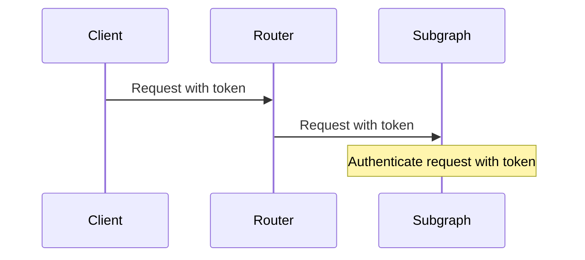
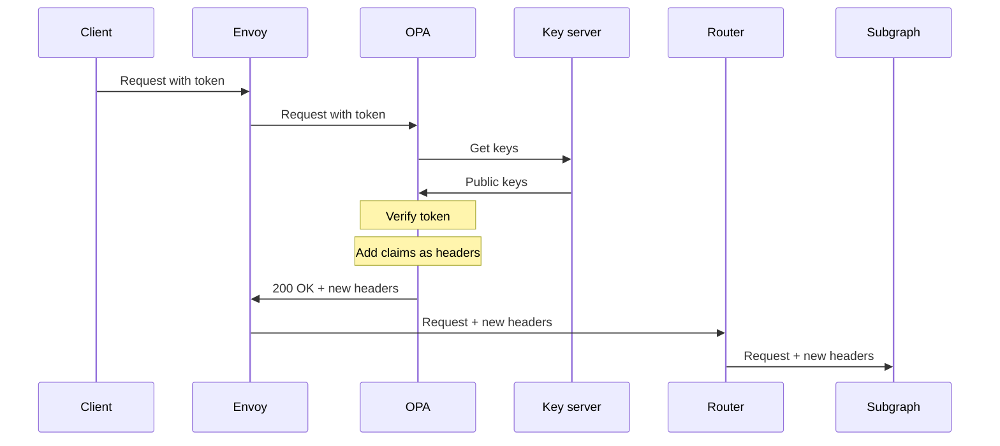
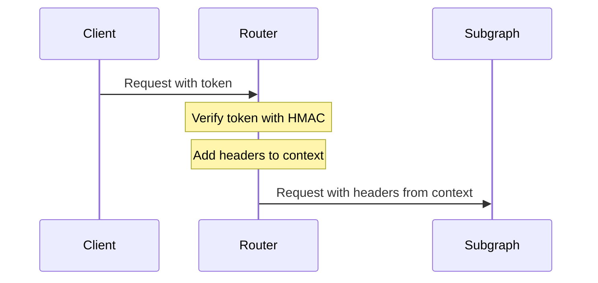

> Self-hosting the Apollo Router is limited to Apollo Enterprise plans. Other plan types use [managed cloud routing with GraphOS](/graphos/routing/cloud/).
>
> [Learn about Apollo plans.](https://www.apollographql.com/pricing/)

When using the Apollo Router as the entry point to your federated supergraph, you have a few options for authenticating incoming client requests:

- [Delegate authentication to your subgraphs.](#authenticate-in-subgraphs)
- [Add an ingress filter](#add-an-ingress-filter) to your supergraph.
- [Create a custom router plugin](#create-a-custom-plugin).

## Authenticate in subgraphs

The simplest authentication strategy is to delegate authentication to your individual subgraph services.



To pass `Authentication` headers from client requests to your subgraphs, add the following to your router's YAML configuration file:

```yaml
headers:
  all:
    - propagate:
        named: authorization
```

**Pros**

- Requires minimal changes to your router configuration.
- Can take advantage of existing authentication code in subgraphs, which is often tied to authorization logic for data sources.

**Cons**

- Each subgraph that contributes to resolving a request needs to authenticate that request.
- If subgraphs are written in different languages, maintaining consistent authentication code for each is complex.

## Add an ingress filter

Many ingresses and generic API gateways provide authentication features.

[Envoy](https://www.envoyproxy.io/) is a powerful proxy with [built-in support for authenticating and authorizing requests with an external service](https://www.envoyproxy.io/docs/envoy/v1.22.0/intro/arch_overview/security/ext_authz_filter). See this [demo project](https://github.com/apollosolutions/router-ext-authz) for an example that uses [Open Policy Agent](https://www.openpolicyagent.org/) as the Policy Decision Point.



**Pros**

- Requires minimal changes to your router configuration.
- Enforces authentication at a single point, reducing complexity relative to authenticating in each subgraph.
- The authorization service can execute arbitrary logic. For example, it can extract claims from a JSON Web Token (JWT), converting them to headers that are forwarded to subgraphs.
- Envoy (as well as Open Policy Agent) typically run as sidecars within the same pod as the router, so requests between services are very fast.

**Cons**

- Does not support both authenticated and unauthenticated APIs (for example, a `login` mutation).
- Requires Envoy and a control plane for configuring the `ext_authz` filter.

## Create a custom plugin

The Apollo Router can authenticate requests in a custom plugin. For a demonstration of JWT authentication, see [this example in the router repository](https://github.com/apollographql/router/tree/main/examples/jwt-auth).



**Pros**

- Enforces authentication at a single point, reducing complexity relative to authenticating in each subgraph.
- Doesn't require additional services, sidecars, or control planes.
- The plugin can execute arbitrary logic. For example, it can extract claims from a JWT, attaching them to the request context so they can be forwarded to subgraphs.

**Cons**

- Requires extensive customization of the router in Rust.
