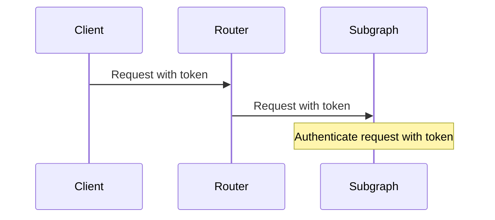
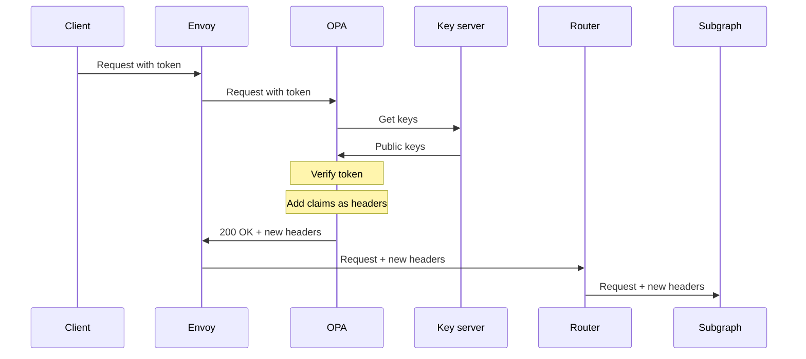
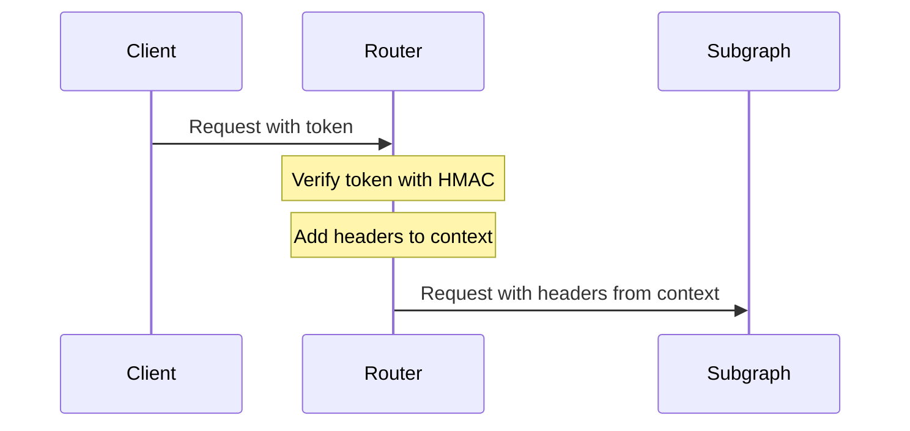

This note describes options for authentication when using Apollo Router.

## Authenticate in subgraphs

The simplest architecture is to delegate authentication to subgraph services.



The YAML configuration for forwarding the `Authorization` header:

```yaml
headers:
  all:
    - propagate:
        named: authorization
```

**Pros**

- Requires very little Router configuration.
- Can leverage existing authentication code, which may be closely tied to authorization logic close to data sources.

**Cons**

- Each subgraph re-authenticates the actor with each subgraph fetch.
- If subgraphs are written in different languages, maintaining authentication code for each is not ideal.

## Ingress filter

Many ingresses or generic API gateways have authentication features.

[Envoy](https://www.envoyproxy.io/) is a powerful proxy with [built-in support for authenticating and authorizing requests with an external service](https://www.envoyproxy.io/docs/envoy/v1.22.0/intro/arch_overview/security/ext_authz_filter). See this [demo project](https://github.com/apollosolutions/router-ext-authz) for an example that uses [Open Policy Agent](https://www.openpolicyagent.org/) as the Policy Decision Point.



**Pros**

- Requires very little Router configuration.
- Enforces authentication at ingress instead of in each subgraph.
- The authorization service can execute arbitrary logic. For example, it can extract claims from a JSON Web Token (JWT), converting them to headers that are forwarded to subgraphs.
- Envoy (as well as Open Policy Agent) typically run as sidecars within the same pod as the router, so requests between services are very fast.

**Cons**

- Does not support both authenticated and unauthenticated APIs (for example, a `login` mutation).
- Requires Envoy and a control plane for configuring the `ext_authz` filter.

## Router extension

The Router can authenticate requests in a custom plugin. See this [example in the router repository](https://github.com/apollographql/router/tree/main/examples/jwt-auth) for an demonstration of JWT authentication.



**Pros**

- Enforces authentication at ingress instead of in each subgraph.
- Doesn't require additional services, sidecars, or control planes.
- The plugin can execute arbitrary logic. For example, it can extract claims from a JWT, attaching them to the request context so they can be forwarded to subgraphs.

**Cons**

- Requires extensive customization of the Router in Rust.
