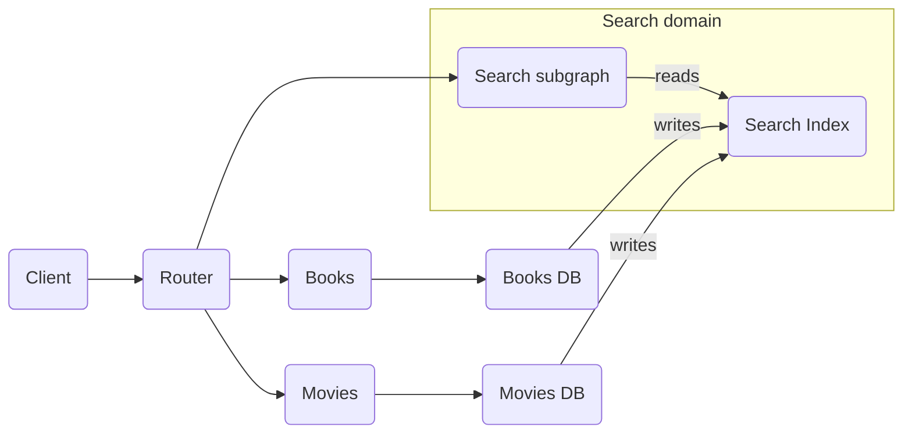

A supergraph helps you orchestrate data fetches across multiple domains, however it _doesn't_ automatically solve some commonly encountered problems in distributed architectures:

- Searching across a variety of types stored in multiple data sources
- Combining lists of multiple types from multiple sources into a _single_ list, especially when paginated
- Filtering a list based on attributes defined in various data sources
- Deriving data from an aggregate of multiple data sources

Although it's sometimes possible to generate query plans to support these use cases using the `@requires` directive, it's almost always better to provide this functionality in a new system, such as a search index.

## Example: search

Given an operation to search across both books and movies, we want to return a polymorphic list of books and movies that match the search term.

```graphql
query SearchEverything($query: String!) {
  search(query: $query) {
    ... on Book {
      title
      authors {
        name
      }
    }
    ... on Movie {
      title
      directors {
        name
      }
    }
  }
}
```

If different subgraphs define the `Book` type and the `Movie` type, the question is: which subgraph provides the `Query.search` root field?

For a given operation, the query planner resolves each field in a single subgraph. This invariant holds true _even if multiple subgraphs define a particular field_.

```graphql title="Books subgraph"
type Query {
  search(query: String!): [Product] @shareable
}

interface Product {
  title: String
}

type Book implements Product {
  title: String
  authors: [Person]
}
```

```graphql title="Movies subgraph"
type Query {
  search(query: String!): [Product] @shareable
}

interface Product {
  title: String
}

type Movie implements Product {
  title: String
  directors: [Person]
}
```

The query planner deterministically chooses **one** subgraph to resolve the `Query.search` field. (It calculates all valid query plans for the operation and chooses the "cheapest" one.)

If the query planner chooses `Query.search` within the Books subgraph, that subgraph can provide only books, not movies.

To resolve this, we _could_ expand the Books subgraph schema to include the `Movie` definition and add the `@key` directive to create a join to the Movies subgraph, like so:

```graphql
type Movie implements Product @key(fields: "id") {
  id: ID!
  title: String @external
}
```

Now the Books subgraph can return `Movie` instances, but that means it needs access to the data source for movie data. This breaks the _separation of concerns_ we rely on to create dividing lines between domains and subgraphs.

## Solution: create a new subgraph

When product requirements don't fit cleanly into a single domain, it often indicates that we need a _new_ domain. Let's design a system that includes a new **search domain**. This includes a search index and a Search subgraph that provides the `Query.search` root field.



This pattern works for all the use cases listed above:

- **Search**: A search index (such as Elasticsearch) is the most efficient way to search through a variety of data types and return only the most relevant results.
- **Combining lists**: A combined index is the most efficient way to list and paginate through a variety of data types. Fetching multiple lists and combining them on the fly usually means overfetching pages of data and throwing data away when it isn't part of the result.
- **Filtering**: A data store can contain indices on various attributes of a variety of data types and efficiently filter results on those attributes.
- **Derived aggregates**: Many data stores can efficiently compute a derived value such as `AVG(products.rating)`, or we can write precomputed derived value to a data store.

We can remove the `Query.search` root field from both the Books and Movies subgraphs and instead add it to our new Search subgraph:

```graphql title="Search subgraph"
type Query {
  search(query: String!): [Product]
}

interface Product {
  id: ID!
  title: String
}

type Book implements Product @key(fields: "id") {
  id: ID!
  title: String @shareable
}

type Movie implements Product @key(fields: "id") {
  id: ID!
  title: String @shareable
}
```

The query plan first uses the **Search** subgraph to return a polymorphic list of `Book`s and `Movie`s with their `id` and `title` fields. Then in parallel, it joins with the Books subgraph to fetch `Book.authors` and joins with the Movies subgraph to fetch `Movie.directors`.

<ExpansionPanel title="Click to expand query plan">

```
QueryPlan {
  Sequence {
    Fetch(service: "search") {
      {
        search(query: $query) {
          __typename
          ... on Book {
            __typename
            id
            title
          }
          ... on Movie {
            __typename
            id
            title
          }
        }
      }
    },
    Parallel {
      Flatten(path: "search.@") {
        Fetch(service: "books") {
          {
            ... on Book {
              __typename
              id
            }
          } =>
          {
            ... on Book {
              authors {
                name
              }
            }
          }
        },
      },
      Flatten(path: "search.@") {
        Fetch(service: "movies") {
          {
            ... on Movie {
              __typename
              id
            }
          } =>
          {
            ... on Movie {
              directors {
                name
              }
            }
          }
        },
      },
    },
  },
}
```

</ExpansionPanel>

Note that the Search subgraph provides a minimal set of fields. We don't need to duplicate the entire `Book` and `Movie` types in our Search domain, just the fields we want to search on.

### Tradeoffs

As you'd expect, adding an entirely new domain to your supergraph has its tradeoffs:

#### The question of ownership

In the Search subgraph example, we've introduced multiple new services that require ongoing development, maintenance, and support. It doesn't make sense for our existing Books and Movies teams to take on this extra burden. Usually, we want to spin up an entirely new team to hold the pager and deployment keys for our new subgraphs and data stores.

#### Eventual consistency

Replicating data from the canonical Books and Movies databases into the Search index inevitably involves replication lag, leading to eventually consistent results between our subgraphs.

How we handle that lag depends on our business requirements. If the results from `Query.search` must be "internally" consistent, we can denormalize data using `@shareable` and `@provides`. We demonstrated this by providing the `title` fields from the Search subgraph and its backing index.

If the results must be accurate with our canonical data source, we can make sure the query planner fetches those fields from their respective subgraphs. The `Book.authors` and `Movie.directors` fields exemplify that pattern.
