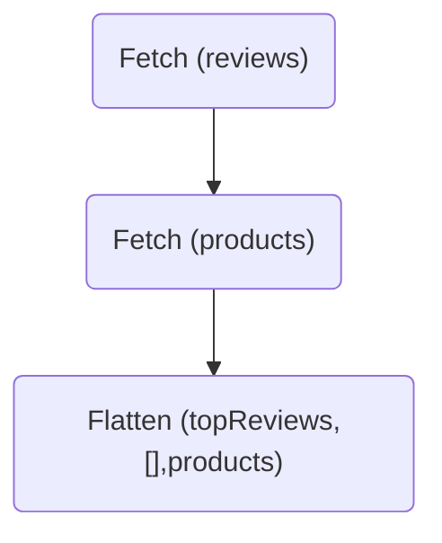

GraphQL developers quickly encounter the infamous "N+1 query problem" with operations that return a list:

```graphql
query TopReviews {
  topReviews(first: 10) {
    id
    rating
    product {
      name
      imageUrl
    }
  }
}
```

In a monolithic GraphQL server, the execution engine takes these steps:

1. Resolve the `Query.topReviews` field, which returns a list of `Review`s.
2. For each `Review` in the list, resolve the `Review.product` field.

If the `Query.topReviews` field returns 10 reviews, then the executor resolves `Review.product` field 10 times. If the `Reviews.product` field makes a database or REST query for a single `Product`, then we'll see 10 unique calls to the data source. This is suboptimal for the following reasons:

- It's more efficient to fetch the 10 products in a single query (e.g. `SELECT * FROM products WHERE id IN (<product ids>)`).
- If any reviews refer to the _same_ product, then we're wasting resources fetching something we already have.

The solution for monolithic GraphQL APIs is the [dataloader](https://github.com/graphql/dataloader) pattern. All GraphQL server implementations support this pattern. The [Apollo Server documentation explains how to use the JavaScript implementation](/apollo-server/data/fetching-data#batching-and-caching) in Node.js servers.

## The N+1 problem in a federated graph

Consider the same `TopReviews` operation, but we've implemented the `Review` and `Product` types in separate subgraphs:

<ExpansionPanel title="Click to expand subgraph schemas">

```graphql title="Reviews subgraph"
type Query {
  topReviews(first: Int): [Review]
}

type Review {
  id: ID
  rating: Int
  product: Product
}

type Product @key(fields: "id") {
  id: ID
}
```

```graphql title="Products subgraph"
type Product @key(fields: "id") {
  id: ID!
  name: String
  imageUrl: String
}
```

</ExpansionPanel>

Fortunately, query planning handles N+1 queries for entities like the `Product` type by default! The query plan for this operation works like this:

1. First, we `Fetch` the list of `Review`s from the Reviews subgraph using the root field `Query.topReviews`. We also ask for the `id` of each associated product.
2. Next, we extract the `Product` _entity references_ and `Fetch` them in a **batch** to the Products subgraph's `Query._entities` root field.
3. After we get back the `Product` entities, we merge them into the list of `Review`s, indicated by the `Flatten` step.



<ExpansionPanel title="Click to expand query plan">

```
QueryPlan {
  Sequence {
    Fetch(service: "reviews") {
      {
        topReviews(first: 10) {
          id
          rating
          product {
            __typename
            id
          }
        }
      }
    },
    Flatten(path: "reviews.@") {
      Fetch(service: "products") {
        {
          ... on Product {
            __typename
            id
          }
        } =>
        {
          ... on Product {
            name
            imageUrl
          }
        }
      },
    },
  },
}
```

</ExpansionPanel>

## Writing efficient entity resolvers

In most subgraph implementations (including [`@apollo/subgraph`](/apollo-server/using-federation/api/apollo-subgraph/)), we don't write the `Query._entities` resolver directly. Instead, we use the [reference resolver API](/federation/entities#2-define-a-reference-resolver) for resolving an individual entity reference:

```js
const resolvers = {
  Product: {
    __resolveReference(productRepresentation) {
      return fetchProductByID(productRepresentation.id);
    }
  }
};
```

The motivation for this API relates to a subtle, critical aspect of the [subgraph specification](/federation/subgraph-spec): **the order of resolved entities must match the order of the given entity references**. If we return entities in the wrong order, those fields are merged with the wrong entities and we'll have incorrect results. To avoid this issue, most subgraph libraries handle entity order for you.

This does reintroduce the N+1 query problem: in the example above, we'll call `fetchProductByID` once for each entity reference.

Fortunately, the solution is exactly the same in a monolithic graph: dataloaders. **In nearly every situation, reference resolvers should use a dataloader.**

```js
const resolvers = {
  Product: {
    __resolveReference(product, context) {
      return context.dataloaders.products(product.id);
    }
  }
};
```

Now, when the query planner calls the Products subgraph with a batch of `Product` entities, we'll make a single batched request to the Products data source.
