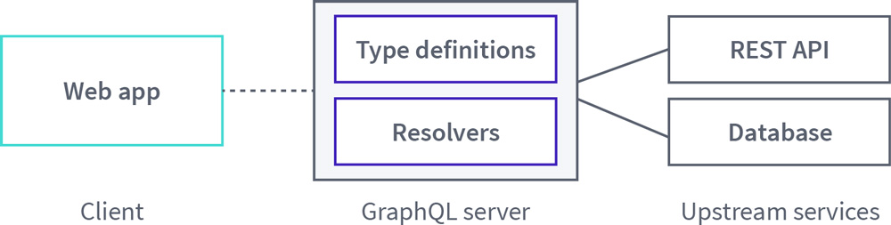
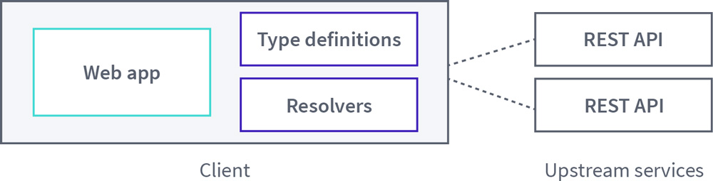
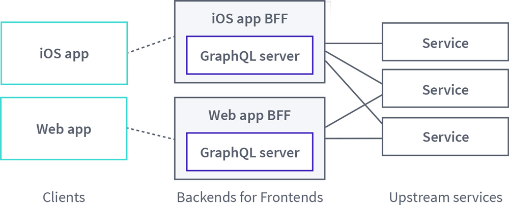
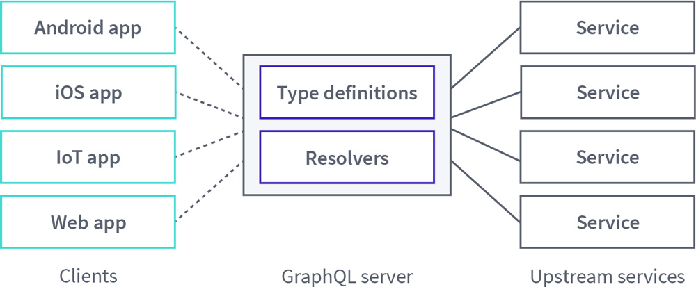
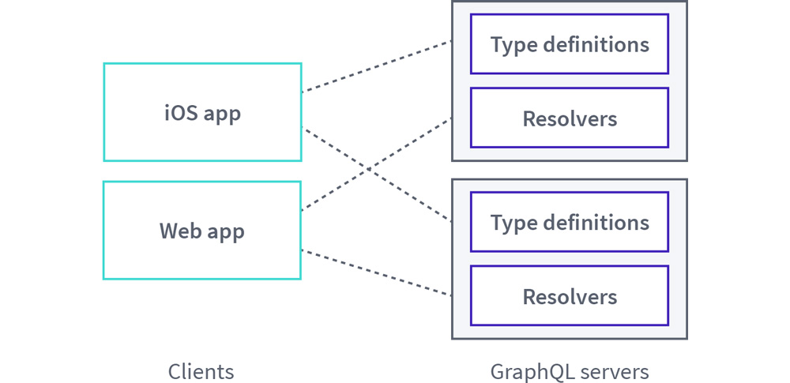

### How GraphQL gains traction

When developers begin to experiment with GraphQL, they often begin with a foundational architecture where a client application queries a single GraphQL server. In turn, the server distributes those requests to backing data sources and returns the data in the client’s desired shape:

As different teams begin to adopt GraphQL, their approach will usually be adapted from this basic architecture, but the implementation details may vary from team to team. At Apollo, we've typically seen that those initial, unconsolidated efforts resemble one of the following four patterns.

### Pattern 1: Client-only graphQL

Client teams that are eager to reap the benefits of GraphQL's client-centric data-fetching capabilities may charge ahead and implement a GraphQL API within the context of their application. With these implementations, these teams are often motivated to adopt GraphQL for the convenience of wrapping existing APIs with a single GraphQL API endpoint.

To illustrate this approach, a client-only GraphQL architecture may look like this:

### Pattern 2: Backend for frontend

GraphQL may also be used as a solution for teams implementing the Backend for Frontend (BFF) pattern. BFFs attempt to solve the problem of requiring different clients (for example, web and iOS) to interact with a monolithic, general-purpose API. Alternatively, BFFs can save client applications from making requests to multiple backend services to obtain all of the data required to render a particular user interface view.

As a solution, BFFs add a new layer where each client has a dedicated BFF service that directly receives the client's requests and is tightly coupled to that user experience. For teams creating BFF services, GraphQL can be a natural fit for building out this intermediary, client-focused layer and adopting this pattern can be an important first step toward consolidating a graph.

In practice, the BFF pattern with GraphQL may look like this:

### Pattern 3: The monolith

The monolith pattern can take on two forms. In its first form, teams may share one codebase for a GraphQL server that is used by one or more clients. In some cases, client code may even live in the same repository as the GraphQL server. However the code is organized, the ownership of this graph is shared by the different developers who contribute to the graph.

In its alternative form, a single team may own a GraphQL API that is accessed by multiple client teams. This team would typically define a set of standards for the graph and champion its adoption throughout the organization.

As with GraphQL-based BFFs, maintaining a single, monolithic GraphQL API can help set the stage for effective consolidation of an organization’s GraphQL-focused efforts.

For either monolithic scenario, its high-level architecture looks like this:

### Pattern 4: Multiple overlapping graphs

Enterprise teams may also independently develop their own service-specific GraphQL APIs in tandem. With this approach, teams may delineate each service API based on types or use cases, but there will often be overlap between the graphs due to the interconnected nature of data.

An example of this architecture could look like this:

### Where do these patterns break down?

After taking stock of who uses GraphQL and how in your company, patterns implemented by various teams can provide insight into what kinds of problems they initially tried to solve. Similarly, these choices can help highlight what GraphQL pain points the teams currently face in their tech stacks.

#### Client-only graphQL

Teams that opt for client-only GraphQL approaches are motivated to improve their client development experience by layering GraphQL on top of REST endpoints or other legacy APIs that they have to work with. And while improved developer experience is a win, beneath this abstraction the client application will still incur performance costs as it maintains responsibility for making multiple requests to various services to gather all of the data required to render a view.

#### BFFs

Like client-only approaches, teams that use GraphQL with BFFs enjoy the advantage of improved developer experience, but they also manage to overcome the performance issues incurred by client-only approaches. BFFs accomplish this by providing a unified interface for a client application to send its requests while also handling the heavy lifting of querying multiple backend services on behalf of the client.

However, there's an inherent tradeoff in building and maintaining BFFs. When every client team is empowered to create a BFF to suit its needs, there will be inevitable duplication of effort across those teams. Alternatively, where BFFs are shared between seemingly similar clients in an effort to reduce duplication, then the GraphQL schema contained within can balloon in size and become confusing due to the lack of clear ownership.

#### Monoliths

The challenges that emerge from shared BFFs are intensified with monolithic GraphQL servers that have shared ownership. Portions of a graph may be well-designed to suit the needs of certain client teams only, while other clients must find workarounds or create overlapping types for their own use. At the same time, standardization becomes an issue because the shape of the graph evolves myopically on a client-by-client or a feature-by-feature basis.

Even in scenarios where a dedicated server team maintains ownership of the graph, challenges quickly arise when more than one graph definition is required for a single product in order to support the needs of multiple clients. A server team may also find itself burdened with the task of building and maintaining the necessary tooling to evolve the schema over time to meet new product needs without breaking compatibility for any clients that are actively consuming data from the graph.

#### Multiple overlapping graphs

Finally, when multiple graphs exist within an enterprise it often indicates that the organization was an early adopter of GraphQL, moved to production quickly, and invested more in GraphQL as time went on. As one potential outcome of this investment, an attempt to expand a monolithic GraphQL API across teams may have ultimately resulted in the graph being split into multiple pieces to accommodate the conflicting needs of each team. The inevitable result of this approach is a duplication of effort to manage these overlapping graphs and a subpar experience for client applications that no longer have a unified interface from which to request data.

Another possible reason an enterprise may have multiple overlapping graphs stems from a deliberate choice for teams to manage their GraphQL APIs independently, but then assemble them into a single GraphQL API using schema stitching. While schema stitching can simplify API usage from a client's perspective, the stitched API may require a considerable amount of imperative code to implement. What's more, it may not always be clear where to split types across services and it also necessitates the designation of an API gatekeeper who will manage the gateway and how the underlying schemas are composed into it.

#### Inconsistency: The common shortcoming

All of the previous patterns—whether client-only GraphQL, BFFs, monoliths, or multiple overlapping graphs—also have a shared shortcoming in that their implementations result in a **lack of consistency.** A more productive way forward for teams searching for better efficiency and understandability from their GraphQL-based architectures typically have two requirements:

1. **Consumers should be able to expect consistency in how they fetch data.** A single endpoint should be exposed to client applications and, regardless of what underlying services supply the data, clients should be able to use consistent workflows to consume the data.

2. **Providers should consistently represent common entities in a consumption-friendly way.** Teams may be empowered to use any underlying technology at the data layer, but access to this data should be consolidated through the GraphQL API and exposed in a way that compliments client use cases. Additionally, teams should be able to delineate service boundaries based on separation of concerns (as opposed to separation by types) without interfering with each other.

### How consolidation addresses these challenges

Consolidating your graph is the key to moving beyond these architectural pitfalls, achieving consistency, and realizing the full potential of GraphQL in an enterprise.

At a fundamental level, moving toward graph consolidation requires that your organization has **one unified graph** instead of multiple graphs created and managed by each team. However, the implementation of that common graph should be **federated across multiple teams**. These are the first two "integrity principles" outlined in [Principled GraphQL](https://principledgraphql.com/).

Specifically, moving toward this kind of consolidated graph allows teams across the enterprise to:

- **Scale GraphQL APIs effectively.** Implementing uniform practices allow the benefits of GraphQL to be realized at scale in a company. For example, teams will have a better understanding of the workflows and policies that they must follow to contribute to the graph. Similarly, they will also benefit from improved standardization when consuming data from the common graph.

- **Obtain a unified view of your data.** Your graph is a representation of the data of your product. Having a consolidated view of this data will provide you with fresh perspective into how that data is currently used, while also inspiring new creative uses for it in the future. Additionally, it will help you to enforce a measure of consistency on how client applications consume that data.

- **Leverage existing infrastructure.** GraphQL consolidation allows teams to reuse existing infrastructure in an organization and help eliminate duplicated efforts where teams interact with data. Consolidation also allows you to take a broad view of the practices and tooling developed by each team that touches your graph and leverages the best of those individual efforts across the company as a whole.

- **Ship code faster.** Companies adopt GraphQL to build and iterate on their products faster. As GraphQL gains traction across teams, these benefits may be partially offset by time spent developing tooling to help support that growth. Consolidation helps reclaim that lost momentum by providing a clearly defined set of practices for teams follow when contributing to or consuming data from the graph.

## What does a consolidated graph look like?

A consolidated, federation-driven GraphQL architecture consists of:

- A collection of **subgraph** services that each define a distinct GraphQL schema
- A **gateway** that composes the distinct schemas into a **federated graph** and executes queries across the services in the graph

Unlike other distributed GraphQL architectures such as schema stitching, federation uses a declarative programming model that enables each subgraph to implement _only_ the part of your graph that for which it’s responsible. With this approach, your company can represent an enterprise-scale graph as a collection of separately maintained GraphQL services. What’s more, schema composition in federation is based on GraphQL primitives, unlike the imperative, implementation-specific approach required by schema-stitching.

Apollo Server provides open source libraries that allow it to act both as a subgraph and as a gateway, but these components can be implemented in any language and framework. Specifically, Apollo Server supports federation via two open-source extension libraries:

- [`@apollo/subgraph`](https://www.npmjs.com/package/@apollo/subgraph) provides primitives that your subgraphs use to make their individual GraphQL schemas composable
- [`@apollo/gateway`](https://www.npmjs.com/package/@apollo/gateway) enables you to set up an instance of Apollo Server as a gateway that distributes incoming GraphQL operations across one or more subgraphs
