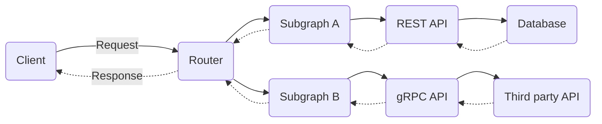

A federated GraphQL API is a multi-tiered architecture made up of independent components. GraphQL requests flow through multiple components to construct a response, which in turn flow back through those same components to create a response to send back to the caller, as illustrated below:



Allowing teams to independently update the components they own is a key benefit of federation. However, understanding and de-risking changes to a component can be challenging, especially because changes might require cascading changes in other components. This is especially true for GraphQL schema definitions, which must be coordinated between subgraph services and the Router.

This document will cover the basic release steps that involvev changes to an existing [supergraph API](/federation/federated-types/overview). We will not go into depth on deploying changes to runtime code or the Router runtime configuration. Specifically, we'll examine two scenarios, both of which involve introducing changes to an existing federated API schema

  - [Backward compatible subgraph schema changes](#backward-compatible-subgraph-schema-changes)
  - [Backward _incompatible_ subgraph schema changes](#backward-incompatible-subgraph-schema-changes)

This guide assumes the general use of [Apollo GraphOS](/graphos/) and some of it's specific features:

- [Managed Federation](/federation/managed-federation/overview/) for propagating the supergraph schema to your Router at runtime
- [Rover](/rover/) for publishing subgraph schemas and running [Schema Checks](/graphos/delivery/schema-checks)
- [Apollo Studio](https://studio.apollographql.com/) for viewing GraphOS metrics and determining things like when it's safe to remove fields.

The release guidelines for each scenario should generally apply to all release management systems, whether we're deploying to Kubernetes, serverless, or bare metal. Some details might change depending on whether we have a manual deployment process, a continuous delivery process, or something in between.

## Backward compatible subgraph schema changes

A schema change is backward compatible if it doesn’t affect existing operations. Some examples of backward compatible changes include:

- Adding a type or field (unused until a client includes the fields in new operations)
- Adding an optional argument to existing fields, ideally with a default value (the argument will have a null or default value until a client uses it in new operations)
- Making a nullable field non-nullable (this restricts the set of possible output values)
- Removing or changing _unused_ schema elements (no existing operation will be broken)

> This also includes changes to schema metadata like adding or changing a deprecations or descriptions, but we won't consider these changes because they don’t affect runtime behavior.

### Release steps

The release steps for backward compatible changes are as follows:

1. In the subgraph code repository, merge a changeset containing both the schema change and the corresponding resolvers to the release branch, triggering the release pipeline.
2. The release pipeline performs prerelease steps like running tests and schema checks.
3. The release pipeline builds the deployable artifacts:
   - The container, jar, or zip of the runtime code
   - Deployment manifests such as Kubernetes YAML or SAM templates
   - The subgraph SDL document
4. The release pipeline then triggers two "deployments" in sequence.
   1. A rolling deploy of the runtime code.
   2. A publish of the subgraph SDL document to Apollo GraphOS, which in turn updates the Router with a new supergraph schema (if the subgraph composes successfully; more on that later).
5. The release pipeline performs postrelease steps such as smoke tests.

### Sequencing schema publishing with service deployments

During Step 4, our system will most likely end up in an inconsistent state, where the Router's version of the schema is out of sync with the subgraph's version.

When the subgraphs update first, a client _could_ request the new schema elements, and the Router will raise an operation validation error because it is not yet aware of changes.

In practice, however, this rarely matters. Due to the declarative nature of GraphQL, clients must update their operations to use the new schema elements. **Clients aren’t polling our schema's introspection response to discover new fields and immediately start requesting them.** (Also, Apollo recommends [disabling introspection in production](https://www.apollographql.com/blog/graphql/security/why-you-should-disable-graphql-introspection-in-production/). Only after the system reaches a consistent state will we announce the availability of these new schema elements to clients.

If we enable [Schema Change Notifications](/graphos/metrics/notifications/schema-change-integration/), Apollo GraphOS will automatically notify our colleagues that the new schema is available right after the Router receives the updated supergraph schema.

### Concurrent subgraph schema changes

Most of the time we can focus on a single subgraph, but it is possible to encounter conflicts when two or more subgraphs change. Consider this sequence of events:

1. Team A makes a change to Subgraph A. The build check succeeds in CI and they merge their code.
2. Team B makes a change to Subgraph B. Their build check also succeeds in CI, even though it actually conflicts with the change in Subgraph A, because the build check runs against _released_ schema definitions.
3. Team B releases their change to production.
4. Team A attempts to release their change, but their new subgraph schema fails to compose and the Router does not update.

The solution is to encounter the build error much earlier in the process. As soon as Team A merges a changeset, Team B should run build checks against that change.

We can accomplish this by creating a special variant of our graph that tracks the `main` branch of each code repository. Apollo GraphOS provides a default variant called `current` for just this use-case, but any variant can be used for this purpose. This requires that:

- Each repository immediately publishes the subgraph schema to the `current` variant each time we merge a change to the `main` branch, even if we won't release the change for a while.
- We run build checks for a proposed change against the `current` variant (to catch build errors quickly) as well as our production variants (to run operation checks against live traffic).

If the build check against the `current` variant fails, we'll need to coordinate with another subgraph team to ensure that our subgraph schemas are compatible before we attempt to release changes to production.

> The longer the time between merging and releasing our change, the more important it is to track changes using the `current` variant. On the other hand, if we have a continuous delivery release process and the time between merge and release is relatively short, it's less likely for teams to introduce incompatible changes with unreleased subgraph schemas.

### Rollbacks

Once clients start using the new schema changes, rolling back a subgraph schema change is the same as making a backward incompatible schema change. This may be difficult or impossible to do depending on client usage. For this reason, it's important to test our new schema changes thoroughly before clients start using the new schema in their operations.

If clients are not yet using the schema changes, we most likely don't need to roll them back — they have no effect until operations start using them.

If circumstances require a rollback, the safest process is to revert the change in the subgraph code repository and perform the full release process, publishing the subgraph schema and rolling out the new code together.

### Staged schema change releases

Instead of attempting rollbacks of schema changes, we may want to release our changes in stages, such as alpha, beta, and generally-available (GA). The [Contracts](/graphos/delivery/contracts/) feature of GraphOS makes this process simple:

1. Mark elements of our schema with the '@tag' directive for the targeted release:

   ```graphql
   type Product {
     id: ID!
     newField: String @tag(name: "alpha")
   }
   ```

2. Configure our GA variant to be a contract that filters out all fields tagged "alpha" or "beta".
3. Configure a separate beta variant to exclude the "alpha" tag, and another alpha variant that doesn't exclude anything.
4. Set up three separate Routers configured to use the alpha, beta, and GA variants.
5. Perform the standard release process. Because we've tagged our new field with "alpha", the schema for the beta and GA variants will not change. This gives us plenty of opportunity to test our change with alpha versions of our clients.
6. Releasing the change to a wider audience is simply a matter of changing the tag to "beta" or removing it altogether.

## Backward incompatible subgraph schema changes

Backward incompatible schema changes remove or alter schema elements in ways that would break existing operations.

Crucially, if a schema element is unused, this does _not_ qualify as a backward incompatible change.

### Release steps

The release steps for backward incompatible changes are similar to those for backward compatible changes, only with some important pre-work:

1. Use the `@deprecated` directive to communicate with clients that schema elements should no longer be relied on.
2. Use Apollo Studio to track the usage of types and fields. Reach out to clients [identified][clientids] as performing the affected operations before releasing the change.
3. Continue to track usage until it reaches zero (or to a minimally acceptable level, for example, where a field is still in use by an older version of a mobile application that is no longer supported).
4. [Perform the release steps for a backward compatible change](#release-steps).

> Consider enforcing that all requests to your supergraph have the proper identification headers. These identifiers enable the metrics that allow you to make potentially breaking changes with confidence. Read more about [Client Awareness here][clientids]. See [Client Id Enforcement](/technotes/TN0001-client-id-enforcement) for an example implementation

[clientids]: /graphos/metrics/client-awareness

### Sequencing schema publishing with service deployments

As with a backward compatible release, our system will most likely end up in an inconsistent state, where the Router's version of the schema is out of sync with the subgraph's version.

When the supergraph updates in the Router, it will no longer validate requests that include removed fields, or respond with null values that are now marked non-null.

But with the pre-work outlined above, we've either minimized or completely removed requests that cause these errors.

### Rollbacks

Assuming we've performed the pre-work and reduced usage of relevant types and fields before changing/removing them, rolling back our changes is effectively a backward compatible schema change.

If circumstances require a rollback, the safest process is to revert the change in the subgraph code repository and perform the full release process, publishing the subgraph schema and rolling out the new code together.

## Key takeaways:

- Isolate types of changes from other types. When possible, don't release schema changes and implementation/configuration changes at the same time.
- Publish subgraph schemas to the "current" variant immediately after merging code and run build checks against the "current" variant to catch subgraph compatibility issues long before a production release. (The longer the delay between merge and deploy, the more important this step is.)
- Sequencing Router/subgraph schema changes isn't as critical in practice as we might think, especially if we use tools like deprecation workflows, usage reporting, and schema change notifications to manage client operations.
- Think about our API schema as a document that always moves forward. While rollbacks of code and configuration must be supported, "rolling back" our published API creates confusions for clients and consumers. Instead of trying to support API rollbacks, consider implementing a staged rollout process for API changes.
