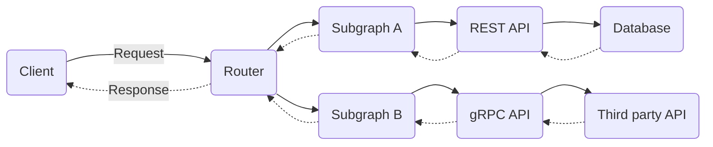

A federated GraphQL API is a multi-tiered architecture made up of independent components. GraphQL requests flow through multiple components to construct a response, which in turn flow back through those same components to create a response to send back to the caller, as illustrated below:



Allowing teams to independently update the components they own is a key benefit of federation. However, understanding and de-risking changes to a component can be challenging, especially because changes might require cascading changes in other components. This is especially true for GraphQL schema definitions, which must be coordinated between subgraph services and the Router.

This section covers the most common change management scenarios in a federated architecture using the Managed Federation features of Apollo GraphOS. We'll consider the proper sequencing of release events, how Apollo tooling makes managing changes easier, and when progressive delivery techniques like blue-green deploys are useful.

Specifically, we'll examine scenarios that:

- Involve a schema change
  - [Backward compatible subgraph schema changes](#backward-compatible-subgraph-schema-changes)
  - [Backward _incompatible_ subgraph schema changes](#backward-incompatible-subgraph-schema-changes)
- Involve schema changes in multiple subgraphs
  - [Changes to shared types](#changes-to-shared-types)
  - [Changes to query planning](#changes-to-query-planning-field-migrations-entity-ownership-changes-etc)
- Don't involve schema changes
  - [Changes to a data source](#changes-to-a-data-source)
  - [Changes to subgraph resolvers](#changes-to-subgraph-resolvers)
  - [Changes to Router logic/configuration](#changes-to-router-logic-or-configuration)

The release guidelines for each scenario should generally apply to all release management systems, whether we're deploying to Kubernetes, serverless, or bare metal. Some details might change depending on whether we have a manual deployment process, a continuous delivery process, or something in between. This guide assumes the use of the [Apollo GraphOS][apollographos] for publishing and validating schemas, as well as [Apollo Managed Federation][managedfederation] for propagating supergraph schemas to our Router servers.

[apollographos]: /graphos/
[managedfederation]: /federation/managed-federation/overview/

## Backward compatible subgraph schema changes

A schema change is backward compatible if it doesn’t affect existing operations. Some examples of backward compatible changes include:

- Adding a type or field (unused until a client includes the fields in new operations)
- Adding an optional argument to existing fields, ideally with a default value (the argument will have a null or default value until a client uses it in new operations)
- Making a nullable field non-nullable (this restricts the set of possible output values)
- Removing or changing _unused_ schema elements (no existing operation will be broken)

> This also includes changes to schema metadata like adding or changing a deprecations or descriptions, but we won't consider these changes because they don’t affect runtime behavior.

### Release steps

The release steps for backward compatible changes are as follows:

1. In the subgraph code repository, merge a changeset containing both the schema change and the corresponding resolvers to the release branch, triggering the release pipeline.
2. The release pipeline performs prerelease steps like running tests and schema checks.
3. The release pipeline builds the deployable artifacts:
   - The container, jar, or zip of the runtime code
   - Deployment manifests such as Kubernetes YAML or SAM templates
   - The subgraph SDL document
4. The release pipeline then triggers two "deployments" in sequence.
   1. A rolling deploy of the runtime code.
   2. A publish of the subgraph SDL document to Apollo GraphOS, which in turn updates the Router with a new supergraph schema (if the subgraph composes successfully; more on that later).
5. The release pipeline performs postrelease steps such as smoke tests.

### Sequencing schema publishing with service deployments

During Step 4, our system will most likely end up in an inconsistent state, where the Router's version of the schema is out of sync with the subgraph's version.

When the subgraphs update first, a client _could_ request the new schema elements, and the Router will raise an operation validation error because it is not yet aware of changes.

In practice, however, this rarely matters. Due to the declarative nature of GraphQL, clients must update their operations to use the new schema elements. **Clients aren’t polling our schema's introspection response to discover new fields and immediately start requesting them.** (Also, Apollo recommends [disabling introspection in production][disableprod]!) Only after the system reaches a consistent state will we announce the availability of these new schema elements to clients.

[disableprod]: https://www.apollographql.com/blog/graphql/security/why-you-should-disable-graphql-introspection-in-production/

If we enable [Schema Change Notifications][notifications], Apollo GraphOS will automatically notify our colleagues that the new schema is available right after the Router receives the updated supergraph schema.

[notifications]: /graphos/notifications/schema-change-integration/

### Concurrent subgraph schema changes

Most of the time we can focus on a single subgraph, but it is possible to encounter conflicts when two or more subgraphs change. Consider this sequence of events:

1. Team A makes a change to Subgraph A. The build check succeeds in CI and they merge their code.
2. Team B makes a change to Subgraph B. Their build check also succeeds in CI, even though it actually conflicts with the change in Subgraph A, because the build check runs against _released_ schema definitions.
3. Team B releases their change to production.
4. Team A attempts to release their change, but their new subgraph schema fails to compose and the Router does not update.

The solution is to encounter the build error much earlier in the process. As soon as Team A merges a changeset, Team B should run build checks against that change.

We can accomplish this by creating a special variant of our graph that tracks the `main` branch of each code repository. Apollo GraphOS provides a default variant called `current` for just this use-case. This requires that:

- Each repository immediately publishes the subgraph schema to the `current` variant each time we merge a change to the `main` branch, even if we won't release the change for a while.
- We run build checks for a proposed change against the `current` variant (to catch build errors quickly) as well as our production variants (to run operation checks against live traffic).

If the build check against the `current` variant fails, we'll need to coordinate with another subgraph team to ensure that our subgraph schemas are compatible before we attempt to release changes to production.

> The longer the time between merging and releasing our change, the more important it is to track changes using the `current` variant. On the other hand, if we have a continuous delivery release process and the time between merge and release is relatively short, it's less likely for teams to introduce incompatible changes with unreleased subgraph schemas.

### Rollbacks

Once clients start using the new schema changes, rolling back a subgraph schema change is the same as making a backward incompatible schema change. This may be difficult or impossible to do depending on client usage. For this reason, it's important to test our new schema changes thoroughly before clients start using the new schema in their operations.

If clients are not yet using the schema changes, we most likely don't need to roll them back — they have no effect until operations start using them.

If circumstances require a rollback, the safest process is to revert the change in the subgraph code repository and perform the full release process, publishing the subgraph schema and rolling out the new code together.

### Staged schema change releases

Instead of attempting rollbacks of schema changes, we may want to release our changes in stages, such as alpha, beta, and generally-available (GA). The "Contracts" feature of GraphOS makes this process simple:

1. "Tag" new elements of our schema with labels for the targeted release:

   ```graphql
   type Product {
     id: ID!
     newField: String @tag(name: "alpha")
   }
   ```

2. Configure our GA variant to be a "contract" that filters out all fields tagged "alpha" or "beta".
3. Configure a separate beta variant to exclude the "alpha" tag, and another alpha variant that doesn't exclude anything.
4. Set up three separate Routers configured to use the alpha, beta, and GA variants.
5. Perform the standard release process. Because we've tagged our new field with "alpha", the schema for the beta and GA variants will not change. This gives us plenty of opportunity to test our change with alpha versions of our clients.
6. Releasing the change to a wider audience is simply a matter of changing the tag to "beta" or removing it altogether.

## Backward incompatible subgraph schema changes

Backward incompatible schema changes remove or alter schema elements in ways that would break existing operations.

Crucially, if a schema element is unused, this does _not_ qualify as a backward incompatible change.

### Release steps

The release steps for backward incompatible changes are similar to those for backward compatible changes, only with some important pre-work:

1. Use the `@deprecated` directive to communicate with clients that schema elements should no longer be relied on.
2. Use Apollo Studio to track the usage of types and fields. Reach out to clients [identified][clientids] as performing the affected operations before releasing the change.
3. Continue to track usage until it reaches zero (or to a minimally acceptable level, for example, where a field is still in use by an older version of a mobile application that is no longer supported).
4. [Perform the release steps for a backward compatible change](#release-steps).

> Consider enforcing that all requests to your supergraph have the proper identification headers. These identifiers enable the metrics that allow you to make potentially breaking changes with confidence. Read more about [Client Awareness here][clientids]. See [Client Id Enforcement](/technotes/TN0001-client-id-enforcement) for an example implementation

[clientids]: /graphos/metrics/client-awareness

### Sequencing schema publishing with service deployments

As with a backward compatible release, our system will most likely end up in an inconsistent state, where the Router's version of the schema is out of sync with the subgraph's version.

When the supergraph updates in the Router, it will no longer validate requests that include removed fields, or respond with null values that are now marked non-null.

But with the pre-work outlined above, we've either minimized or completely removed requests that cause these errors.

### Rollbacks

Assuming we've performed the pre-work and reduced usage of relevant types and fields before changing/removing them, rolling back our changes is effectively a backward compatible schema change.

If circumstances require a rollback, the safest process is to revert the change in the subgraph code repository and perform the full release process, publishing the subgraph schema and rolling out the new code together.

## Changes to query planning (field migrations, entity ownership changes, etc.)

Query planning changes involve changes to federation metadata that affect how the Router fetches data from subgraphs without changing the schema itself. This requires making changes to more than one subgraph schema. Because it involves changes to at least three services (the Router plus two subgraphs), safely rolling out changes and being able to roll them back if we encounter errors is critical.

Apollo strongly recommends that we isolate query planning changes from other kinds of schema or implementation changes. All services should be already have working resolvers to support the new query plans.

Consider the scenario of moving a field on an entity from one subgraph (Subgraph A) to another (Subgraph B). After the migration, Subgraph B takes on the responsibility for resolving the field.

```graphql title="Before"
# Subgraph A
type User @key(fields: "id") {
  id: ID!
  fieldToMigrate: String
}

# Subgraph B
type User @key(fields: "id") {
  id: ID! 
}
```

```graphql title="After"
# Subgraph A
type User @key(fields: "id") {
  id: ID!
  fieldToMigrate: String
}

# Subgraph B
type User @key(fields: "id") {
  id: ID!
  fieldToMigrate: String @override(from: "A")
}
```

> For more information on this topic, check out our federation docs on [Migrating entities and fields](/federation/entities-advanced/#migrating-entities-and-fields)

### Release steps

When determining the safest sequence of events, we must make sure that our resolvers are in place _before_ the Router's query planning logic changes.

In this example, we must release Subgraph B first so that its resolver for `fieldToMigrate` is in production before the Router starts creating new query plans.

1. In the Subgraph B repository, commit a changeset containing the schema change and the resolver implementations to the release branch, then trigger the release pipeline.
2. The release pipeline executes: building artifacts, triggering a rolling deploy of Subgraph B, and publishing subgraph SDL.

   At this point, the Router continues to generate the the same query plans with Subgraph A as the owner of the `User.fieldToMigrate` field. **Composition is broken**, so Apollo GraphOS does not publish the new supergraph to the Router.

3. In the Subgraph A repository, commit a changeset containing the schema change to the release branch, then trigger the release pipeline. **For rollback purposes, we should leave the resolver for `User.fieldToMigrate` in place.**
4. The release pipeline executes: building artifacts, triggering a rolling deploy of Subgraph A, and publishing subgraph SDL.

   As soon as the pipeline publishes the subgraph schema, composition resolves and Router update. They will now create query plans that use Subgraph B to resolve the field.

In the event of an issue with the new query plans, rolling this change back requires re-publishing the subgraph schemas. We can accomplish this by releasing the previous versions of the subgraphs in the reverse order, but that may take too much time in the midst of an outage.

### Release alternative: manual schema publishing

Because the query planning change should not require changes to our runtime code, we could choose to publish schemas _without_ deploying our services. The process would be:

1. Release a version of Subgraph B with the field resolver in place (but inactive without the schema defining it.)
2. Edit the subgraph schemas for both Subgraph A and Subgraph B.
3. Manually publish them using [Rover][rover], one after the other, updating the Router after the second publish.
4. Commit the changes to the respective repositories. The next release will be a no-op because Apollo Studio already has these changes.

[rover]: /rover/

In the event of an issue, we can quickly publish the previous versions of the subgraph schemas to "roll back".

We might choose to keep a copy of subgraph schemas in a separate code repository for review and auditing purposes, as well as a convenient location for making and publishing these manual changes.

## Changes to a data source

Changing a data source safely requires three separate releases to avoid downtime. This process should be very familiar; it is standard practice for any kind of database migration or API change in a service-oriented architecture.

1. Release #1: Make a backward compatible change to the data source

   For example, add a column to a database and backfill the data using an async process.

2. Release #2: Update calling sites in subgraphs

   For example, change SQL queries to use new column.

3. Remove unneeded code/data

   For example, drop the unused column.

This process allows for rolling back changes after Release #2 because the data source supports the previous version of subgraph resolvers.

### Progressive delivery techniques

**Feature flags**: we might choose to leverage feature flags in Release #2, enabling a quick rollback if we discover a problem in the data or implementation. In order to "pin" users to a specific flag value and ensure a consistent experience during the rollout, pass a user-identifying header though each layer of the system.

We can configure the Router to forward headers to subgraph services by [customizing the subgraph data source][customizereqs].

[customizereqs]: federation/building-supergraphs/router/#customizing-requests

## Changes to subgraph resolvers

Changing the behavior of a resolver (such as calling a new data source, changing the computation of a value, or optimizing execution by adding [Dataloaders](/apollo-server/data/fetching-rest#using-with-dataloader)) might be performed in a single release for low-risk changes.

Because a resolver might be called in various contexts (nested at different layers of an operation) it can be challenging to reason about the effects of our change. We might choose to progressively release the change using feature flags or canary deploys.

Because this change does not require changes to other components, it allows rolling back the subgraph service should an issue arise in the new code.

### Progressive delivery techniques

**Feature flags**: we might choose to leverage feature flags, breaking up the release into multiple steps, enabling a quick rollback if we discover a problem in the implementation. In order to "pin" users to a specific flag value and ensure a consistent experience during the rollout, pass a user-identifying header though each layer of the system.

1. Author the resolver to provide both old and new codepaths gated by a feature flag.
2. Release the new code. The new codepath is enabled for zero users by default, so the release should have no impact on current behavior.
3. Progressively enable the feature flag for more users, monitoring error rates or support inquiries.
4. Once the feature flag is enabled for 100% of users, remove the old codepath and perform a clean-up release.

**Canary or blue-green deploys**: instead of adding complexity to our resolver by supporting two codepaths and selecting one based on a feature flag, we can choose to simply author the new resolver and release it more carefully.

1. Author the new resolver in the subgraph code repository.
2. Release the new code using a canary deployment mechanism.
3. Observe error rates or other relevant metrics (either manually, or with an automated progressive delivery controller like [Flagger][flagger]).
4. If metrics are acceptable, release the new code to all replicas.
5. If metrics are unacceptable, cancel the canary deployment, roll back the release, and revert the code change.

[flagger]: https://flagger.app/

## Changes to Router logic or configuration

The Router is critical infrastructure and should be treated as such. Although we can treat releases as standard rolling deploys, it's highly recommended to use progressive delivery techniques like canary or blue-green deploys.

### Progressive delivery techniques

Deploying Router changes without schema changes using a blue-green deployment process is straightforward, whether we're manually deploying to separate replica sets or clusters, or using a automated progressive delivery controller like [Flagger][flagger].

1. Author the new logic or configuration change in the Router code repository.
2. Release the new code to the inactive replica set.
3. Incrementally shift traffic to the replica set containing the changes either manually, or with an automated progressive delivery controller.
4. Observe error rates or other relevant metrics.
5. If metrics are acceptable, shift all traffic to the replica set.
6. If metrics are unacceptable, shift traffic back to the old replica set, cancel the deployment, and revert the code change.

## Summary

It can feel overwhelming to consider all the ways the components in a federated architecture interact. By considering this finite set of change scenarios independently, it becomes clearer which processes and techniques are useful.

Key takeaways:

- Isolate types of changes from other types. When possible, don't release schema changes and implementation/configuration changes at the same time.
- Sequencing Router/subgraph schema changes isn't as critical in practice as we might think, especially if we use tools like deprecation workflows, usage reporting, and schema change notifications to manage client operations.
- Think about our API schema as a document that always moves forward. While rollbacks of code and configuration must be supported, "rolling back" our published API creates confusions for clients and consumers. Instead of trying to support API rollbacks, consider implementing a staged rollout process for API changes.
- Using two replica sets for the Router enables blue-green deployments and safer releases containing logic or configuration changes in this critical production service.
- Publish subgraph schemas to the "current" variant immediately after merging code and run build checks against the "current" variant to catch subgraph compatibility issues long before a production release. (The longer the delay between merge and deploy, the more important this step is.)
- Pass stable user identifiers through all layers of the stack to enable consistent per-user results when using feature flags.
