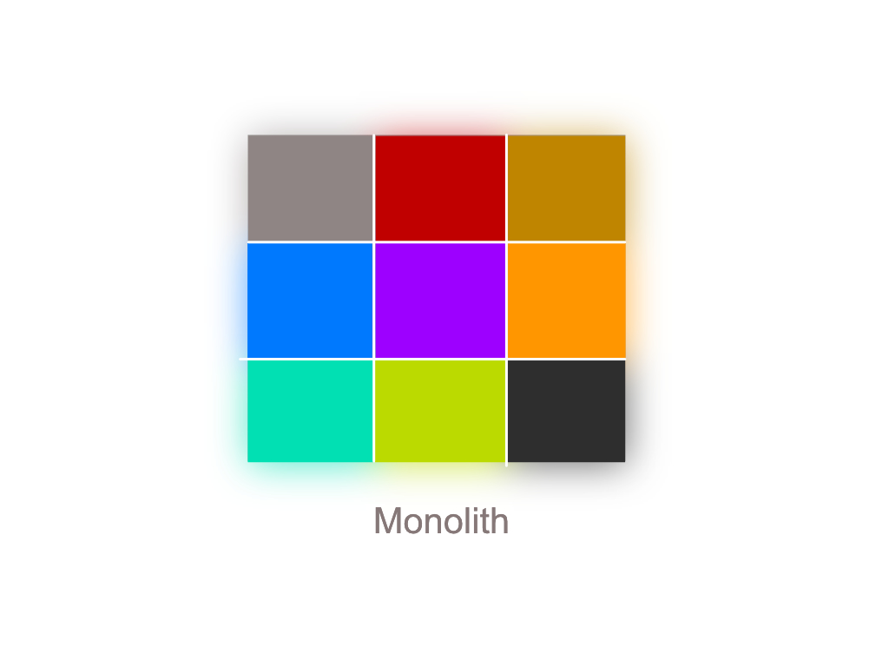
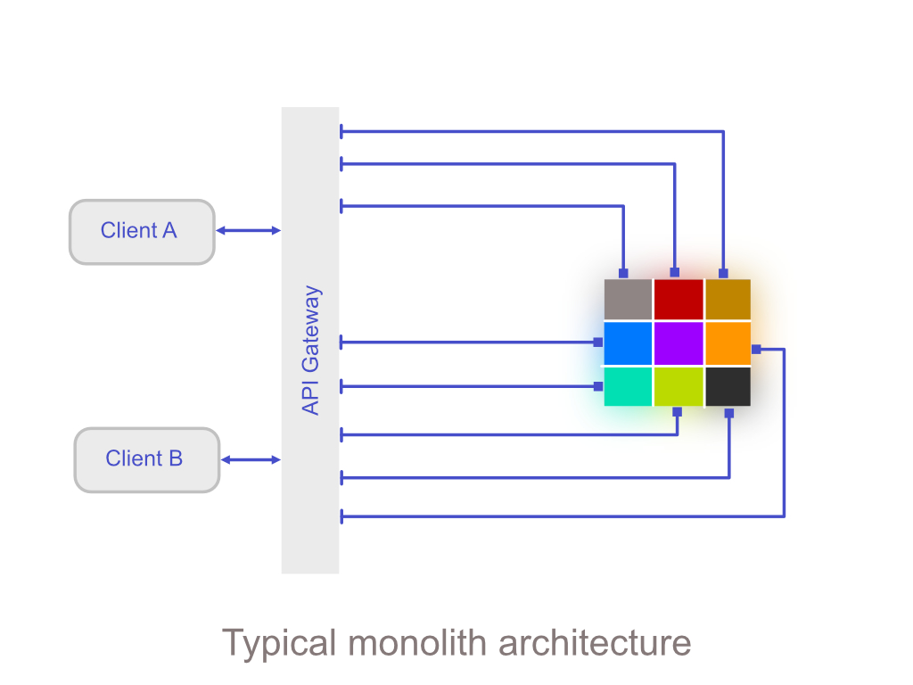
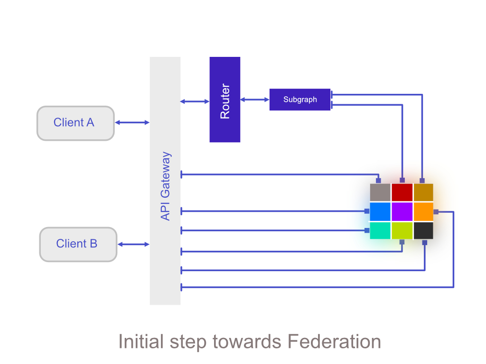
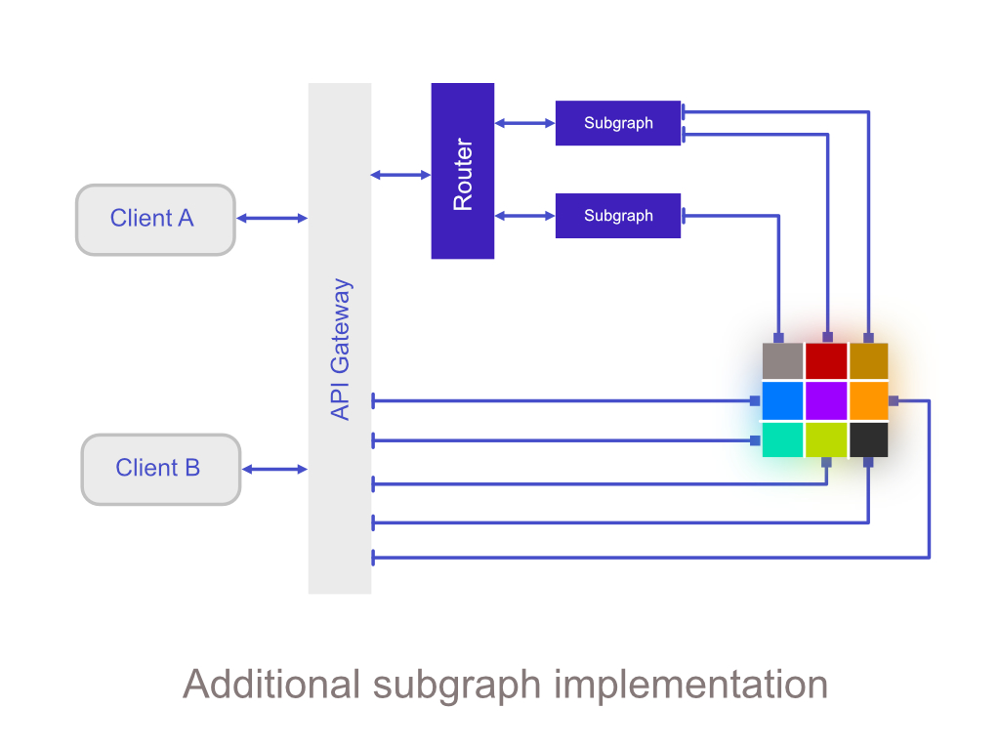
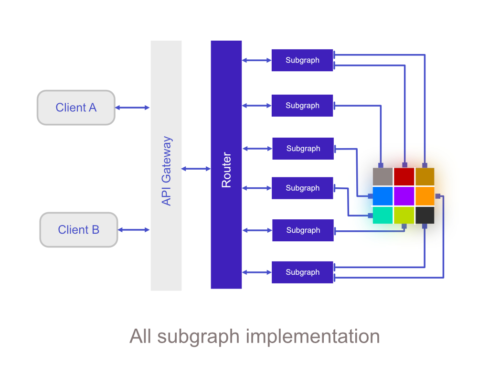
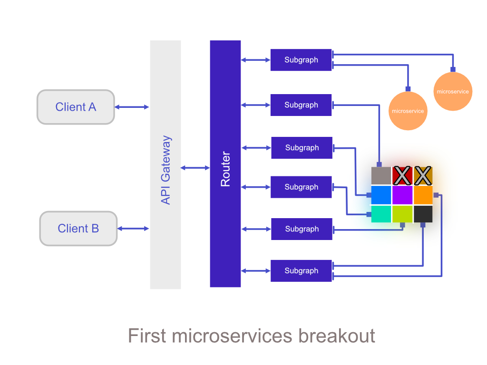

---
title: Monolith to Federation - First steps
id: TN0042
description: Using the strangulation pattern to remove the monolith
tags: [federation, transformation, organization]
 ---

## Introduction
Most organizations will have a Monolith which they will want to move away from using Federation, the task almost always seems implausibly difficult to understand and thus tackle.
At Apollo we have seen many different patterns of migrating away from a monolith, in this technote we will discuss the pattern which has the greatest possible level of success, and one which iteratively provides progressive feedback into the business investing in this change.

## The digital transformation
The pattern in question is the strangulation pattern, which essentially entails logically splitting the monolith up into parts and migrating the sections in question away bit by bit. This way you are achieving your goal of moving away from the monolith whilst critically showing incremental progress to the business, mentioned previously.
The first thing to note - often the hardest - is how do you split the monolith up? Most, if not all companies choose to split up by domain. In this example we will start with a typical e-commerce application and some of its associated domains.

- Product
- Inventory
- Cart
- Order
- Payment
- Customer account
- Marketing

Using the domains discussed above we can see how we could view a monolith in segments relating to specific domains - in figure below

If we look at the simplified and typical monolith setup, you can see how clients fetch data and how tightly bound clients are, to the system. To move past this, we use Federation as the critical enabler.

The key technical aspect to manage here is bringing about productive change as fast as possible, wasting as little time and money during the digital transformation.
The basic approach is to decouple the existing clients from the monolith and onto an established contract - which here - is afforded by the Federation layer. We are now actively removing risk of back end change from the client, thus allowing the org to go ahead with the transformation.

The API Gateway here will now allow us to fetch (previously monolith) a data response from the new Federation architecture. Record lessons here and apply them going forward to the next subgraph.
Note: some client work *may* be required here to bind use queries you have newly created or improved. Normally

Upon proving and testing one subgraph and integrating into clients the pattern is now established to add further subgraphs, which transparently starts adding more functionality to our Federation stack.
It is exceptionally important to note that this pattern keeps the monolith in play purely as a data source, because there must be a constant in play. Changing everything introduces change across and activating nearly every team, which will become impossible to manage. Creating a contract in this pattern de-risks the migration hugely because the org can be 100% certain they can serve the same data reliably, and not introduce further delay finding new data source.
However, it is not important to connect to the monolith *if* you have the new API endpoints already available. If this is the case, you can bypass the monolith immediately as a datasource and connect where ever you like.

Using the strangulation pattern, we will arrive at a point where all traffic is now for each client is actually being facaded by the supergraph itself.

We are now officially in a decoupled state, whereby the client has no idea where the data is coming from, *fundamentally* freeing the org to start the decommissioning phase of this pattern; shutting down the monolith section by section.

The diagram above demonstrates two domains which were previously served by the monolith, now being served by the newly created microservices. It is critical to note, this pattern actively hides implementational details away from the client, yet fulfils the agreed data response, due to the fact there is now a contract involved in the shape of our new supergraph.

The end state of the transformation is achieved once all the domains in the monolith have been migrated, thus allowing the org to successfully rid themselves of the monolith.

## Conclusion
Although moving away from deeply entrenched monolith can seem like an impossible task. Using very simple steps as described in this pattern and also compartmentalising away any un-required complexity - what seems an impossible task, can be achieved in a manageable fashion.
Leverage the supergraph contract to decouple your systems and allow you to migrate away from the monolith, without impacting your clients.