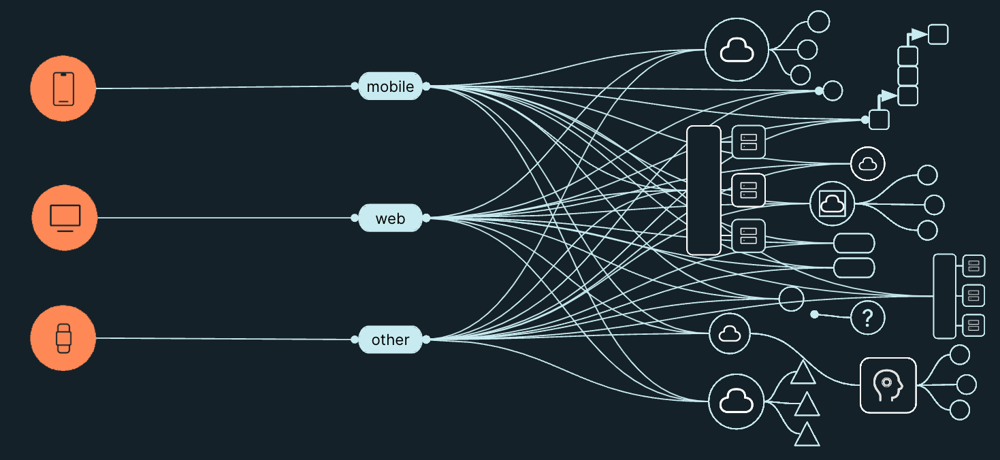
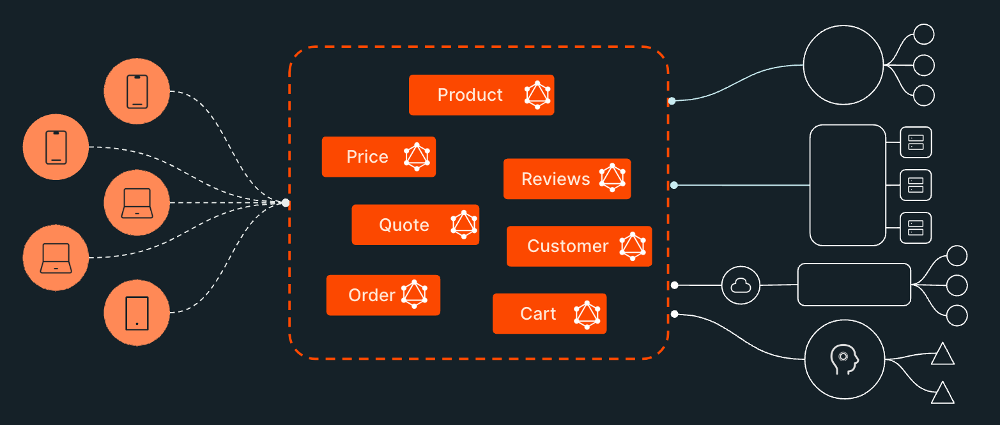

One of the advantages of using GraphQL is that it provides an abstraction between the consumers of the graph and 
the teams maintaining the backend services. 

Using an example architecture where each application has a BFF and that BFF connects to a number of backend services, the number of 
connections grows quickly and a change to any of the backing APIs/Components could have major implications. 

Imagine an architecture with 10 applications, each with it's own BFF, and the company is migrating one of many backend APIs to a 
different technology. There is potentially 10 BFFs to update as a result. Clients must be aware of what is happening during 
those changes, must track timelines, track changes to field names, etc.

However, if that company was using GraphQL as an abstraction layer, the consumers don't need to know about this change as the backing services 
are abstracted behind the schema of the graph. The only change needed is at the GraphQL layer.

Scaling this up to enterprise level, this could potentially eliminate hundreds or even thousands of updates, deployments, 
dependencies, etc. This could have a significant reduction of both risk and cost.