```mermaid
flowchart LR
%%{init:{'flowchart':{'nodeSpacing': 10, 'rankSpacing': 200}}}%%
  app1["🖥️ App"]
  app2["📱 App"]
  app3["📱 App"]
  app4["🖥️ App"]
  app5["🖥️ App"]
  app6["🖥️ App"]
  app7["📱 App"]
  app8["📱 App"]
  app9["🖥️ App"]
  app10["🖥️ App"]

  bff1[BFF]
  bff2[BFF]
  bff3[BFF]
  bff4[BFF]
  bff5[BFF]
  bff6[BFF]
  bff7[BFF]
  bff8[BFF]
  bff9[BFF]
  bff10[BFF]

  oldservice["❌ Old Service ❌"]
  newservice["✨ New Service ✨"]

  app1 --> bff1
  app2 --> bff2
  app3 --> bff3
  app4 --> bff4
  app5 --> bff5
  app6 --> bff6
  app7 --> bff7
  app8 --> bff8
  app9 --> bff9
  app10 --> bff10

  bff1 --> oldservice
  bff1 -.-> newservice
  bff2 --> oldservice
  bff2 -.-> newservice
  bff3 --> oldservice
  bff3 -.-> newservice
  bff4 --> oldservice
  bff4 -.-> newservice
  bff5 --> oldservice
  bff5 -.-> newservice
  bff6 --> oldservice
  bff6 -.-> newservice
  bff7 --> oldservice
  bff7 -.-> newservice
  bff8 --> oldservice
  bff8 -.-> newservice
  bff9 --> oldservice
  bff9 -.-> newservice
  bff10 --> oldservice
  bff10 -.-> newservice
```

One of the advantages of using GraphQL is that it provides an abstraction between the consumers of the graph and 
the teams maintaining the backend services. 

In an architecture where each application has a BFF and that BFF connects to a number of backend services, the number of 
connections grows quickly and a change to any of the backing APIs/Components has major implications. 

```mermaid
flowchart LR
%%{init:{'flowchart':{'nodeSpacing': 10, 'rankSpacing': 200}}}%%
  app1["🖥️ App"]
  app2["📱 App"]
  app3["📱 App"]
  app4["🖥️ App"]
  app5["🖥️ App"]

  bff1[BFF]
  bff2[BFF]
  bff3[BFF]
  bff4[BFF]
  bff5[BFF]

  rest1[Rest Service 1]
  rest2[Rest Service 2]
  rest3[Rest Service 3]
  rest4[Rest Service 4]
  rest5[Rest Service 5]

  soap1[SOAP Service 1]
  soap2[SOAP Service 2]
  soap3[SOAP Service 3]
  soap4[SOAP Service 4]
  soap5[SOAP Service 5]

  grpc1[gRPC Service 1]
  grpc2[gRPC Service 2]
  grpc3[gRPC Service 3]
  grpc4[gRPC Service 4]
  grpc5[gRPC Service 5]

  app1 --> bff1
  app2 --> bff2
  app3 --> bff3
  app4 --> bff4
  app5 --> bff5

  bff1 --> rest1
  bff1 --> rest2
  bff1 --> rest3
  bff1 --> soap4
  bff1 --> grpc4

  bff2 --> rest3
  bff2 --> rest4
  bff2 --> rest5
  bff2 --> soap1
  bff2 --> soap2
  bff2 --> grpc1
  bff2 --> grpc2
  bff2 --> grpc3
  bff2 --> grpc4

  bff3 --> rest1
  bff3 --> rest3
  bff3 --> soap1
  bff3 --> soap2
  bff3 --> soap3
  bff3 --> soap5
  bff3 --> grpc5

  bff4 --> rest1
  bff4 --> grpc5

  bff5 --> grpc1
  bff5 --> grpc2
  bff5 --> grpc3
  bff5 --> grpc4
  bff5 --> grpc5
```

## Example: Service Migration

Imagine an architecture with 10 applications, each with it's own BFF. The company is migrating one of many backend APIs to a 
different technology. As a result, there are  10 BFFs to update due to the data orchestration happening for each application within those BFFs. Clients must be aware of what is happening during 
those changes, must track timelines, track changes to field names, etc.

However, if that company was using GraphQL as an abstraction layer, the consumers don't need to know about this change as the backing services 
are abstracted behind the schema of the graph. The only change needed is at the GraphQL layer.

```mermaid
flowchart LR
%%{init:{'flowchart':{'nodeSpacing': 10, 'rankSpacing': 200}}}%%
  app1["🖥️ App"]
  app2["📱 App"]
  app3["📱 App"]
  app4["🖥️ App"]
  app5["🖥️ App"]
  app6["🖥️ App"]
  app7["📱 App"]
  app8["📱 App"]
  app9["🖥️ App"]
  app10["🖥️ App"]

  oldservice["❌ Old Service ❌"]
  newservice["✨ New Service ✨"]
  graphql["✅ GraphQL ✅"]

  app1 --> graphql
  app2 --> graphql
  app3 --> graphql
  app4 --> graphql
  app5 --> graphql
  app6 --> graphql
  app7 --> graphql
  app8 --> graphql
  app9 --> graphql
  app10 --> graphql

  graphql --> oldservice
  graphql -.-> newservice
```

Scaling this up to enterprise level, this could potentially eliminate hundreds of updates, deployments, 
dependencies, etc due to the reduced impact of changes to backing services.

## Conclusion
GraphQL provides a great tool to abstract away the complexities of your backing services from your front end consumers. It can 
shield your consumers from major changes to those services while also reducing the impact of those changes across your architecture. Ultimately, It provides choice and control to your
consumers without negatively impacting your backing services.