```mermaid
flowchart LR
%%{init:{'flowchart':{'nodeSpacing': 10, 'rankSpacing': 200}}}%%
  app1["🖥️ App"]
  app2["📱 App"]
  app3["📱 App"]
  app4["🖥️ App"]
  app5["🖥️ App"]
  app6["🖥️ App"]
  app7["📱 App"]
  app8["📱 App"]
  app9["🖥️ App"]
  app10["🖥️ App"]

  oldservice["❌ Old Service ❌"]
  newservice["✨ New Service ✨"]
  graphql["✅ GraphQL ✅"]

  app1 --> graphql
  app2 --> graphql
  app3 --> graphql
  app4 --> graphql
  app5 --> graphql
  app6 --> graphql
  app7 --> graphql
  app8 --> graphql
  app9 --> graphql
  app10 --> graphql

  graphql --> oldservice
  graphql -.-> newservice
```

One of the advantages of using GraphQL is that it provides an abstraction between service consumers and 
the teams maintaining the backend services. 

In a backend-for-frontend (BFF) architecture, each BFF connects to any number of backend services. As you add new BFFs for each application, the number of connections proliferates, and changes to any backend services have major implications.

```mermaid
flowchart LR
%%{init:{'flowchart':{'nodeSpacing': 10, 'rankSpacing': 200}}}%%
  app1["🖥️ App"]
  app2["📱 App"]
  app3["📱 App"]
  app4["🖥️ App"]
  app5["🖥️ App"]

  bff1[BFF]
  bff2[BFF]
  bff3[BFF]
  bff4[BFF]
  bff5[BFF]

  rest1[REST Service 1]
  rest2[REST Service 2]
  rest3[REST Service 3]
  rest4[REST Service 4]
  rest5[REST Service 5]

  soap1[SOAP Service 1]
  soap2[SOAP Service 2]
  soap3[SOAP Service 3]
  soap4[SOAP Service 4]
  soap5[SOAP Service 5]

  grpc1[gRPC Service 1]
  grpc2[gRPC Service 2]
  grpc3[gRPC Service 3]
  grpc4[gRPC Service 4]
  grpc5[gRPC Service 5]

  app1 --> bff1
  app2 --> bff2
  app3 --> bff3
  app4 --> bff4
  app5 --> bff5

  bff1 --> rest1
  bff1 --> rest2
  bff1 --> rest3
  bff1 --> soap4
  bff1 --> grpc4

  bff2 --> rest3
  bff2 --> rest4
  bff2 --> rest5
  bff2 --> soap1
  bff2 --> soap2
  bff2 --> grpc1
  bff2 --> grpc2
  bff2 --> grpc3
  bff2 --> grpc4

  bff3 --> rest1
  bff3 --> rest3
  bff3 --> soap1
  bff3 --> soap2
  bff3 --> soap3
  bff3 --> soap5
  bff3 --> grpc5

  bff4 --> rest1
  bff4 --> grpc5

  bff5 --> grpc1
  bff5 --> grpc2
  bff5 --> grpc3
  bff5 --> grpc4
  bff5 --> grpc5
```

## Service migration example

Suppose a company has an architecture with ten applications, each with its own BFF. The company is migrating one of many backend APIs to a different technology. As a result of the BFFs owning data orchestration, the organization must update ten different BFFs. 

To avoid breaking changes, clients must:
- be aware of what is happening during those change,
- track timelines,
- and track changes to field names.

```mermaid
flowchart LR
%%{init:{'flowchart':{'nodeSpacing': 10, 'rankSpacing': 200}}}%%
  app1["🖥️ App"]
  app2["📱 App"]
  app3["📱 App"]
  app4["🖥️ App"]
  app5["🖥️ App"]
  app6["🖥️ App"]
  app7["📱 App"]
  app8["📱 App"]
  app9["🖥️ App"]
  app10["🖥️ App"]

  bff1[BFF]
  bff2[BFF]
  bff3[BFF]
  bff4[BFF]
  bff5[BFF]
  bff6[BFF]
  bff7[BFF]
  bff8[BFF]
  bff9[BFF]
  bff10[BFF]

  oldservice["❌ Old Service ❌"]
  newservice["✨ New Service ✨"]

  app1 --> bff1
  app2 --> bff2
  app3 --> bff3
  app4 --> bff4
  app5 --> bff5
  app6 --> bff6
  app7 --> bff7
  app8 --> bff8
  app9 --> bff9
  app10 --> bff10

  bff1 --> oldservice
  bff1 -.-> newservice
  bff2 --> oldservice
  bff2 -.-> newservice
  bff3 --> oldservice
  bff3 -.-> newservice
  bff4 --> oldservice
  bff4 -.-> newservice
  bff5 --> oldservice
  bff5 -.-> newservice
  bff6 --> oldservice
  bff6 -.-> newservice
  bff7 --> oldservice
  bff7 -.-> newservice
  bff8 --> oldservice
  bff8 -.-> newservice
  bff9 --> oldservice
  bff9 -.-> newservice
  bff10 --> oldservice
  bff10 -.-> newservice
```

If the company used GraphQL as an abstraction layer, the consumers wouldn't need to know about this change because the organization has abstracted backend APIs behind a graph schema. The only change needed is at the GraphQL layer.
have been abstracted behind the schema of the graph by the organization. The only change needed is at the GraphQL layer.

As a company grows, this could eliminate hundreds of updates, deployments, and dependencies due to the reduced impact of changes to backend services.

## Conclusion
GraphQL is a powerful tool for abstracting away the complexities of your backend services from front-end consumers. It can shield your consumers from major changes to those services while reducing the impact of those changes across your architecture. Ultimately, it provides choice and control to your consumers without negatively impacting your backend services.