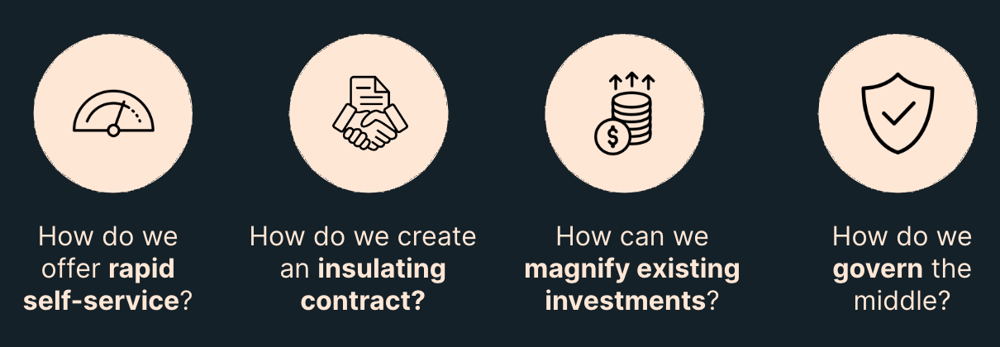
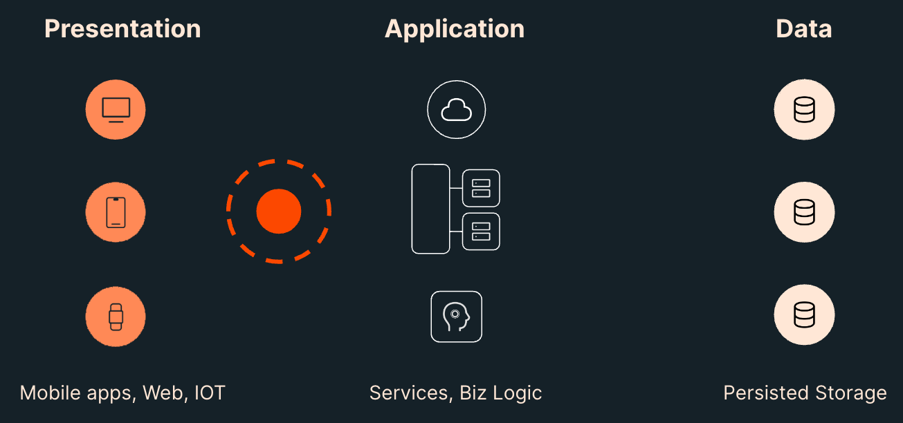
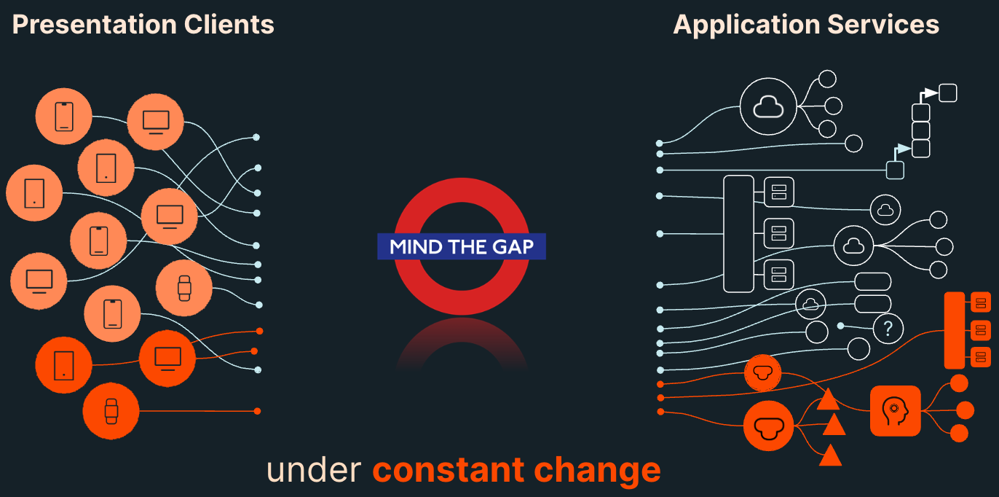
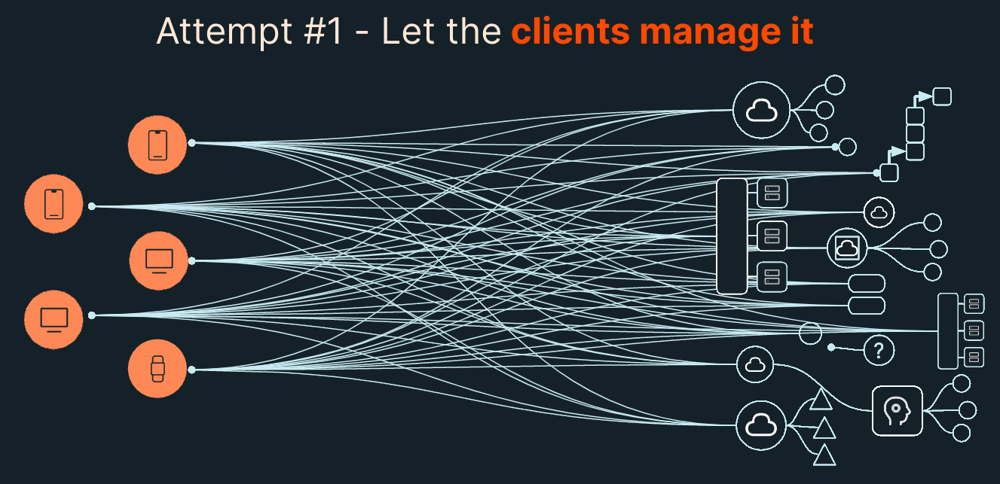
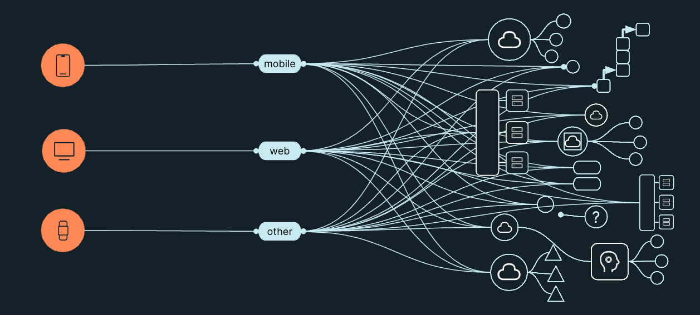
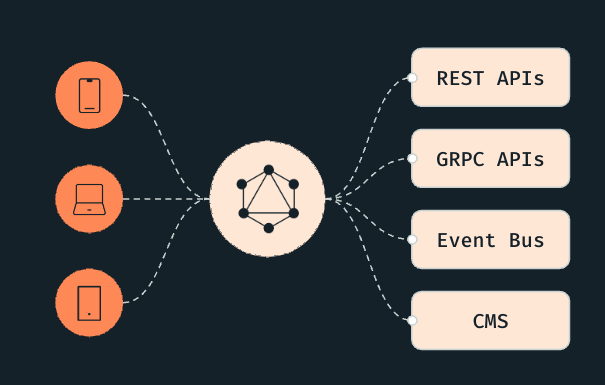
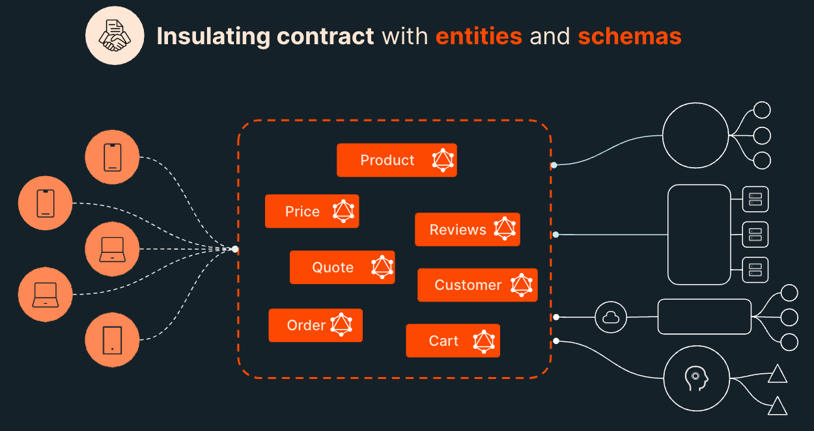
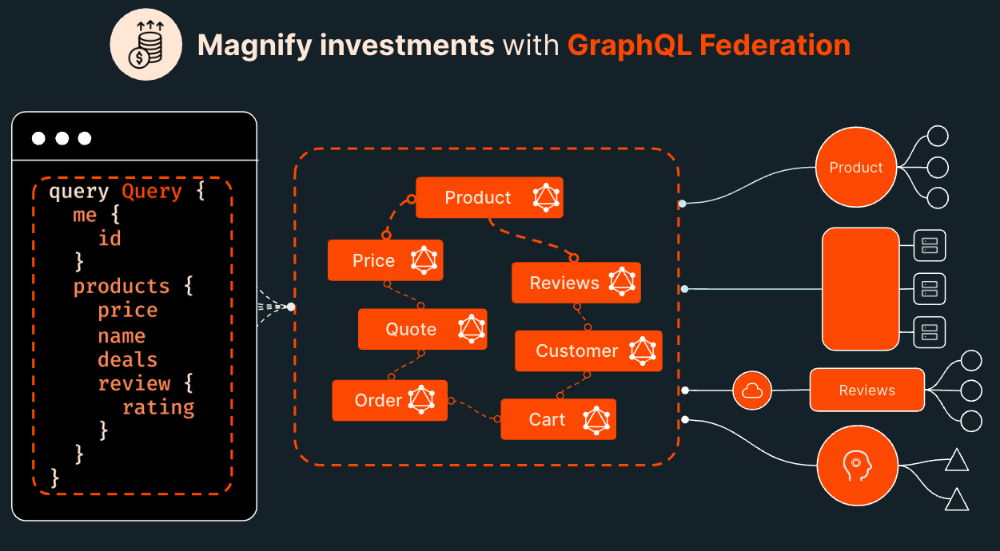
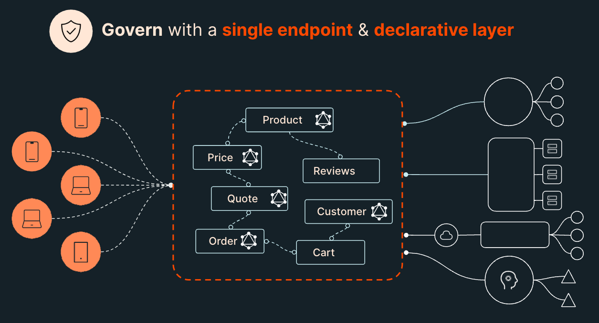

<iframe width="100%" height="400" src="https://www.youtube.com/embed/5DVi99KPALo?si=2O3TpHiAbvXQhfuG" title="YouTube video player" frameborder="0" allow="accelerometer; autoplay; clipboard-write; encrypted-media; gyroscope; picture-in-picture; web-share" allowfullscreen></iframe>

## GraphQL versus REST is the wrong question

It is common to hear GraphQL and REST pitted against each other as competing technologies. While this may be true in some cases, most organizations who have adopted GraphQL utilize both for different purposes and at various layers of the stack.

This page outlines some of the approaches typically taken, where GraphQL fits into the architectural toolbox, and how it can help an API strategy reach some important goals:

- Offer rapid self-service
- Create an insulating contract
- magnify existing investments
- Govern the middle layer

## Traditional N-Tier Architecture
In traditional n-tier architecture, the stack is broken into the Presentation, Application, and Data layers. Each of these have a distinct purpose:

- Presentation: where our customers touch our products, our experiences, and our API marketplaces
- Application: where our services and business logic live and through which our Presentation clients access their Data
- Data: The storage of data about your company, customers, products, etc.

However, there is a gap between the Presentation and Application tiers that can cause friction between teams and prevent us from getting our data and products into the hands of our customer.

From the Application Tier side's perspective:

> "Our job is to expose everything we know, all the data we have access to, and all the capabilities we must deliver in the most efficient, most performant, least opinionated way we can. How clients consume, aggregate, orchestrate and enrich what we provide via our API endpoints isn't really not our job. Remember, separation of concerns!"

And from the Presentation side of the divide, the thinking is different:

> "We are frustrated that the APIs we access either don't provide what we need, require too much aggregation, or orchestration, are too slow, there's just too many of them and they are always changing without notice!"

Change is constant on both the Presentation and the Application tiers. There are always new clients, new data access requirements, product requirements, new data, new services, new business logic etc.

## Approaches to N-Tier Architecture
### Client Managed

**Analysis**
Many API strategies start this way but very quickly get out of control. Every client is own their own and this very quickly leads to inconsistencies and maintainability issues.

**Problems**:

- Separation of concerns
- ❌ "Fat" clients and inconsistent UX
- ❌ Logic is thrown away on every client rewrite
- ❌ Not Rapid Self-Service
- ❌ Not an Insulating Contract
- ❌ Does not Magnify Existing Investments
- ❌ No Governance

### Backend For Frontend APIs (BFFs)

**Analysis**
BFFs are a reasonable approach to this problem as it allows data to be aggregated from the many backing APIs. However, as more and more clients are added, especially if your companies utilizes micro frontends, this can quickly grow out of control and become a problem of maintainability as well as make governance impossible.

**Problems**:
- ❌ Number of BFFs can expand to a point of it becoming impossible to manage
- ❌ Does not Magnify Existing Investments
- ❌ No Governance

<Note>It is possible that you may still have a need for a BFF in addition to GraphQL for "Utility" endpoints that are specific to your application. In this case, you could utilize a passthrough pattern to direct data fetch/mutation through your BFF to your GraphQL layer.</Note>

## Using GraphQL

GraphQL is a translation layer that allows the needs of the Presentation layer to be translated to the Application layer with it's services and data. By it's very nature it is self-serve, it provide insulating contracts, all investments are magnified since all consumers benefit from all investment, and it is highly governable since all data is exposed through a single endpoint with declarative policies.

* ✅ GraphQL enables rapid self service for our presentation clients by replacing one-off handwritten BFF apis with declarative queries.
* ✅ GraphQL provides an insulating contract between our Presentation and Application layers that is flexible enough to manage the constant change while stable enough to prevent breaking changes
* ✅ GraphQL goes beyond just preserving the value of our existing API's, to actually increasing and magnifying the value through federation and its ability to connect and compose independent APIs together 
* ✅ GraphQL brings a declarative layer and a control plane to the middle, enabling us to apply declarative governance in this crucial layer.

### Rapid Self Serve

GraphQL accomplishes Rapid Self Service with queries: on-demand definitions of just what the presentation view needs, regardless of the source of that data. Each front-end use case (and/or each micro-front end if you have them) defines a declarative query to fetch precisely the data they need in a single request. 

The key insight here is that this is demand driven API creation without endpoints. We don't need an endpoint for each query, they are all sent to the same single endpoint to be executed by a query planned and distributed efficiently to the underlying Application services and data tier.

### Insulating Contract

The most stable portion of any enterprise architecture are the fundamental nouns that drive the business (E.g. Customer, Order, Product). They are defined by the very business model. They endure, even as the underlying data storage models and service models that define them are re-built.

Modernization is coming for every part of our stack, so we know that anything in our stack has a fixed lifetime, and that lifetime is shortening every year. The answer is to model these entities in a layer that is declarative, is not embedded in our code, and can both survive and evolve.

### Magnify Investments

The abstraction that GraphQL provides allows new data entities and fields to be added over time without directly impacting the consuming clients. Our API clients can navigate across API bounds with no awareness that they are retrieving data from different teams, different APIs that could be written in different languages, with different API protocols, etc.

This magnifies your investments because investments in the graph are both immediate value to all current clients and value to all potential future clients. All investments in your graph pay dividends.

### Governance

Bringing all these core domain entities into one layer where they can satisfy an unlimited number of tailored queries from our clients, without creating a custom endpoint for each, means something important for governance.

It means we have a single place, a static place in our registry where all our API surface area is defined. Rather than hundreds of endpoints and custom code.

## Conclusion
GraphQL should not be positioned as in competition with REST but rather as a new layer in the stack with a different purpose: Bridge "The Middle", the gap between Presentation and Application layers.

To use GraphQL and REST together:

- ✅ Use REST for backend data services
- ✅ Use GraphQL as a middle layer which aggregates data from your backend data services
- ✅ Use GraphQL to abstract away the implementation details of your backend services