<Tip>

If you're looking for more material on this topic, watch Dan Boerner's keynote at API Summit 2023: [GraphQL and REST: true BFFs](https://www.youtube.com/watch?v=5DVi99KPALo).

<ExpansionPanel title="Watch the video below">

<YouTube youTubeId="5DVi99KPALo" />

</ExpansionPanel>

</Tip>

It's common to hear GraphQL and REST pitted against each other as competing technologies. While these technologies overlap, most organizations adopting GraphQL use both for different purposes and at different layers of the stack.

This page outlines:

- Approaches organizations typically take
- Where GraphQL best fits into the architectural toolbox
- How it can help drive a resilient API strategy

## Traditional N-tier architecture

In a traditional [N-tier architecture](https://en.wikipedia.org/wiki/Multitier_architecture), at least three layers comprise the stack: Presentation, Application, and Data. Each of these has a distinct purpose:

- The **Presentation** layer is where customers interact with products, experiences, and API marketplaces.
- The **Application** layer is where services and business logic live and through which **Presentation** apps access data.
- The **Data** layer stores data about your company, customers, products, etc.

```mermaid
flowchart LR
%%{init:{'flowchart':{'nodeSpacing': 10, 'rankSpacing': 100}}}%%
  subgraph presentation["Presentation"]
    direction LR
    app1["🖥️ App"]
    app2["📱 App"]
    app3["⌚️ App"]
  end

  subgraph application["Application"]
    direction LR
    service1[Service]
    service2[Service]
    service3[Service]
  end

  subgraph data["Data"]
    direction LR
    database1[(Database)]
    database2[(Database)]
    database3[(Database)]
  end

  presentation --> application --> data
```

However, friction between the Presentation and Application layers can prevent organizations from getting products and data into customers' hands.

From the Application layer perspective:

> "Our job is to expose everything we know, all the data we have access to, and all the capabilities we must deliver in the most efficient, most performant, least opinionated way we can. How clients consume, aggregate, orchestrate, and enrich what we provide via API endpoints isn't our job. Remember, separation of concerns!"

From the Presentation side, the thinking is different:

> "We're frustrated that the APIs we access either require too much aggregation or orchestration or don't provide what we need, are too slow, that there's too many of them, and they are always changing without notice!"

Change is constant in both the Presentation and the Application layers. There are always new clients, new data access and product requirements, new data, new services, new business logic, and other changes.

```mermaid
flowchart LR
%%{init:{'flowchart':{'nodeSpacing': 10, 'rankSpacing': 100}}}%%
  app1["🖥️ App"]
  app2["📱 App"]
  app3["⌚️ App"]
  app4["✨ New App ✨"]

  service1[Service]
  service2[Service]
  service3[Service]
  service4["✨ New Service ✨"]
  service5["✨ New Service ✨"]

  database1[(Database)]
  database2[(Database)]
  database3[(Database)]
  database4[("✨ New Database ✨")]
  database5[("✨ New Database ✨")]

  app1 --> service1
  app2 --> service1
  app3 --> service1
  app4 -.-> service1

  app1 --> service2
  app2 --> service2
  app3 --> service2
  app4 -.-> service2

  app1 --> service3
  app2 --> service3
  app3 --> service3
  app4 -.-> service3

  app1 -.-> service4
  app2 -.-> service4
  app3 -.-> service4
  app4 -.-> service4


  app1 -.-> service5
  app2 -.-> service5
  app3 -.-> service5
  app4 -.-> service5

  service1 --> database1
  service2 --> database2
  service3 --> database3
  service4 -.-> database4
  service5 -.-> database5
```

## API strategy goals

Setting high-level goals should be part of deciding your organization's API strategy. Common goals include:

- Offering rapid self-service
- Creating an insulating contract
- Magnifying existing investments
- Governing the middle layer

### Offering rapid self-service

A key goal of any API strategy should be to enable API consumers. That means having as little friction as possible for consumers onboarding onto your API. The more a consumer can self-serve, the better.

### Creating an insulating contract

Your API strategy should shield API consumers from the complexities of backend services. Conversely, the strategy should insulate the impact of upstream client changes on downstream services.

The contract, the interface over which your API consumers communicate with your API, should act as an abstraction.

### Magnifying existing investments

Any API investment should positively impact its current and future use cases.

### Governing the middle layer

An API should have a defined stewardship and governance model, including appropriate stakeholders.

<Tip>

Read more on [Supergraph stewardship](/technotes/TN0025-supergraph-stewardship/).

</Tip>

## Approaches to growing complexity

Organizations frequently use a client-managed or Backend for Frontend (BFF) approach to handle complexity between Presentation and Application layers. These approaches can have limitations in achieving the goals of a resilient API strategy.

### Client-managed

In a client-managed approach, each app talks directly to each backend service, creating a multitude of connections and dependencies.

```mermaid
flowchart LR
%%{init:{'flowchart':{'nodeSpacing': 10, 'rankSpacing': 100}}}%%
  app1["🖥️ App"]
  app2["📱 App"]
  app3["⌚️ App"]

  service1[Service]
  service2[Service]
  service3[Service]
  service4[Service]
  service5[Service]

  database1[(Database)]
  database2[(Database)]
  database3[(Database)]
  database4[(Database)]
  database5[(Database)]

  app1 --> service1
  app2 --> service1
  app3 --> service1

  app1 --> service2
  app2 --> service2
  app3 --> service2

  app1 --> service3
  app2 --> service3
  app3 --> service3

  app1 --> service4
  app2 --> service4
  app3 --> service4


  app1 --> service5
  app2 --> service5
  app3 --> service5

  service1 --> database1
  service2 --> database2
  service3 --> database3
  service4 --> database4
  service5 --> database5
```

#### Analysis

Many API strategies start as client-managed, but this strategy can quickly get out of control. Every client is on their own, leading to inconsistencies and maintainability issues.

#### Problems

- No separation of concerns
- "Thick" clients and inconsistent UX
- Logic is thrown away on every client rewrite
- Not rapid or self-service
- Not an insulating contract
- Doesn't magnify existing investments
- No governance

### Backend for Frontend APIs (BFFs)

In a Backend for Frontend (BFF) approach, each app has a dedicated API that they own called a BFF. This BFF is specific to the app, is maintained by the app team, and is responsible for the data orchestration needs of that app.

```mermaid
flowchart LR
%%{init:{'flowchart':{'nodeSpacing': 10, 'rankSpacing': 200}}}%%
  app1["🖥️ App"]
  app2["📱 App"]
  app3["📱 App"]
  app4["🖥️ App"]
  app5["🖥️ App"]
  bff1[BFF]
  bff2[BFF]
  bff3[BFF]
  bff4[BFF]
  bff5[BFF]
  rest1[Rest Service 1]
  rest2[Rest Service 2]
  rest3[Rest Service 3]
  rest4[Rest Service 4]
  rest5[Rest Service 5]
  soap1[SOAP Service 1]
  soap2[SOAP Service 2]
  soap3[SOAP Service 3]
  soap4[SOAP Service 4]
  soap5[SOAP Service 5]
  grpc1[gRPC Service 1]
  grpc2[gRPC Service 2]
  grpc3[gRPC Service 3]
  grpc4[gRPC Service 4]
  grpc5[gRPC Service 5]
  app1 --> bff1
  app2 --> bff2
  app3 --> bff3
  app4 --> bff4
  app5 --> bff5
  bff1 --> rest1
  bff1 --> rest2
  bff1 --> rest3
  bff1 --> soap4
  bff1 --> grpc4
  bff2 --> rest3
  bff2 --> rest4
  bff2 --> rest5
  bff2 --> soap1
  bff2 --> soap2
  bff2 --> grpc1
  bff2 --> grpc2
  bff2 --> grpc3
  bff2 --> grpc4
  bff3 --> rest1
  bff3 --> rest3
  bff3 --> soap1
  bff3 --> soap2
  bff3 --> soap3
  bff3 --> soap5
  bff3 --> grpc5
  bff4 --> rest1
  bff4 --> grpc5
  bff5 --> grpc1
  bff5 --> grpc2
  bff5 --> grpc3
  bff5 --> grpc4
  bff5 --> grpc5
```

#### Analysis

BFFs can offer a viable solution for addressing certain issues associated with the client-managed approach. The BFF approach lets consumers aggregate data from many backend APIs. However, as your organization adds more and more clients, this approach can also grow out of control. This can especially become an issue for organizations using micro-frontends. Maintainability and governance can become increasingly challenging.

#### Problems

- Number of BFFs can expand to the point that it becomes impossible to manage them
- Doesn't magnify existing investments
- While an API Gateway can provide some governance of BFFs, it still doesn't provide much governance of data retrieval

<Note>
  You may still need a BFF in addition to GraphQL for "Utility" endpoints specific to your application. In this case,
  you could use a passthrough pattern to direct data fetching and mutations through your BFF to your GraphQL layer.
</Note>

## Using GraphQL

When using GraphQL, all apps talk to a common GraphQL middle layer that then orchestrates the calls to downstream data services.

This middle layer translates the needs of the Presentation layer to the Application layer. By its nature, GraphQL is self-serve. A GraphQL schema acts as an insulating contract, and all investments are magnified since all consumers benefit from all investments. It is highly governable since a single endpoint exposes all data with declarative policies.

```mermaid
flowchart LR
%%{init:{'flowchart':{'nodeSpacing': 10, 'rankSpacing': 200}}}%%
  app1["🖥️ App"]
  app2["📱 App"]
  app3["⌚️ App"]
  graphql["✅ GraphQL ✅"]
  rest["Rest APIs"]
  grpc["gRPC APIs"]
  soap["SOAP APIs"]
  bus["Event Bus"]
  cms["CMS"]

  app1 --> graphql
  app2 --> graphql
  app3 --> graphql

  graphql --> rest
  graphql --> grpc
  graphql --> soap
  graphql --> bus
  graphql --> cms
```

### Rapid self-service

> ✅ GraphQL enables [rapid self-service](#offer-rapid-self-service) for Presentation layer clients by replacing one-off handwritten BFF APIs with declarative queries.

Queries are on-demand definitions of only what the Presentation layer needs, regardless of the data source. Each frontend use case (and each micro-frontend if you use them) defines a declarative query to fetch precisely the data it needs in a single request.

GraphQL enables demand-driven API creation without creating new endpoints. Every client sends requests to the same endpoint to be executed by a query planner and distributed efficiently to the underlying Application and Data layers.

### Creating an insulating contract

> ✅ GraphQL provides an [insulating contract](#creating-an-insulating-contract) between Presentation and Application layers that is flexible enough to manage constant change while stable enough to prevent breaking changes.

The most stable portion of any enterprise data model is the fundamental objects that drive the business&mdash;for example, Customers, Orders, or Products. These objects endure, even as the underlying data storage and service models that define them are rebuilt.

Modernization means that every part of a stack has a fixed lifetime, and that lifetime shortens every year. The answer is to model these entities in a declarative layer that is not embedded in code and can survive and evolve.

### Magnifying investments

> ✅ GraphQL goes beyond preserving the value of our existing APIs to [magnifying investments](#magnifying-existing-investments) through [federation](/federation/) and its ability to connect and compose independent APIs.

GraphQL provides an abstraction layer that allows organizations to add new data entities and fields over time without directly impacting the consuming clients. API clients can navigate across APIs without awareness that they're retrieving data from different teams, different APIs potentially written in different languages, with different API protocols, etc.

All investments in the graph pay dividends because they provide value to both current and potential future clients.

### Governance

> ✅ GraphQL provides a declarative control plane as the crucial middle layer of your architecture.

GraphQL enables organizations to centralize all core domain entities into a unified layer, catering to custom queries from clients without the need for individualized endpoints. This is great for governance since it gives organizations a single, static location to define their entire API surface area instead of managing hundreds of endpoints.

## Conclusion

GraphQL is not in competition with REST. Rather, it is best suited as a new layer in the stack with a different purpose&mdash;**to bridge the gap between the Presentation and Application layers**.

GraphQL enables organizations to drive a resilient API strategy that provides governance and ownership while reducing friction and allowing API consumers to increase their velocity through self-service.

To use GraphQL and REST together:

- ✅ Use REST for backend data services
- ✅ Use GraphQL as a middle layer which aggregates data from your backend data services
- ✅ Use [GraphQL to abstract](/technotes/TN0043-using-graphql-for-abstraction/) away the implementation details of your backend services
