<Tip>

If you're looking for more material on this topic, watch Dan Boerner's keynote at API Summit 2023: [GraphQL and REST: True BFFs](https://www.youtube.com/watch?v=5DVi99KPALo).

<ExpansionPanel title="Watch the video below">

<YouTube youTubeId="5DVi99KPALo" />

</ExpansionPanel>

</Tip>

It is common to hear GraphQL and REST pitted against each other as competing technologies. While both technologies have some overlap, most organizations who have adopted GraphQL utilize each for different purposes and at various layers of the stack.

This page outlines some of the approaches typically taken, where GraphQL fits into the architectural toolbox best, and how it can help drive a resilient API strategy.

## Traditional N-Tier Architecture

In a traditional N-tier architecture, the stack is broken into at least 3 layers: Presentation, Application, and Data layers. Each of these has a distinct purpose:

- Presentation: where our customers interact with our products, our experiences, and our API marketplaces
- Application: where our services and business logic live and through which our Presentation clients access their Data
- Data: the storage of data about your company, customers, products, etc.

```mermaid
flowchart LR
%%{init:{'flowchart':{'nodeSpacing': 10, 'rankSpacing': 100}}}%%
  subgraph presentation["Presentation"]
    direction LR
    app1["🖥️ App"]
    app2["📱 App"]
    app3["⌚️ App"]
  end

  subgraph application["Application"]
    direction LR
    service1[Service]
    service2[Service]
    service3[Service]
  end

  subgraph data["Data"]
    direction LR
    database1[(Database)]
    database2[(Database)]
    database3[(Database)]
  end

  presentation --> application --> data
```

However, there is a gap between the Presentation and Application tiers that can cause friction between teams and prevent us from getting our data and products into the hands of our customers.

From the Application Tier perspective:

> "Our job is to expose everything we know, all the data we have access to, and all the capabilities we must deliver in the most efficient, most performant, least opinionated way we can. How clients consume, aggregate, orchestrate and enrich what we provide via our API endpoints isn't really our job. Remember, separation of concerns!"

And from the Presentation side of the divide, the thinking is different:

> "We are frustrated that the APIs we access either don't provide what we need, require too much aggregation, or orchestration, are too slow, there's just too many of them and they are always changing without notice!"

Change is constant on both the Presentation and the Application tiers. There are always new clients, new data access requirements, product requirements, new data, new services, new business logic, and many other kinds of changes.

```mermaid
flowchart LR
%%{init:{'flowchart':{'nodeSpacing': 10, 'rankSpacing': 100}}}%%
  app1["🖥️ App"]
  app2["📱 App"]
  app3["⌚️ App"]
  app4["✨ New App ✨"]

  service1[Service]
  service2[Service]
  service3[Service]
  service4["✨ New Service ✨"]
  service5["✨ New Service ✨"]

  database1[(Database)]
  database2[(Database)]
  database3[(Database)]
  database4[("✨ New Database ✨")]
  database5[("✨ New Database ✨")]

  app1 --> service1
  app2 --> service1
  app3 --> service1
  app4 -.-> service1

  app1 --> service2
  app2 --> service2
  app3 --> service2
  app4 -.-> service2

  app1 --> service3
  app2 --> service3
  app3 --> service3
  app4 -.-> service3

  app1 -.-> service4
  app2 -.-> service4
  app3 -.-> service4
  app4 -.-> service4


  app1 -.-> service5
  app2 -.-> service5
  app3 -.-> service5
  app4 -.-> service5

  service1 --> database1
  service2 --> database2
  service3 --> database3
  service4 -.-> database4
  service5 -.-> database5
```

## API Strategy Goals

As part of deciding an API strategy, there should be some high level goals set.

### Offer rapid self-service

The biggest goal of any API strategy should be to enable consumers. In practice, this means having as low of friction as possible for consumers to
get started consuming your API. The more a consumer can self-serve, the better.

### Create an insulating contract

The consumers of an API should be shielded from the complexities of the backing services and vise versa. Every effort should be made to reduce
the impact of changes to downstream services on upstream clients.

### Magnify existing investments

Any effort investment into an API should have a positive impact to multiple use cases now as well as many use cases in the future.

### Govern the middle layer

An API should have a defined stewardship and governance model. Appropriate stakeholders should be represented as part of the governance model.

<Tip>

Read more on [Supergraph stewardship](/technotes/TN0025-supergraph-stewardship/)

</Tip>

## Approaches to Growing Complexity

### Client Managed

```mermaid
flowchart LR
%%{init:{'flowchart':{'nodeSpacing': 10, 'rankSpacing': 100}}}%%
  app1["🖥️ App"]
  app2["📱 App"]
  app3["⌚️ App"]

  service1[Service]
  service2[Service]
  service3[Service]
  service4[Service]
  service5[Service]

  database1[(Database)]
  database2[(Database)]
  database3[(Database)]
  database4[(Database)]
  database5[(Database)]

  app1 --> service1
  app2 --> service1
  app3 --> service1

  app1 --> service2
  app2 --> service2
  app3 --> service2

  app1 --> service3
  app2 --> service3
  app3 --> service3

  app1 --> service4
  app2 --> service4
  app3 --> service4


  app1 --> service5
  app2 --> service5
  app3 --> service5

  service1 --> database1
  service2 --> database2
  service3 --> database3
  service4 --> database4
  service5 --> database5
```

**Analysis**

Many API strategies start this way but very quickly get out of control. Every client is on their own and this quickly leads to inconsistencies and maintainability issues.

**Problems**:

- Separation of concerns
- ❌ "Fat" clients and inconsistent UX
- ❌ Logic is thrown away on every client rewrite
- ❌ Not rapid or self-service
- ❌ Not an insulating contract
- ❌ Does not magnify existing investments
- ❌ No governance

### Backend For Frontend APIs (BFFs)

```mermaid
flowchart LR
%%{init:{'flowchart':{'nodeSpacing': 10, 'rankSpacing': 200}}}%%
  app1["🖥️ App"]
  app2["📱 App"]
  app3["📱 App"]
  app4["🖥️ App"]
  app5["🖥️ App"]
  bff1[BFF]
  bff2[BFF]
  bff3[BFF]
  bff4[BFF]
  bff5[BFF]
  rest1[Rest Service 1]
  rest2[Rest Service 2]
  rest3[Rest Service 3]
  rest4[Rest Service 4]
  rest5[Rest Service 5]
  soap1[SOAP Service 1]
  soap2[SOAP Service 2]
  soap3[SOAP Service 3]
  soap4[SOAP Service 4]
  soap5[SOAP Service 5]
  grpc1[gRPC Service 1]
  grpc2[gRPC Service 2]
  grpc3[gRPC Service 3]
  grpc4[gRPC Service 4]
  grpc5[gRPC Service 5]
  app1 --> bff1
  app2 --> bff2
  app3 --> bff3
  app4 --> bff4
  app5 --> bff5
  bff1 --> rest1
  bff1 --> rest2
  bff1 --> rest3
  bff1 --> soap4
  bff1 --> grpc4
  bff2 --> rest3
  bff2 --> rest4
  bff2 --> rest5
  bff2 --> soap1
  bff2 --> soap2
  bff2 --> grpc1
  bff2 --> grpc2
  bff2 --> grpc3
  bff2 --> grpc4
  bff3 --> rest1
  bff3 --> rest3
  bff3 --> soap1
  bff3 --> soap2
  bff3 --> soap3
  bff3 --> soap5
  bff3 --> grpc5
  bff4 --> rest1
  bff4 --> grpc5
  bff5 --> grpc1
  bff5 --> grpc2
  bff5 --> grpc3
  bff5 --> grpc4
  bff5 --> grpc5
```

**Analysis**

BFFs are a reasonable approach to this problem as it allows data to be aggregated from the many backing APIs. However, as more and more clients are added, especially if your companies utilizes micro frontends, this can quickly grow out of control and become a problem of maintainability as well as make governance impossible.

**Problems**:

- ❌ Number of BFFs can expand to a point of it becoming impossible to manage
- ❌ Does not Magnify Existing Investments
- ❌ While an API Gateway could allow for some governance of BFFs, it still doesn't not allow much governance of the data retrieval.

<Note>
  It is possible that you may still have a need for a BFF in addition to GraphQL
  for "Utility" endpoints that are specific to your application. In this case,
  you could utilize a passthrough pattern to direct data fetch/mutation through
  your BFF to your GraphQL layer.
</Note>

## Using GraphQL

```mermaid
flowchart LR
%%{init:{'flowchart':{'nodeSpacing': 10, 'rankSpacing': 200}}}%%
  app1["🖥️ App"]
  app2["📱 App"]
  app3["⌚️ App"]
  graphql["✅ GraphQL ✅"]
  rest["Rest APIs"]
  grpc["gRPC APIs"]
  soap["SOAP APIs"]
  bus["Event Bus"]
  cms["CMS"]

  app1 --> graphql
  app2 --> graphql
  app3 --> graphql

  graphql --> rest
  graphql --> grpc
  graphql --> soap
  graphql --> bus
  graphql --> cms
```

GraphQL is a translation layer that allows the needs of the Presentation layer to be translated to the Application layer with its services and data. By its very nature, it is self-serve, it provides insulating contracts, all investments are magnified since all consumers benefit from all investments, and it is highly governable since all data is exposed through a single endpoint with declarative policies.

### Rapid Self Serve

> ✅ GraphQL enables [rapid self service](#offer-rapid-self-service) for our presentation clients by replacing one-off handwritten BFF apis with declarative queries.

GraphQL accomplishes Rapid Self Service with queries: on-demand definitions of just what the presentation view needs, regardless of the source of that data. Each front-end use case (and/or each micro-front end if you have them) defines a declarative query to fetch precisely the data they need in a single request.

The key insight here is that this is demand driven API creation without endpoints. We don't need an endpoint for each query, they are all sent to the same single endpoint to be executed by a query planned and distributed efficiently to the underlying Application services and data tier.

### Insulating Contract

> ✅ GraphQL provides an [insulating contract](#create-an-insulating-contract) between our Presentation and Application layers that is flexible enough to manage the constant change while stable enough to prevent breaking changes.

The most stable portion of any enterprise architecture are the fundamental nouns that drive the business (E.g. Customer, Order, Product). They are defined by the very business model. They endure, even as the underlying data storage models and service models that define them are re-built.

Modernization is coming for every part of our stack, so we know that anything in our stack has a fixed lifetime, and that lifetime is shortening every year. The answer is to model these entities in a layer that is declarative, is not embedded in our code, and can both survive and evolve.

### Magnify Investments

> ✅ GraphQL goes beyond just preserving the value of our existing API's, to actually increasing and magnifying the value through federation and its ability to connect and compose independent APIs together.

The abstraction that GraphQL provides allows new data entities and fields to be added over time without directly impacting the consuming clients. Our API clients can navigate across API bounds with no awareness that they are retrieving data from different teams, different APIs that could be written in different languages, with different API protocols, etc.

This magnifies your investments because investments in the graph are both immediate value to all current clients and value to all potential future clients. All investments in your graph pay dividends.

### Governance

> ✅ GraphQL brings a declarative layer and a control plane to the middle, enabling us to [apply declarative governance](#govern-the-middle-layer) in this crucial layer.

Bringing all these core domain entities into one layer where they can satisfy an unlimited number of tailored queries from our clients, without creating a custom endpoint for each, means something important for governance.

It means we have a single place, a static place in our registry where all our API surface area is defined. Rather than hundreds of endpoints and custom code.

## Conclusion

GraphQL is not in competition with REST, but rather is best used as a new layer in the stack with a different purpose: Bridge "The Middle",
the gap between the Presentation and Application layers. It will enable you to drive a resilient API strategy that provide the correct governance and
ownership while also reducing friction due to change and allowing your API consumers to increase their velocity through self-service.

To use GraphQL and REST together:

- ✅ Use REST for backend data services
- ✅ Use GraphQL as a middle layer which aggregates data from your backend data services
- ✅ Use [GraphQL to abstract](/technotes/TN0043-using-graphql-for-abstraction/) away the implementation details of your backend services
