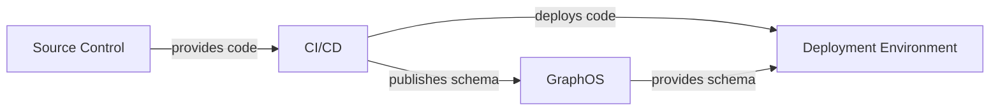
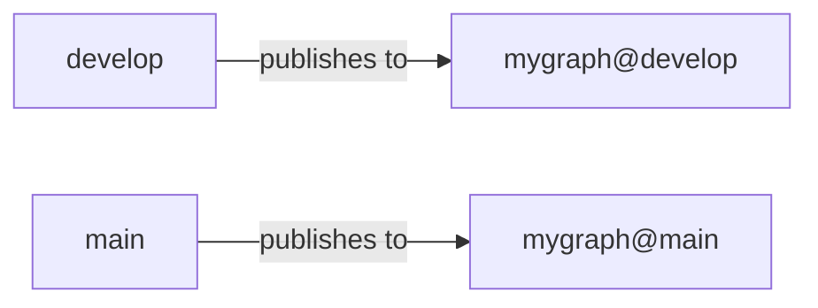
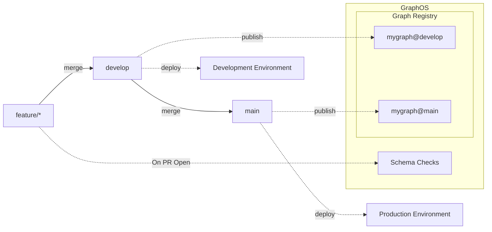
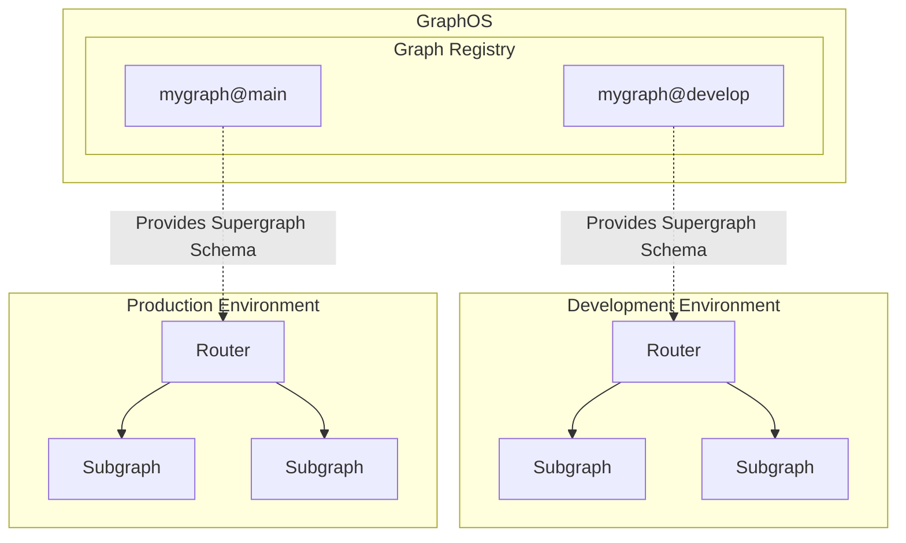
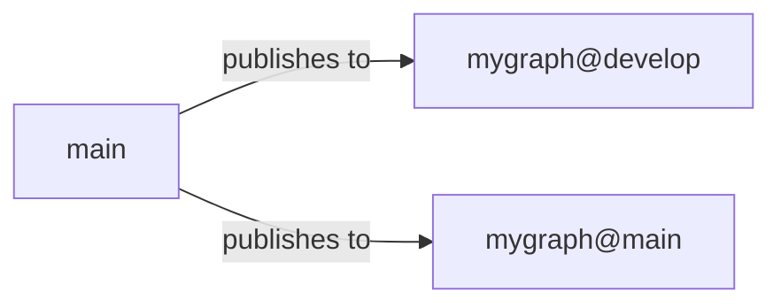
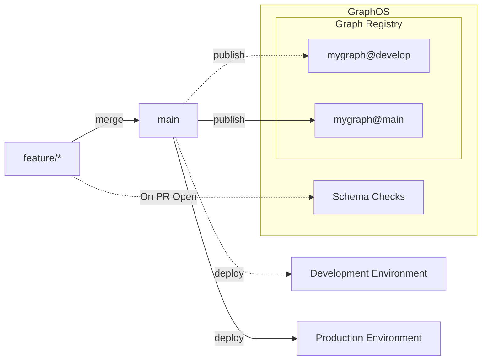
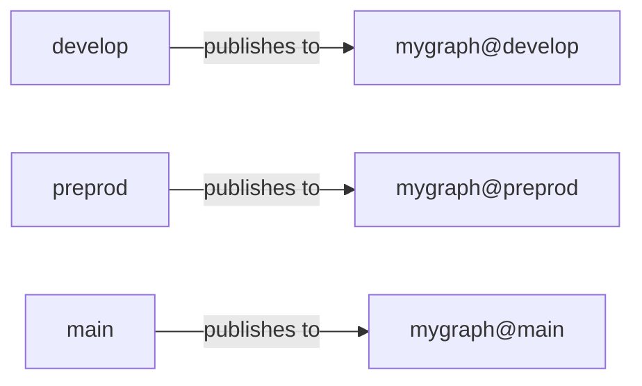
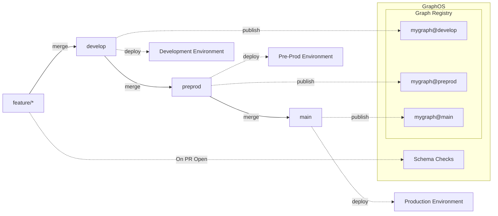
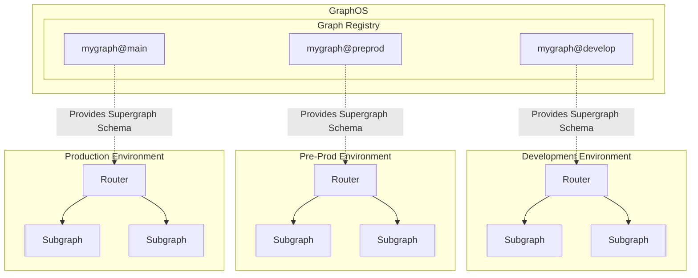

Customers that utilize GraphOS and Federation commonly use Graph Variants to manage environments and promotion through those environments.

In a typical architecture, organizations often set up multiple environments, such as development, pre-prod, and prod, each having a separate K8 cluster (or server) and a distinct database. They may also establish separate CI/CD jobs for each environment or configure CI/CD jobs to behave differently based on environment-specific variables.

Similarly, each environment may have a dedicated Graph Variant, with each variant representing a specific copy of the graph that is specific to that environment.

In this setup, your source control (e.g., Github) houses the code, your CI/CD system deploys the code to the target environment and publishes the schema, and the deployment environment retrieves its schema from GraphOS.



<Tip>

Reminder that the purpose of publishing your subgraph schemas to GraphOS is so they can be composed into a Supergraph which is consumed by the Router. The Router will be configured to consume a specific variant.

</Tip>

## Tying Branches to Variants and Environments

Depending on your needs, you can tie your branches to variants to represent environments using a couple of common patterns.

### Git Flow (feature, develop, main)

In Git Flow, you typically have a `develop` branch and a `main` branch where `develop` represents the newest code that hasn't necessarily been deployed to a production environment and `main` represents the production code.

In this setup, you would likely create two variants: `mygraph@develop` and `mygraph@main`, linking them directly to these Git branches.



The general flow here is that a `feature/*` branch contains the code for a particular feature.

When a pull request is opened to merge `feature/*` into `develop`, a set of Schema Checks is executed to ensure this set of changes will not break the supergraph upon composing or publishing the changes.

Once the code is merged from `feature/*` into `develop`, a CI/CD job runs to deploy the changes to the development environment and publish the subgraph to the `mygraph@develop` variant.

When the code in the `develop` branch is ready for production, it is merged into `main`, triggering a CI/CD job to deploy the changes to the production environment and publish the subgraph to the `mygraph@main` variant.



In the deployment environments, your subgraphs and Router run with the Router configured to pull from a specific variant.



### Simplified Feature Branch Flow (feature, main)

This is very similar to Git Flow, with the exception that there is no "develop" branch representing the lower environment. Instead, new features are branched directly off the `main` branch, and when the code is completed, it is merged back into `main` directly. In this model, `main` represents the latest code but not necessarily what is deployed to production.

In this setup, you would still have two variants: `mygraph@develop` and `mygraph@main`, but the timing of when they are published differs slightly from Git Flow.



The general flow here is that a `feature/*` branch contains the code for a particular feature.

When a pull request is opened to merge `feature/*` into `main`, a set of Schema Checks is executed to ensure this set of changes will not break the supergraph upon composing or publishing the changes.

Once the code is merged from `feature/*` into `main`, a CI/CD job runs to deploy the changes to the development environment and publish the subgraph to the `mygraph@develop` variant.

When the code in the `main` branch is ready for production, a CI/CD job runs to deploy the changes to the production environment and publish the subgraph to the `mygraph@main` variant.



In the deployment environments, your subgraphs and Router run with the Router configured to pull from a specific variant.


### Multi-Branch Flow (feature, develop, preprod, main)

In some cases, you may need multiple branches to accommodate multiple non-production environments. This can be achieved by expanding the Git Flow setup with additional variants tied to various branches.

In this setup, you would likely have a variant for each deployment environment (`mygraph@develop`, `mygraph@preprod`, `mygraph@main`), each linked directly to the appropriate Git branches.



The general flow here is that a `feature/*` branch contains the code for a particular feature.

When a pull request is opened to merge `feature/*` into `develop`, a set of Schema Checks is executed to ensure these changes won't break the supergraph upon composing or publishing.

Once the code is merged from `feature/*` into `develop`, a CI/CD job runs to deploy the changes to the development environment and publish the subgraph to the `mygraph@develop` variant.

When the code in the `develop` branch is ready for pre-production verification, such as User Acceptance Testing, the code is merged into `preprod`. Subsequently, a CI/CD job is run to deploy the changes to the pre-prod environment and publish the subgraph to the `mygraph@preprod` variant.

Finally, when the code in the `preprod` branch is ready for production, it is merged into `main`, and a CI/CD job is run to deploy the changes to the production environment and publish the subgraph to the `mygraph@main` variant.



In the deployment environments, your subgraphs and Router run with the Router configured to pull from a specific variant.



## Running Subgraph Checks

Using [`rover subgraph check`](/rover/commands/subgraphs/#validating-subgraph-schema-changes) to run checks when opening a merge request is a great tool for ensuring that changes won't cause problems with the composition of your supergraph. Setting this up requires a CI/CD job to run against pull request events and execute the rover command on the updated schema.

Here is an example using Github Actions:

```yml
name: Pull Request Check Code

on: pull_request

env:
  APOLLO_KEY: ${{ secrets.APOLLO_KEY }}
  APOLLO_VCS_COMMIT: ${{ github.event.pull_request.head.sha }}

jobs:
  npm-build:
    runs-on: ubuntu-latest
    steps:
      - uses: actions/checkout@v3

      - uses: actions/setup-node@v3
        with:
          node-version: 18.x
          cache: "npm"

      - run: npm ci

      - run: npm run build
  checks:
    name: Rover Subgraph Check
    runs-on: ubuntu-latest

    steps:
      - name: Checkout
        uses: actions/checkout@v3

      - name: Install Rover
        run: |
          curl -sSL https://rover.apollo.dev/nix/v0.8.1 | sh
          echo "$HOME/.rover/bin" >> $GITHUB_PATH

      - name: Rover Subgraph Check
        run: |
          rover subgraph check ${{ secrets.APOLLO_GRAPH_ID }}@develop \ # Specifying the variant here... this might also come from an environment variable, input, etc
            --name subgraph-a \
            --schema ./src/schema.graphql
```

<Tip>

For a more comprehensive example of deployment, Kubernetes setup, CI/CD, etc., check out our [Reference Architecture](/graphos/enterprise/reference-architecture).

</Tip>

## Publishing Schema

To publish a schema from your CI/CD jobs to a GraphOS Variant, you can utilize the [`rover subgraph publish`](/rover/commands/subgraphs#publishing-a-subgraph-schema-to-graphos) command. Remember to specify the variant when running the `publish` command.

Here is an example using GitHub Actions:

```yml
name: Manual Deploy

on: workflow_dispatch

env:
  APOLLO_KEY: ${{ secrets.APOLLO_KEY }}
  APOLLO_VCS_COMMIT: ${{ github.event.pull_request.head.sha }}

jobs:
  deploy:
    # Your deployment steps would go here!
  publish:
    name: Rover Subgraph Publish
    runs-on: ubuntu-latest

    steps:
      - name: Checkout
        uses: actions/checkout@v3

      - name: Install Rover
        run: |
          curl -sSL https://rover.apollo.dev/nix/v0.8.1 | sh
          echo "$HOME/.rover/bin" >> $GITHUB_PATH

      - name: Rover Subgraph Publish
        run: |
          rover subgraph publish ${{ secrets.APOLLO_GRAPH_ID }}@develop \ # Specifying the variant here... this might also come from an environment variable, input, etc
            --name subgraph-a \
            --routing-url http://graphql.mygraph.svc.cluster.local:4000 \
            --schema ./src/schema.graphql
```
