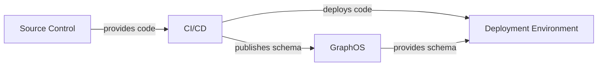
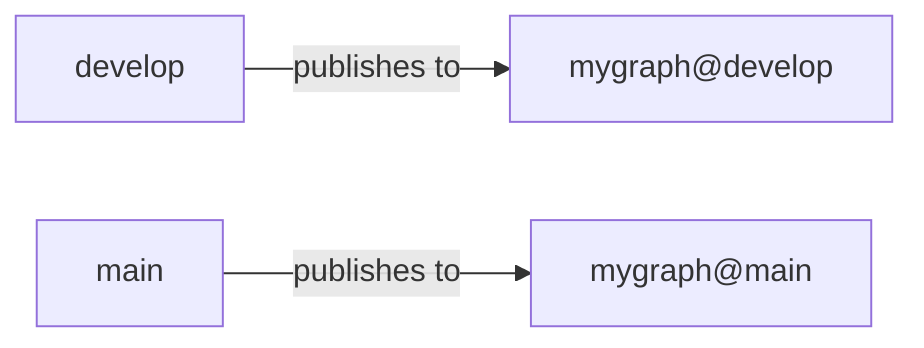
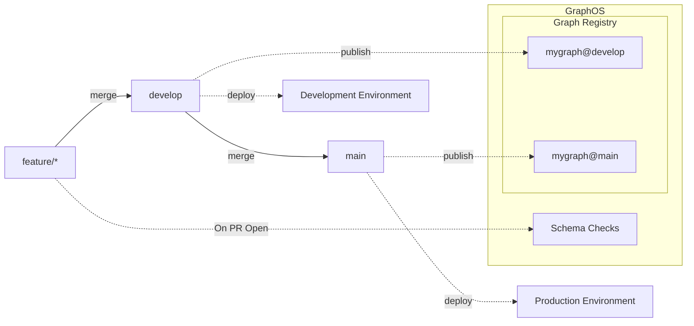
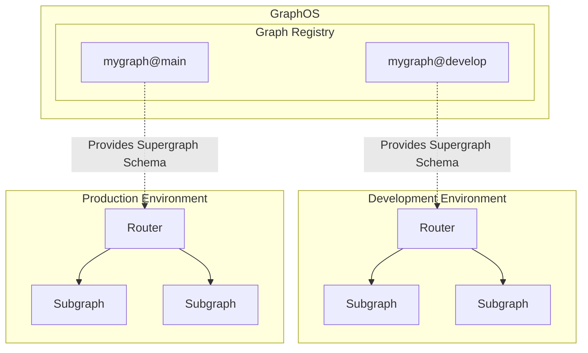
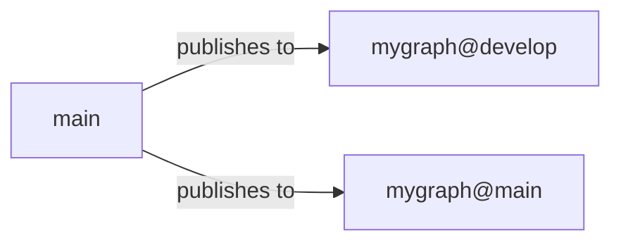
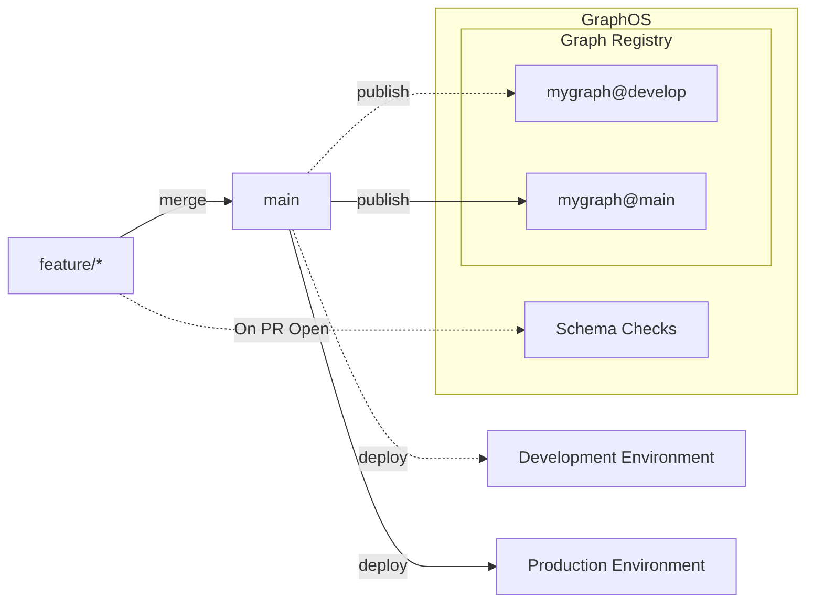
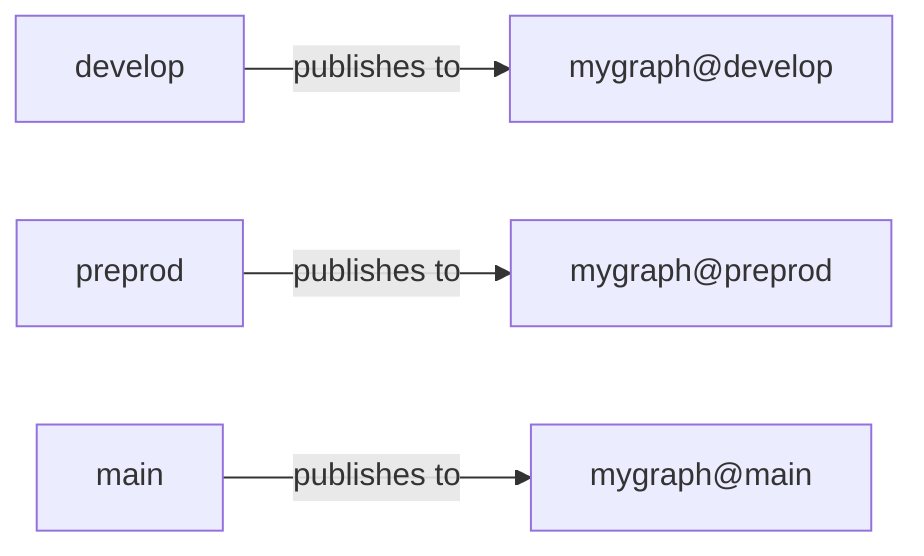
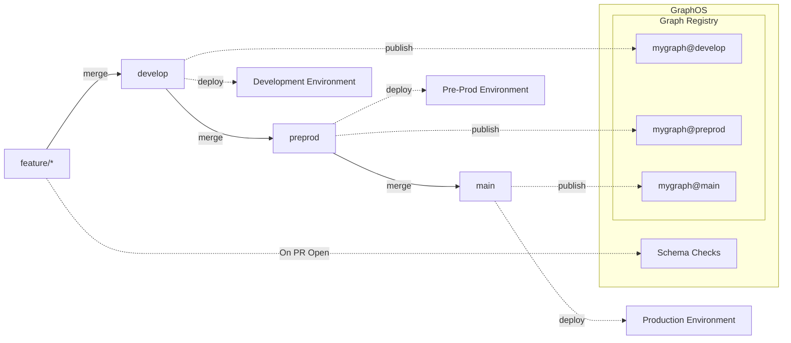
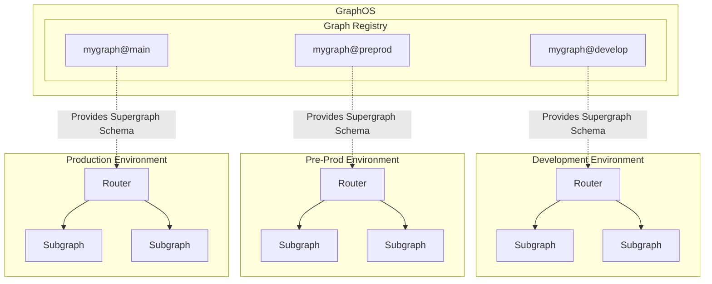

In this tech note, learn CI/CD best practices and examples for using graph variants for multiple deployment environments.

In a typical deployment architecture, organizations set up multiple environments&mdash;such as development, pre-prod, and prod&mdash;with each having a separate Kubernetes cluster and database. They create separate CI/CD jobs for each environment or configure them to behave differently based on environment-specific variables. They use in GraphOS a dedicated graph variant for each environment, with each variant representing a specific copy of the graph for that environment.

The setup for a typical deployment architecture begins with code and schemas in source control. A CI/CD system both deploys code to a target deployment environment and publishes schemas to GraphOS, which then provides the schemas to a deployment environment:



<Tip>

The purpose of publishing your subgraph schemas to GraphOS is so that they can be composed into a Supergraph which is consumed by the router. Each Router will be configured to consume a specific variant via a fixed graph reference. As a result, it's important that graph references/variant names are fixed, such as aligning them with each environment as demonstrated in this tech note.

</Tip>

## Source control branches for variants

The source control branching model you use affects the branch in which the code for a graph variant is developed. Let's go over examples for a few common branching models.

### Git flow (feature, develop, main)

In Git Flow, you typically have a `develop` branch and a `main` branch, where `develop` contains the code under-development that hasn't necessarily been deployed to a production environment, and `main` contains the production code.

In this setup, you can create two variants, `mygraph@develop` and `mygraph@main`, that correspond directly to the `develop` and `main` branches.



A `feature/*` branch contains the code for a particular feature.

When a pull request is opened to merge `feature/*` into `develop`, a set of schema checks is executed to ensure this set of changes will not break the supergraph upon composing or publishing the changes.

Once the code is merged from `feature/*` into `develop`, a CI/CD job runs to deploy the changes to the development environment and publish the subgraph to the `mygraph@develop` variant.

When the code in the `develop` branch is ready for production, it is merged into `main`, triggering a CI/CD job to deploy the changes to the production environment and publish the subgraph to the `mygraph@main` variant.



In the deployment environments, your subgraphs and the GraphOS Router run with the router configured to pull from a specific variant.



### Simplified feature branch flow (feature, main)

A branching model similar to Git Flow uses `feature` and `main` branches but doesn't use `develop`. Instead, new features are branched directly off the `main` branch, and when the code is completed, each `feature` branch is merged directly into `main`. In this model, `main` represents the latest code but not necessarily what is deployed to production.

In this setup, you can still have two variants, `mygraph@develop` and `mygraph@main`, but the timing of when they are published differs slightly from Git Flow.



A `feature/*` branch contains the code for a particular feature.

When a pull request is opened to merge `feature/*` into `main`, a set of schema checks is executed to ensure this set of changes will not break the supergraph upon composing or publishing the changes.

Once the code is merged from `feature/*` into `main`, a CI/CD job runs to deploy the changes to the development environment and publish the subgraph to the `mygraph@develop` variant.

When the code in the `main` branch is ready for production, a CI/CD job runs to deploy the changes to the production environment and publish the subgraph to the `mygraph@main` variant.



In the deployment environments, your subgraphs and the GraphOS Router run with the router configured to pull from a specific variant.


### Multi-branch flow (feature, develop, preprod, main)

In some cases, you might need multiple branches to accommodate multiple non-production environments. This can be achieved by expanding the Git Flow setup with additional variants tied to various branches.

In this setup, you would likely have a variant for each deployment environment (`mygraph@develop`, `mygraph@preprod`, `mygraph@main`), each linked directly to the appropriate Git branches.



A `feature/*` branch contains the code for a particular feature.

When a pull request is opened to merge `feature/*` into `develop`, a set of schema checks is executed to ensure these changes won't break the supergraph upon composing or publishing.

Once the code is merged from `feature/*` into `develop`, a CI/CD job runs to deploy the changes to the development environment and publish the subgraph to the `mygraph@develop` variant.

When the code in the `develop` branch is ready for pre-production verification, such as user acceptance testing, the code is merged into `preprod`. Subsequently, a CI/CD job is run to deploy the changes to the pre-prod environment and publish the subgraph to the `mygraph@preprod` variant.

Finally, when the code in the `preprod` branch is ready for production, it is merged into `main`, and a CI/CD job is run to deploy the changes to the production environment and publish the subgraph to the `mygraph@main` variant.



In the deployment environments, your subgraphs and Router run with the router configured to pull from a specific variant.



## Running subgraph checks

Using [`rover subgraph check`](/rover/commands/subgraphs/#validating-subgraph-schema-changes) to run checks when opening a merge request is a great tool for ensuring that changes won't cause problems with the composition of your supergraph. Setting this up requires a CI/CD job to run against pull request events and execute the rover command on the updated schema.

Here is an example using GitHub Actions:

```yml
name: Pull Request Check Code

on: pull_request

env:
  APOLLO_KEY: ${{ secrets.APOLLO_KEY }}
  APOLLO_VCS_COMMIT: ${{ github.event.pull_request.head.sha }}

jobs:
  npm-build:
    runs-on: ubuntu-latest
    steps:
      - uses: actions/checkout@v3

      - uses: actions/setup-node@v3
        with:
          node-version: 18.x
          cache: 'npm'

      - run: npm ci

      - run: npm run build
  checks:
    name: Rover Subgraph Check
    runs-on: ubuntu-latest

    steps:
      - name: Checkout
        uses: actions/checkout@v3

      - name: Install Rover
        run: |
          curl -sSL https://rover.apollo.dev/nix/v0.8.1 | sh
          echo "$HOME/.rover/bin" >> $GITHUB_PATH

      - name: Rover Subgraph Check
        run: |
          rover subgraph check ${{ secrets.APOLLO_GRAPH_ID }}@develop \ # Specifying the variant here. This might also come from an environment variable, input, etc
            --name subgraph-a \
            --schema ./src/schema.graphql
```

<Tip>

For a more comprehensive example of deployment, Kubernetes setup, CI/CD, etc., check out our [Reference Architecture](/graphos/enterprise/reference-architecture).

</Tip>

## Publishing schemas

To publish a schema from your CI/CD jobs to a GraphOS variant, you can use the [`rover subgraph publish`](/rover/commands/subgraphs#publishing-a-subgraph-schema-to-graphos) command.

Here is an example using GitHub Actions:

```yml
name: Manual Deploy

on: workflow_dispatch

env:
  APOLLO_KEY: ${{ secrets.APOLLO_KEY }}
  APOLLO_VCS_COMMIT: ${{ github.event.pull_request.head.sha }}

jobs:
  deploy:
    # Your deployment steps would go here!
  publish:
    name: Rover Subgraph Publish
    runs-on: ubuntu-latest

    steps:
      - name: Checkout
        uses: actions/checkout@v3

      - name: Install Rover
        run: |
          curl -sSL https://rover.apollo.dev/nix/v0.8.1 | sh
          echo "$HOME/.rover/bin" >> $GITHUB_PATH

      - name: Rover Subgraph Publish
        run: |
          rover subgraph publish ${{ secrets.APOLLO_GRAPH_ID }}@develop \ # Specifying the variant here. This might also come from an environment variable, input, etc
            --name subgraph-a \
            --routing-url http://graphql.mygraph.svc.cluster.local:4000 \
            --schema ./src/schema.graphql
```
