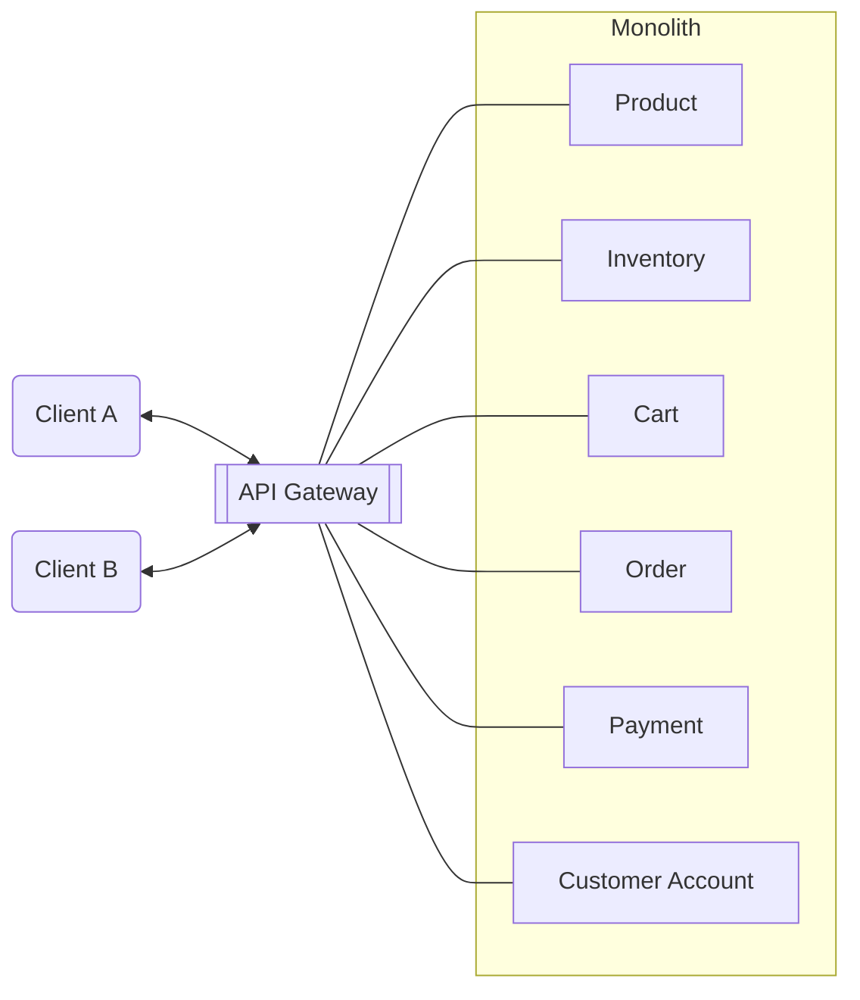
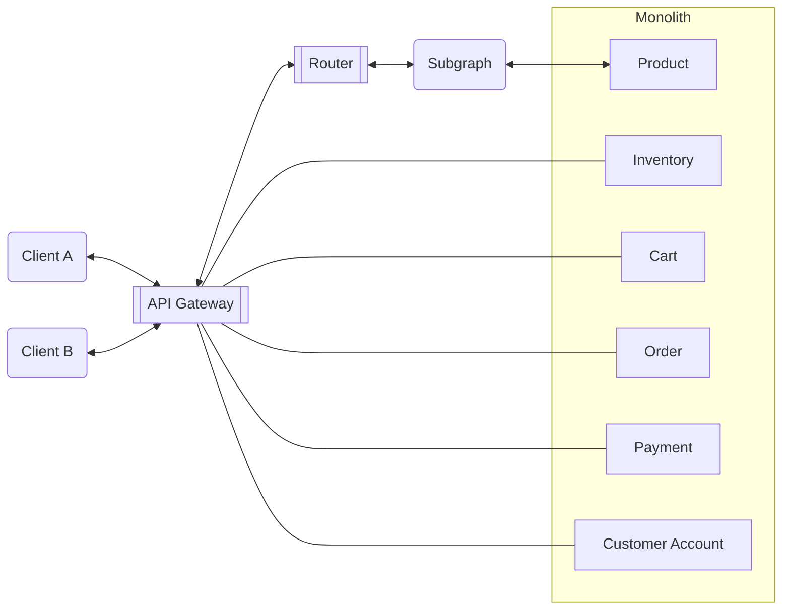
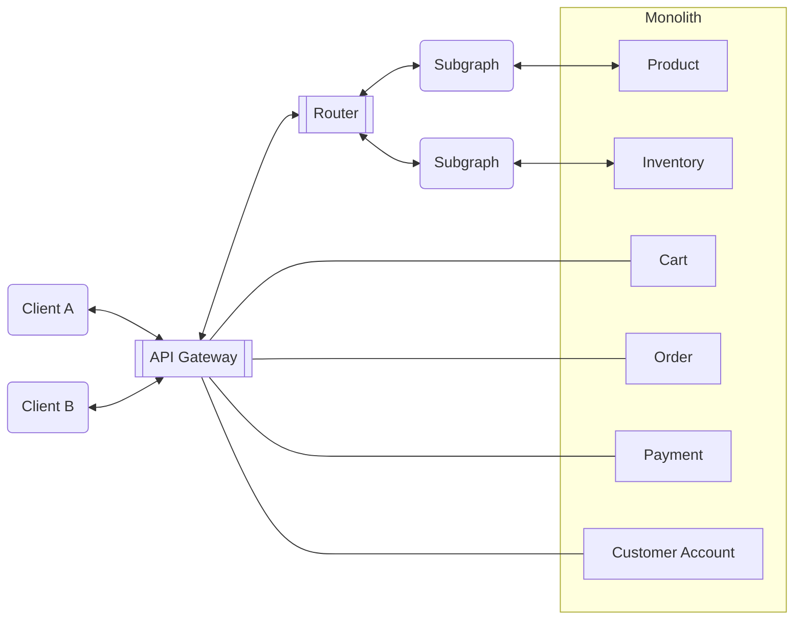
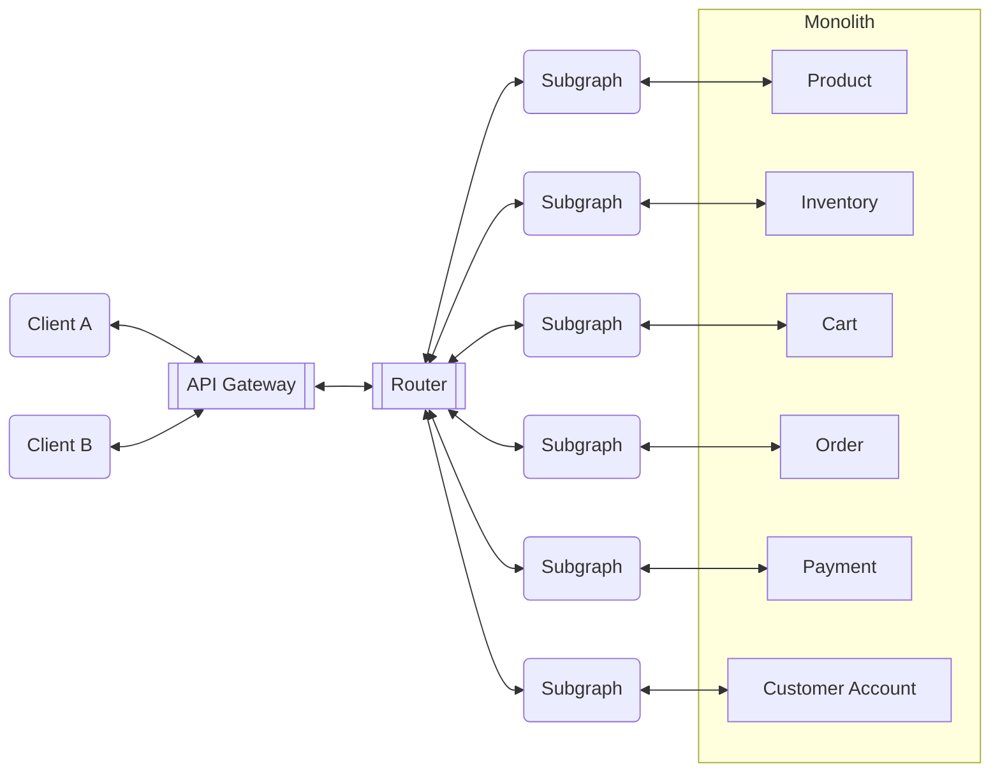
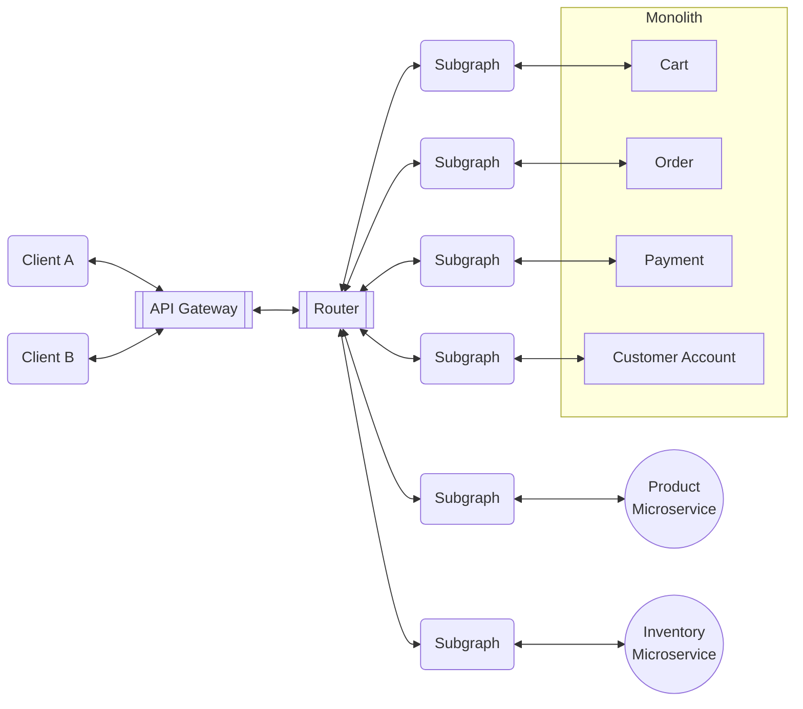
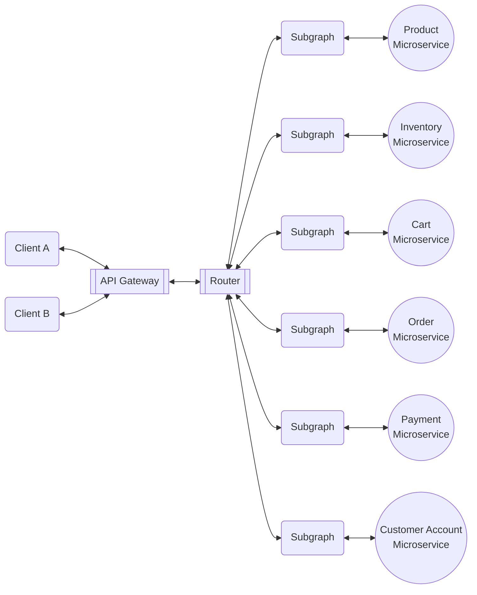

## Introduction

Many organizations aim to transition from a monolithic architecture to a [federated one](/federation). This process can seem challenging, but at Apollo, we've observed numerous successful migrations away from monoliths.

This tech note explores one of the most successful migration patterns: **the strangler pattern**. This approach allows for iterative and progressive changes, providing businesses with the confidence to invest in transformative changes.

<Tip>

Learn more about the benefits of [federation](/federation).

</Tip>

## Migration steps

The strangler pattern involves logically dissecting the monolith and migrating each part incrementally. This approach enables a smooth transition away from a monolith while demonstrating gradual progress to your organization.

### Divide the monolith into distinct domains

The initial challenge is determining how to divide the monolith. Most companies choose to separate systems based on distinct domains. As an example, a typical e-commerce application often has domains such as:

- Product
- Inventory
- Cart
- Order
- Payment
- Customer Account

The simplified monolith setup illustrates how clients fetch data and the tight integration within the system.

To overcome this, you can leverage [federated architecture](/federation).

### Decouple clients

Migration involves decoupling clients from the monolith onto a federated graph. With federation, clients can interact with the federated graph as if it were a monolith. This mitigates the risk of back-end changes affecting clients. The API Gateway facilitates fetching data responses from the newly federated architecture by reconfiguring existing routes.

<Note>

In federated architecture, the individual GraphQL APIs are called **subgraphs**. [Learn more.](/federation/#next-steps)

</Note>

<Tip>

Learn more about [how the Apollo Router works with API gateways](/technotes/TN0037-api-gateways/).

</Tip>

### Incrementally migrate further domains

Once one subgraph is successfully implemented, the pattern is established to add further subgraphs, progressively adding functionality to the federated architecture. It's crucial to keep the monolith as a data source initially to de-risk the migration and ensure reliable data service.

The federated architecture eventually handles all traffic for each client.

This marks the decoupled state, allowing the organization to begin the decommissioning phase by shutting down the monolith domain by domain.

The diagram below shows newly created microservices serving domains previously handled by the monolith. This pattern hides implementation details from the client while fulfilling the agreed data response.

The transformation is complete when all monolith domains have migrated, allowing the organization to successfully eliminate the monolith.

## Conclusion

While moving away from a deeply entrenched monolith may seem daunting, taking the strangler pattern approach makes the task more manageable. You can use the federated architecture to decouple systems, facilitating a seamless migration away from the monolith without impacting clients.
