Avoid exposing implementation details of upstream systems in your schema. Doing so avoids leaking details of your upstream systems to outside parties, reducing security risk by making field stuffing more difficult to perform.

In addition, it allows evolving upstream systems while keeping a stable client API, ensuring that your clients aren't linked to a specific datasource, but instead a client-focused schema that happens to use a given datasource at the time.

## Anti-Patterns
- ❌ Exposing foreign keys — model the relationship between types instead of exposing attributes and requiring clients to resolve the relationship with another request.
- ❌ Exposing low-level mutations — looks for REST-style verbs like `patch` and `put`. Model mutations as business processes, not database transactions.

## Why it is a Best Practice
GraphQL is a powerful tool for abstracting away the complexities of your backend services from front-end consumers. It 
can shield your consumers from major changes to those services while reducing the impact of those changes across your 
architecture.

It will enable you to drive a resilient API strategy that provide the correct governance and ownership while also reducing 
friction due to change and allowing your API consumers to increase their velocity through self-service. This will enable you to drive
an API strategy that delivers on the goals of:

- Offering rapid self-service
- Creating an insulating contract
- Magnifying existing investments
- Governing the middle layer

## Implementing in Practice
We recommend that you utilize graphql as a middle layer between your frontend applications and your backend services. All API consumers
should avoid going directly to backend services and instead go through your graph layer. This will provide a insulating layer that will
protect against change over time.

```mermaid
flowchart LR
%%{init:{'flowchart':{'nodeSpacing': 10, 'rankSpacing': 200}}}%%
  app1["🖥️ App"]
  app2["📱 App"]
  app3["⌚️ App"]
  graphql["✅ GraphQL ✅"]
  rest["Rest APIs"]
  grpc["gRPC APIs"]
  soap["SOAP APIs"]
  bus["Event Bus"]
  cms["CMS"]
  app1 --> graphql
  app2 --> graphql
  app3 --> graphql
  graphql --> rest
  graphql --> grpc
  graphql --> soap
  graphql --> bus
  graphql --> cms
```

## Resources and Further Reading
- [GraphQL as an abstraction layer](/technotes/TN0043-using-graphql-for-abstraction/)
- [Using Graphql and REST Together](/technotes/TN0044-graphql-and-rest-together/)

## Supergraph Architecture Framework (SAF)
The best practices outlined in this section are part of the [Supergraph Architecture Framework (SAF)](/graphos/enterprise/supergraph-architecture-framework). The SAF provides a collection of best practices in supergraph development. 
It serves as a roadmap for architecture and platform teams, guiding your organization toward an optimal supergraph implementation.

Contact your Apollo customer success team to complete the SAF assessment. If you're just getting started with Apollo, don't hesitate to get in touch.

<TrackableButton
  size="lg"
  colorScheme="indigo"
  href="https://www.apollographql.com/contact-sales"
  eventName="content_contact_sales"
>
  Get in touch
</TrackableButton>