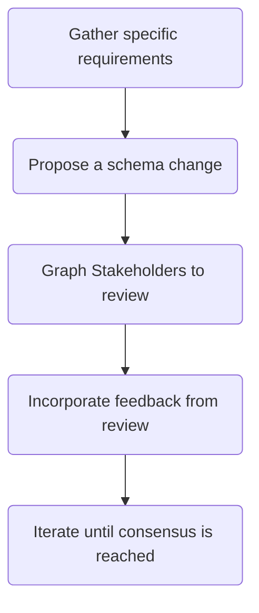

GraphQL is "[unapologetically driven by the requirements of views and the front-end engineers that write them](https://spec.graphql.org/draft/#sel-FADRBBBNBtDz3J)" and your design process should reflect that. Include front-end developers, UX/UI designers, and product leaders in schema design sessions. Require wireframes and design comps in addition to functional requirements as prerequisites to schema design.

## Anti-Patterns
- ❌ Design solely based on underlying data sources
- ❌ Autogenerate schema based on underlying data sources

## Why it is a Best Practice
It is tempting and often the default to take a data-first approach due to the ease of reflecting existing data and services into a GraphQL Schema. However, this can lead to a suboptimal customer experience due to not having a clear understanding of what the needs of the customer are and why they exist. On top of this, a risk of over-exposing data unnecessarily is introduced which at best creates tech debt risk and at worst creates a security/privacy risk.

The end result is a graph that is difficult to evolve due to a lack of clear understanding of the graph as well as scope creep due to graph sprawl.

## Implementing in Practice
We recommend implementing a schema proposal and review process which provides an opportunity to communicate use cases and requirements while also providing an opportunity for graph stakeholders to provide feedback.

Your proposal process may consist of written documents such as an RFC, a schema review meeting, a schema review in Apollo Studio, or some other process that fits your organization.

The proposal should be reviewed by all applicable graph stakeholders, or representatives of each group of graph stakeholders. Feedback from the review should be incorporated into the schema proposal.

This process should be repeated until all parties come to consensus on the schema proposal and any tradeoffs in the design are documented and agreed upon.

## Resources and Further Reading
- [Yelp's “dream query” design process](https://engineeringblog.yelp.com/2020/10/dream-query.html)
- [Demand oriented schema design](/technotes/TN0027-demand-oriented-schema-design/)

## Supergraph Architecture Framework (SAF)
The best practices outlined in this section are part of the [Supergraph Architecture Framework (SAF)](/graphos/enterprise/supergraph-architecture-framework). The SAF provides a collection of best practices in supergraph development. 
It serves as a roadmap for architecture and platform teams, guiding your organization toward an optimal supergraph implementation.

Contact your Apollo customer success team to complete the SAF assessment. If you're just getting started with Apollo, don't hesitate to get in touch.

<TrackableButton
  size="lg"
  colorScheme="indigo"
  href="https://www.apollographql.com/contact-sales"
  eventName="content_contact_sales"
>
  Get in touch
</TrackableButton>